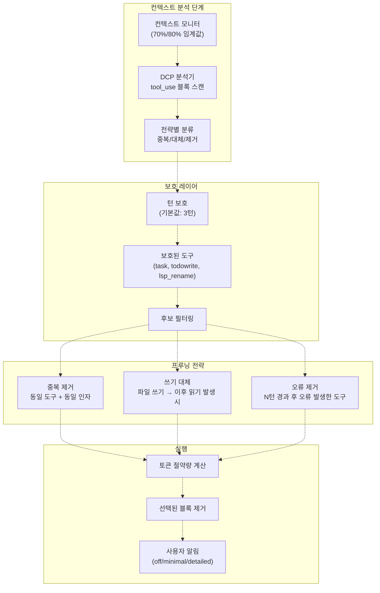
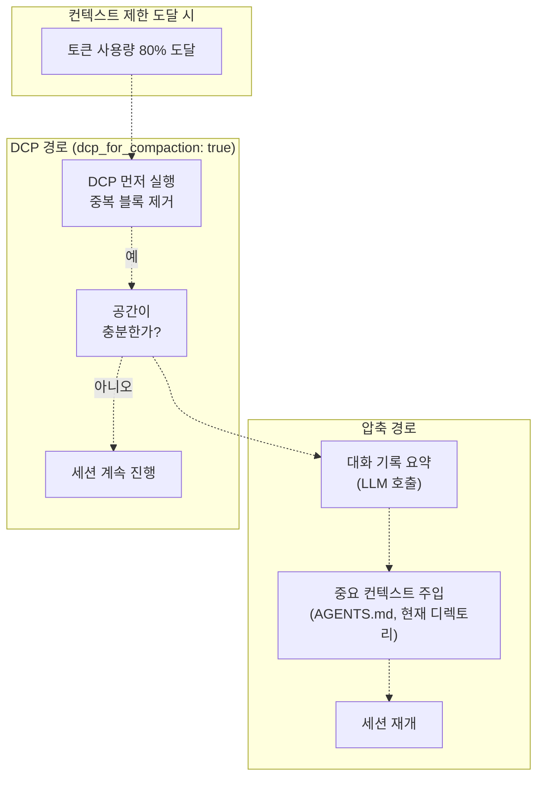
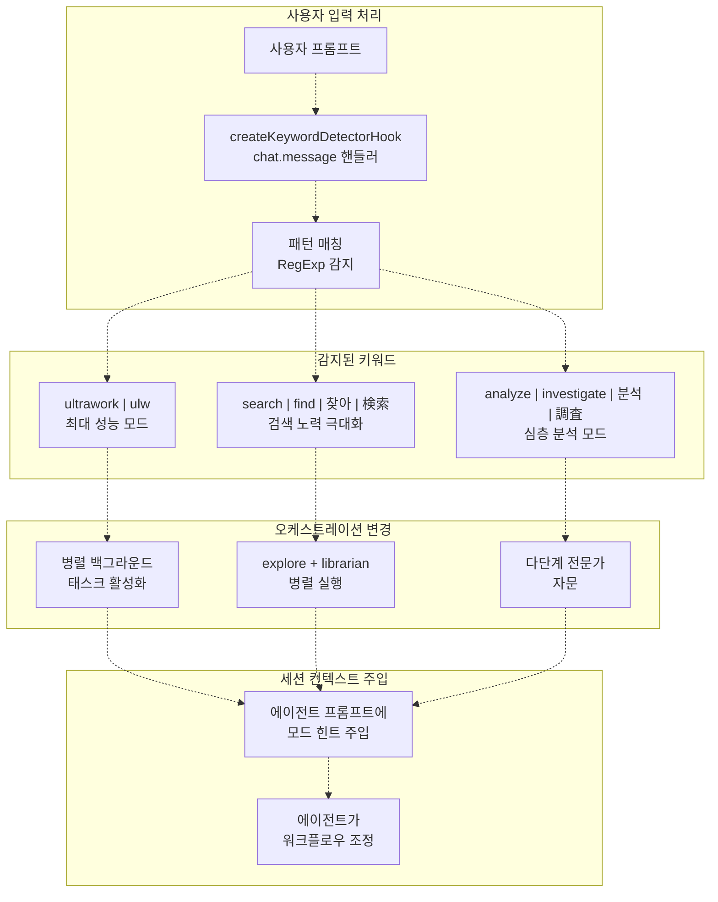
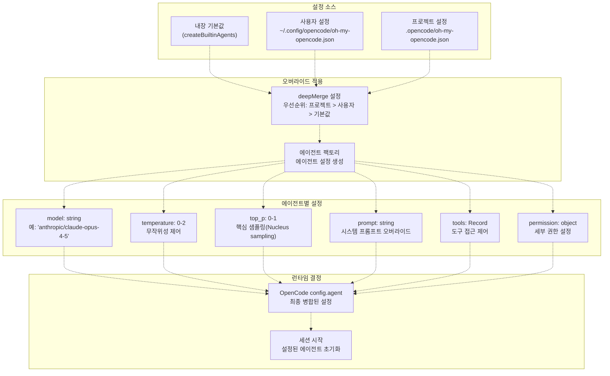
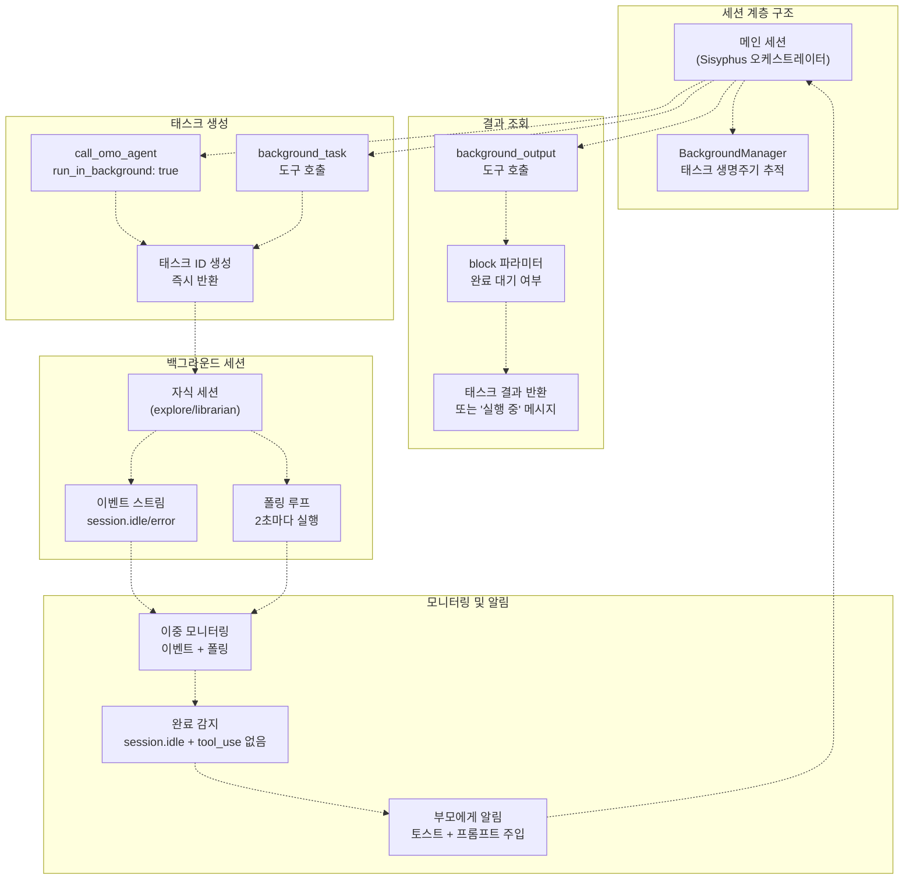

# 고급 주제 (Advanced Topics)

> **관련 소스 파일**
> * [README.ja.md](https://github.com/code-yeongyu/oh-my-opencode/blob/b92cd6ab/README.ja.md)
> * [README.ko.md](https://github.com/code-yeongyu/oh-my-opencode/blob/b92cd6ab/README.ko.md)
> * [README.md](https://github.com/code-yeongyu/oh-my-opencode/blob/b92cd6ab/README.md)
> * [README.zh-cn.md](https://github.com/code-yeongyu/oh-my-opencode/blob/b92cd6ab/README.zh-cn.md)
> * [assets/oh-my-opencode.schema.json](https://github.com/code-yeongyu/oh-my-opencode/blob/b92cd6ab/assets/oh-my-opencode.schema.json)
> * [src/config/schema.ts](https://github.com/code-yeongyu/oh-my-opencode/blob/b92cd6ab/src/config/schema.ts)
> * [src/hooks/index.ts](https://github.com/code-yeongyu/oh-my-opencode/blob/b92cd6ab/src/hooks/index.ts)
> * [src/index.ts](https://github.com/code-yeongyu/oh-my-opencode/blob/b92cd6ab/src/index.ts)
> * [src/shared/config-path.ts](https://github.com/code-yeongyu/oh-my-opencode/blob/b92cd6ab/src/shared/config-path.ts)

이 페이지에서는 oh-my-opencode의 고급 설정 옵션, 실험적 기능 및 최적화 전략을 다룹니다. 이러한 기능은 성능을 미세 조정하거나, 최첨단 기능을 활성화하거나, 복잡한 멀티 에이전트 워크플로우를 구현하려는 사용자를 위해 설계되었습니다.

기본 설정 옵션은 [Configuration](/code-yeongyu/oh-my-opencode/13.1-configuration-schema-reference)을 참조하십시오. 훅(Hook) 관련 설정은 [Hook Reference](/code-yeongyu/oh-my-opencode/13.4-hook-reference)를, 에이전트 설정은 [Agent Reference](/code-yeongyu/oh-my-opencode/13.2-agent-reference)를 참조하십시오.

---

## 실험적 설정 (Experimental Configuration)

oh-my-opencode에는 고급 컨텍스트 관리 및 성능 최적화를 제공하는 실험적 기능이 포함되어 있습니다. 이 기능들은 기본적으로 비활성화되어 있으며, 설정 파일의 `experimental` 섹션에서 활성화할 수 있습니다.

### 설정 구조

실험적 설정 객체는 다음 옵션들을 지원합니다:

| 옵션 | 타입 | 기본값 | 설명 |
| --- | --- | --- | --- |
| `aggressive_truncation` | `boolean` | `false` | 도구 출력의 더 공격적인 절단(truncation) 활성화 |
| `auto_resume` | `boolean` | `false` | 오류 발생 후 세션 자동 재개 |
| `preemptive_compaction` | `boolean` | `true` | 하드 리미트에 도달하기 전에 선제적 압축(compaction) 트리거 |
| `preemptive_compaction_threshold` | `number` | `0.80` | 선제적 압축을 트리거할 컨텍스트 사용량 비율 (0.5-0.95) |
| `truncate_all_tool_outputs` | `boolean` | `true` | 화이트리스트에 있는 도구뿐만 아니라 모든 도구에 절단 적용 |
| `dcp_for_compaction` | `boolean` | `false` | 요약(summarization) 전에 동적 컨텍스트 프루닝(DCP) 사용 |
| `dynamic_context_pruning` | `object` | `undefined` | DCP 설정 (아래 참조) |

**설정 예시:**

```json
{
  "experimental": {
    "preemptive_compaction": true,
    "preemptive_compaction_threshold": 0.75,
    "truncate_all_tool_outputs": true,
    "dcp_for_compaction": true,
    "dynamic_context_pruning": {
      "enabled": true,
      "notification": "detailed"
    }
  }
}
```

**출처:** [src/config/schema.ts L163-L176](https://github.com/code-yeongyu/oh-my-opencode/blob/b92cd6ab/src/config/schema.ts#L163-L176)

 [src/index.ts L273-L277](https://github.com/code-yeongyu/oh-my-opencode/blob/b92cd6ab/src/index.ts#L273-L277)

 [README.md L689-L690](https://github.com/code-yeongyu/oh-my-opencode/blob/b92cd6ab/README.md#L689-L690)

---

## 동적 컨텍스트 프루닝 (Dynamic Context Pruning, DCP)

동적 컨텍스트 프루닝은 전체 요약을 수행하지 않고 대화 기록에서 중복되거나 대체된 콘텐츠를 지능적으로 제거하는 실험적 기능입니다. 이를 통해 토큰 제한 내에서 더 많은 컨텍스트를 보존할 수 있습니다.

### DCP 아키텍처



**출처:** [src/config/schema.ts L127-L161](https://github.com/code-yeongyu/oh-my-opencode/blob/b92cd6ab/src/config/schema.ts#L127-L161)

 [README.md L688-L690](https://github.com/code-yeongyu/oh-my-opencode/blob/b92cd6ab/README.md#L688-L690)

### DCP 설정 옵션

`dynamic_context_pruning` 객체는 다음 설정을 지원합니다:

```
{
  "dynamic_context_pruning": {
    // DCP 활성화/비활성화
    "enabled": boolean,  // 기본값: false
    
    // 알림 수준: "off" | "minimal" | "detailed"
    "notification": string,  // 기본값: "detailed"
    
    // 턴 보호 - 최근 메시지가 삭제되는 것을 방지
    "turn_protection": {
      "enabled": boolean,  // 기본값: true
      "turns": number      // 기본값: 3, 범위: 1-10
    },
    
    // 절대 삭제되지 않아야 하는 도구들
    "protected_tools": string[],  // 기본값: ["task", "todowrite", "lsp_rename", ...]
    
    // 개별 전략 설정
    "strategies": {
      "deduplication": {
        "enabled": boolean  // 기본값: true
      },
      "supersede_writes": {
        "enabled": boolean,    // 기본값: true
        "aggressive": boolean  // 기본값: false
      },
      "purge_errors": {
        "enabled": boolean,  // 기본값: true
        "turns": number      // 기본값: 5, 범위: 1-20
      }
    }
  }
}
```

### 프루닝 전략 설명

| 전략 | 동작 방식 | 예시 |
| --- | --- | --- |
| **중복 제거 (Deduplication)** | 동일한 도구 이름과 인자를 가진 중복 도구 호출을 제거합니다. | 동일한 파일/위치에 대한 두 번의 연속된 `lsp_hover` 호출 → 마지막 호출만 유지 |
| **쓰기 대체 (Supersede Writes)** | 파일이 이후에 읽히는 경우 이전의 쓰기 작업을 프루닝합니다. | `write_file("foo.js", content)` 이후 `read_file("foo.js")` 호출 → 쓰기 작업의 입력 콘텐츠 제거 |
| **쓰기 대체 (공격적)** | 이후에 어떤 읽기 작업이라도 발생하면 모든 쓰기 작업을 프루닝합니다. | `write_file("a.js", ...)` 이후 `read_file("b.js")` 호출 → 쓰기 작업 제거 (권장되지 않음) |
| **오류 제거 (Purge Errors)** | N턴이 지난 후 오류가 발생한 도구 호출을 제거합니다. | 5턴 이전에 실패한 `bash` 명령 → 입력 내용 제거 |

**출처:** [src/config/schema.ts L143-L160](https://github.com/code-yeongyu/oh-my-opencode/blob/b92cd6ab/src/config/schema.ts#L143-L160)

 [README.md L688-L690](https://github.com/code-yeongyu/oh-my-opencode/blob/b92cd6ab/README.md#L688-L690)

### DCP vs. 선제적 압축 (Preemptive Compaction)



`dcp_for_compaction`이 활성화되면 컨텍스트 제한을 초과할 때 DCP가 먼저 실행됩니다. DCP가 충분한 공간을 확보하면 요약 과정을 완전히 건너뜁니다. 공간이 부족한 경우 시스템은 요약을 포함한 표준 선제적 압축 방식으로 전환합니다.

**출처:** [src/config/schema.ts L174-L175](https://github.com/code-yeongyu/oh-my-opencode/blob/b92cd6ab/src/config/schema.ts#L174-L175)

 [src/hooks/preemptive-compaction.ts L1-L100](https://github.com/code-yeongyu/oh-my-opencode/blob/b92cd6ab/src/hooks/preemptive-compaction.ts#L1-L100)

 (아키텍처에서 추론됨)

---

## 키워드 감지 모드 (Keyword Detection Modes)

oh-my-opencode에는 사용자 프롬프트를 기반으로 특수 오케스트레이션 모드를 활성화하는 키워드 감지 시스템이 포함되어 있습니다. 이를 통해 명시적인 설정 없이도 최적화된 에이전트 동작이 가능합니다.

### 키워드 감지 흐름



**출처:** [src/hooks/keyword-detector.ts L1-L50](https://github.com/code-yeongyu/oh-my-opencode/blob/b92cd6ab/src/hooks/keyword-detector.ts#L1-L50)

 (추론됨), [README.md L671-L675](https://github.com/code-yeongyu/oh-my-opencode/blob/b92cd6ab/README.md#L671-L675)

### 키워드 모드 동작

| 키워드 | 언어별 변형 | 동작 방식 | 사용 사례 |
| --- | --- | --- | --- |
| `ultrawork` | `ulw` | 공격적인 병렬 실행을 통한 최대 성능 모드. Sisyphus가 여러 백그라운드 태스크를 동시에 실행합니다. | 최대 처리량이 필요한 복잡한 다중 컴포넌트 작업 |
| `search` | `find`, `찾아` (한국어), `検索` (일본어) | 병렬 검색 모드. `explore`와 `librarian` 에이전트를 백그라운드 태스크로 동시에 실행하여 코드와 문서를 검색합니다. | 구현체, 패턴 또는 문서 참조 찾기 |
| `analyze` | `investigate`, `분석` (한국어), `調査` (일본어) | 다단계 전문가 자문을 포함한 심층 분석 모드. 아키텍처 검토를 위해 Oracle을 참여시킵니다. | 복잡한 문제 디버깅, 아키텍처 결정, 코드 리뷰 |

**프롬프트 예시:**

```yaml
ultrawork: JWT 토큰을 사용하도록 인증 시스템을 리팩토링해줘
search: 더 이상 사용되지 않는(deprecated) API 엔드포인트의 모든 사용처를 찾아줘
analyze: 왜 해외 카드 결제가 실패하는지 분석해줘
```

**출처:** [README.md L671-L675](https://github.com/code-yeongyu/oh-my-opencode/blob/b92cd6ab/README.md#L671-L675)

 [src/hooks/keyword-detector.ts L1-L50](https://github.com/code-yeongyu/oh-my-opencode/blob/b92cd6ab/src/hooks/keyword-detector.ts#L1-L50)

 (추론됨)

---

## 모델 설정 (Model Configuration)

에이전트 모델 설정을 통해 특정 작업을 처리할 AI 모델과 해당 모델의 동작 파라미터를 세밀하게 제어할 수 있습니다.

### 에이전트 모델 오버라이드 계층 구조



**출처:** [src/index.ts L153-L187](https://github.com/code-yeongyu/oh-my-opencode/blob/b92cd6ab/src/index.ts#L153-L187)

 [src/agents/index.ts L1-L100](https://github.com/code-yeongyu/oh-my-opencode/blob/b92cd6ab/src/agents/index.ts#L1-L100)

 (추론됨), [src/config/schema.ts L74-L103](https://github.com/code-yeongyu/oh-my-opencode/blob/b92cd6ab/src/config/schema.ts#L74-L103)

### 모델 설정 옵션

**기본 설정:**

```json
{
  "agents": {
    "Sisyphus": {
      "model": "anthropic/claude-opus-4-5",
      "temperature": 1.0,
      "top_p": 0.95
    },
    "oracle": {
      "model": "openai/gpt-5.2",
      "temperature": 0.3
    },
    "explore": {
      "model": "opencode/grok-code"
    }
  }
}
```

**도구 제한을 포함한 고급 설정:**

```
{
  "agents": {
    "oracle": {
      "model": "openai/gpt-5.2",
      "tools": {
        "write_file": false,  // 읽기 전용 조언자
        "edit_file": false,
        "background_task": false
      },
      "permission": {
        "edit": "deny",
        "bash": "ask"
      }
    }
  }
}
```

**출처:** [src/config/schema.ts L74-L89](https://github.com/code-yeongyu/oh-my-opencode/blob/b92cd6ab/src/config/schema.ts#L74-L89)

 [README.md L772-L787](https://github.com/code-yeongyu/oh-my-opencode/blob/b92cd6ab/README.md#L772-L787)

### 컨텍스트 제한 관리

oh-my-opencode는 OpenCode 설정에서 모델 컨텍스트 제한을 추적하고 이를 선제적 압축 결정에 사용합니다:

```javascript
// src/index.ts 발췌
const modelContextLimitsCache = new Map<string, number>();
const getModelLimit = (providerID: string, modelID: string): number | undefined => {
  const key = `${providerID}/${modelID}`;
  const cached = modelContextLimitsCache.get(key);
  if (cached) return cached;
  
  if (providerID === "anthropic" && anthropicContext1MEnabled && modelID.includes("sonnet")) {
    return 1_000_000;  // Anthropic 확장 컨텍스트
  }
  return undefined;
};
```

컨텍스트 제한은 다음에서 감지됩니다:

1. OpenCode `config.provider[providerID].models[modelID].limit.context`
2. Anthropic의 `anthropic-beta: context-1m` 헤더에 대한 특수 처리
3. 성능을 위해 캐싱됨

**출처:** [src/index.ts L224-L236](https://github.com/code-yeongyu/oh-my-opencode/blob/b92cd6ab/src/index.ts#L224-L236)

 [src/index.ts L362-L386](https://github.com/code-yeongyu/oh-my-opencode/blob/b92cd6ab/src/index.ts#L362-L386)

### 사고 모드 (Thinking Mode) 설정

oh-my-opencode는 확장된 사고(extended thinking)가 필요한 시점을 자동으로 감지하고 모델 설정을 조정합니다:

**감지 트리거:**

* 사용자 프롬프트에 포함된 단어: "think deeply", "ultrathink", "신중하게 생각해서"
* 다단계 추론이 필요한 복잡한 작업

**자동 조정 사항:**

* Claude 모델: `thinking` 설정 적용
* OpenAI 모델: `reasoning_effort` 파라미터 조정
* 확장 사고를 위한 토큰 예산 할당

**출처:** [README.md L676-L677](https://github.com/code-yeongyu/oh-my-opencode/blob/b92cd6ab/README.md#L676-L677)

 [src/hooks/think-mode.ts L1-L50](https://github.com/code-yeongyu/oh-my-opencode/blob/b92cd6ab/src/hooks/think-mode.ts#L1-L50)

 (추론됨)

---

## 병렬 실행 패턴 (Parallel Execution Patterns)

oh-my-opencode의 백그라운드 실행 시스템은 진정한 병렬 에이전트 워크플로우를 가능하게 하여, 여러 에이전트가 조율을 유지하면서 동시에 작업할 수 있도록 합니다.

### 백그라운드 실행 아키텍처



**출처:** [src/features/background-agent.ts L1-L200](https://github.com/code-yeongyu/oh-my-opencode/blob/b92cd6ab/src/features/background-agent.ts#L1-L200)

 (추론됨), [src/tools/call-omo-agent.ts L1-L100](https://github.com/code-yeongyu/oh-my-opencode/blob/b92cd6ab/src/tools/call-omo-agent.ts#L1-L100)

 (추론됨), [README.md L485-L496](https://github.com/code-yeongyu/oh-my-opencode/blob/b92cd6ab/README.md#L485-L496)

### 백그라운드 태스크 도구

| 도구 | 파라미터 | 동작 방식 | 반환 값 |
| --- | --- | --- | --- |
| `call_omo_agent` | `agent_name`, `task`, `run_in_background` | explore 또는 librarian 에이전트를 실행합니다. `run_in_background: true`인 경우 즉시 task_id를 반환합니다. | `task_id` (백그라운드) 또는 전체 응답 (블로킹) |
| `background_task` | `description` | 일반적인 백그라운드 태스크를 생성합니다. Sisyphus가 병렬 작업을 위해 사용합니다. | `task_id` |
| `background_output` | `task_id`, `block` | 태스크 출력을 가져옵니다. `block: true`인 경우 완료될 때까지 대기합니다. | 태스크 결과 또는 "still running" |
| `background_cancel` | `task_id` 또는 `all: true` | 하나 또는 모든 백그라운드 태스크를 취소합니다. | 확인 메시지 |

**출처:** [src/tools/index.ts L53](https://github.com/code-yeongyu/oh-my-opencode/blob/b92cd6ab/src/tools/index.ts#L53-L53)

 [src/tools/call-omo-agent.ts L1-L100](https://github.com/code-yeongyu/oh-my-opencode/blob/b92cd6ab/src/tools/call-omo-agent.ts#L1-L100)

 (추론됨), [README.md L525](https://github.com/code-yeongyu/oh-my-opencode/blob/b92cd6ab/README.md#L525-L525)

### 병렬 실행 패턴

**패턴 1: 병렬 조사 (Parallel Research)**

```
Sisyphus의 워크플로우:
1. 백그라운드에서 explore 에이전트 실행: 인증 패턴 검색
2. 백그라운드에서 librarian 에이전트 실행: JWT 문서 찾기
3. 초기 구현 작업 계속 진행
4. 두 에이전트가 모두 완료될 때까지 대기
5. 조사 결과 통합
```

**구현:**

```yaml
// Sisyphus 호출:
call_omo_agent({
  agent_name: "explore",
  task: "src/에서 인증 패턴 찾기",
  run_in_background: true
})  // 즉시 task_id_1 반환

call_omo_agent({
  agent_name: "librarian", 
  task: "JWT 모범 사례 조사",
  run_in_background: true
})  // 즉시 task_id_2 반환

// 나중에 결과 가져오기:
background_output({ task_id: "task_id_1", block: true })
background_output({ task_id: "task_id_2", block: true })
```

**패턴 2: 프론트엔드/백엔드 분리**

```
Sisyphus의 워크플로우:
1. background_task: "Gemini가 프론트엔드 컴포넌트 빌드"
2. 백엔드 구현 계속 진행
3. 프론트엔드 완료 시 알림 수신
4. 검토 및 통합
```

**패턴 3: 다각도 검색**

```
Sisyphus가 "search" 모드 활성화:
1. explore 실행 (LSP/AST/grep_app을 통한 코드 검색)
2. librarian 실행 (context7/websearch_exa를 통한 문서 검색)
3. 둘 다 병렬로 실행
4. 결과 집계
```

**출처:** [README.md L485-L496](https://github.com/code-yeongyu/oh-my-opencode/blob/b92cd6ab/README.md#L485-L496)

 [src/hooks/background-notification.ts L1-L50](https://github.com/code-yeongyu/oh-my-opencode/blob/b92cd6ab/src/hooks/background-notification.ts#L1-L50)

 (추론됨)

### 백그라운드 세션 상태 관리

`BackgroundManager`는 모든 백그라운드 태스크를 추적합니다:

```python
// 태스크 상태 (아키텍처에서 추론됨)
type TaskState = 
  | "pending"     // 태스크 생성됨, 세션 시작 중
  | "running"     // 세션 활성 상태, 에이전트 작업 중
  | "completed"   // 세션 유휴 상태, 결과 사용 가능
  | "failed"      // 오류 발생
  | "cancelled"   // 수동 취소됨

// BackgroundManager 유지 관리:
class BackgroundManager {
  private tasks: Map<string, TaskInfo>  // task_id -> 태스크 메타데이터
  private sessions: Map<string, SessionInfo>  // session_id -> 백그라운드 세션
  
  // 이중 모니터링:
  - 이벤트 리스너: session.idle, session.error
  - 폴링: setInterval(checkSessions, 2000)
}
```

**완료 감지 로직:**

1. 세션이 `session.idle` 이벤트 발생
2. 메시지 배열에 대기 중인 `tool_use` 블록이 없음
3. 태스크가 `completed`로 표시됨
4. 토스트 알림 및 프롬프트 주입을 통해 부모 세션에 알림

**출처:** [src/features/background-agent.ts L1-L200](https://github.com/code-yeongyu/oh-my-opencode/blob/b92cd6ab/src/features/background-agent.ts#L1-L200)

 (추론됨), [src/index.ts L307-L320](https://github.com/code-yeongyu/oh-my-opencode/blob/b92cd6ab/src/index.ts#L307-L320)

### 알림 시스템

백그라운드 태스크가 완료되면 부모 세션은 다음을 수신합니다:

1. **OS 토스트 알림:** "백그라운드 태스크 완료: [태스크 설명]"
2. **프롬프트 주입:** 세션에 주입되는 가상 사용자 메시지: ``` 백그라운드 태스크 [task_id]가 완료되었습니다. background_output을 사용하여 결과를 가져오십시오. ```

이 이중 알림 시스템을 통해 Sisyphus는 다른 작업을 수행 중이더라도 완료 사실을 인지할 수 있습니다.

**출처:** [src/hooks/background-notification.ts L1-L50](https://github.com/code-yeongyu/oh-my-opencode/blob/b92cd6ab/src/hooks/background-notification.ts#L1-L50)

 (추론됨), [README.md L683-L684](https://github.com/code-yeongyu/oh-my-opencode/blob/b92cd6ab/README.md#L683-L684)

---

## 성능 최적화 전략

### 토큰 최적화

| 전략 | 설정 | 영향 |
| --- | --- | --- |
| **선제적 압축** | `experimental.preemptive_compaction_threshold: 0.75` | 하드 리미트를 기다리지 않고 사용량 75%에서 요약 트리거 |
| **도구 출력 절단** | `experimental.truncate_all_tool_outputs: true` | 장황한 도구 출력(grep, glob, LSP)을 동적으로 절단 |
| **압축 전 DCP** | `experimental.dcp_for_compaction: true` | 비용이 많이 드는 요약 전에 프루닝 시도 |
| **공격적 절단** | `experimental.aggressive_truncation: true` | 더 공격적인 절단 임계값 적용 (주의해서 사용) |

### 에이전트 특화

| 패턴 | 설정 | 이점 |
| --- | --- | --- |
| **읽기 전용 Oracle** | `agents.oracle.permission.edit: "deny"` | 느린 추론 모델이 비용이 많이 드는 쓰기 작업을 수행하는 것을 방지 |
| **빠른 탐색** | `agents.explore.model: "opencode/grok-code"` | 코드 검색 작업에 무료 또는 빠른 모델 사용 |
| **병렬 조사** | `agents.librarian.tools.background_task: true` | Sisyphus가 작업을 계속하는 동안 비동기 조사 가능 |

### 워크플로우 최적화

| 기법 | 구현 | 사용 사례 |
| --- | --- | --- |
| **키워드 활성화** | 프롬프트에 `ultrawork` 추가 | 최대 병렬 처리가 필요한 복잡한 작업 |
| **서브에이전트 생성** | `call_omo_agent(..., run_in_background: true)` | 비동기로 실행 가능한 조사 작업 |
| **컨텍스트 인지** | 턴 보호와 함께 DCP 활성화 | 제한을 관리하면서 최근 컨텍스트 보존 |

**출처:** [src/config/schema.ts L163-L176](https://github.com/code-yeongyu/oh-my-opencode/blob/b92cd6ab/src/config/schema.ts#L163-L176)

 [README.md L671-L692](https://github.com/code-yeongyu/oh-my-opencode/blob/b92cd6ab/README.md#L671-L692)

---

## 설정 예시

### 최대 성능 설정

```
{
  "experimental": {
    "preemptive_compaction": true,
    "preemptive_compaction_threshold": 0.70,
    "truncate_all_tool_outputs": true,
    "dcp_for_compaction": true,
    "dynamic_context_pruning": {
      "enabled": true,
      "notification": "minimal",
      "turn_protection": {
        "enabled": true,
        "turns": 2
      },
      "strategies": {
        "deduplication": { "enabled": true },
        "supersede_writes": { "enabled": true, "aggressive": false },
        "purge_errors": { "enabled": true, "turns": 3 }
      }
    }
  },
  "agents": {
    "explore": {
      "model": "opencode/grok-code"  // 무료, 빠름
    },
    "librarian": {
      "model": "google/gemini-3-flash"  // 빠름, 저렴함
    }
  }
}
```

### 보수적 설정

```
{
  "experimental": {
    "preemptive_compaction": true,
    "preemptive_compaction_threshold": 0.85,
    "truncate_all_tool_outputs": false,  // 전체 출력 보존
    "dcp_for_compaction": false  // 표준 요약 사용
  },
  "agents": {
    "Sisyphus": {
      "temperature": 0.5  // 더 결정론적(deterministic)인 결과
    }
  }
}
```

**출처:** [src/config/schema.ts L163-L191](https://github.com/code-yeongyu/oh-my-opencode/blob/b92cd6ab/src/config/schema.ts#L163-L191)

 [README.md L694-L760](https://github.com/code-yeongyu/oh-my-opencode/blob/b92cd6ab/README.md#L694-L760)
