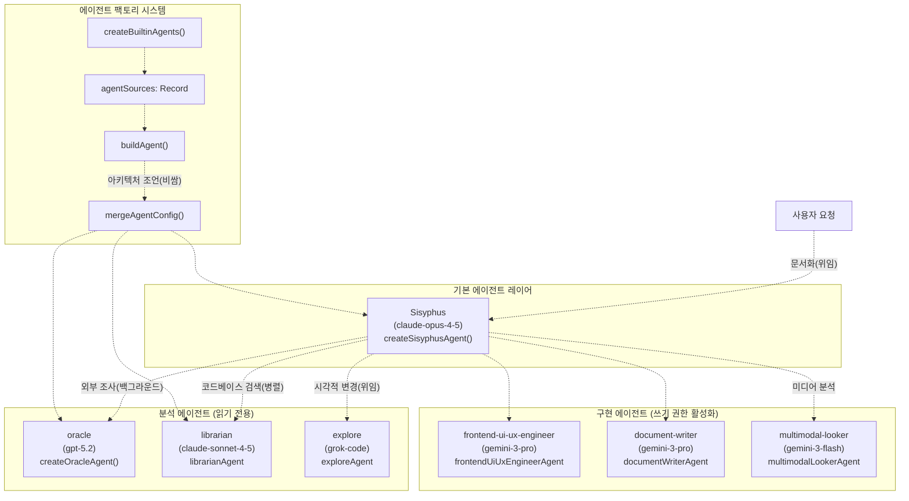
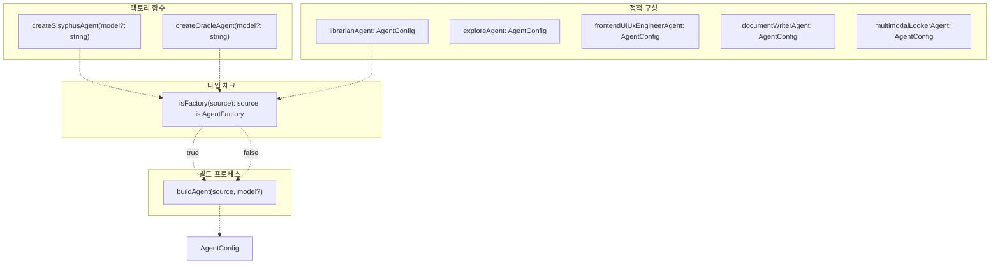
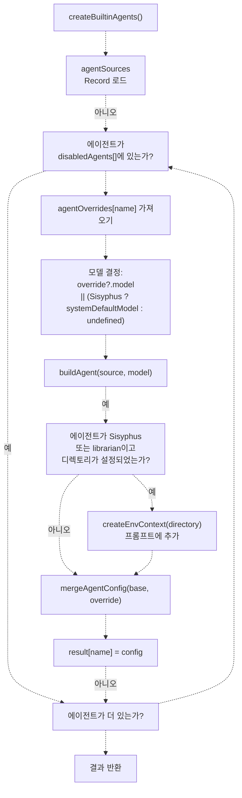
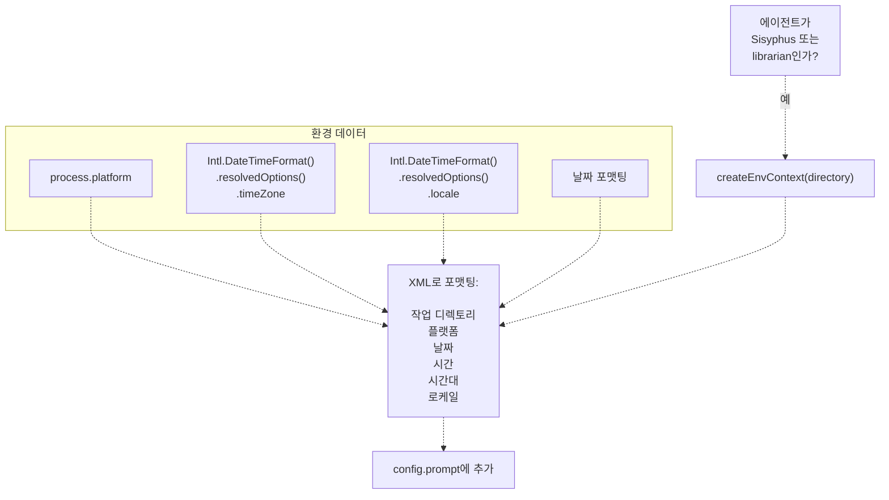
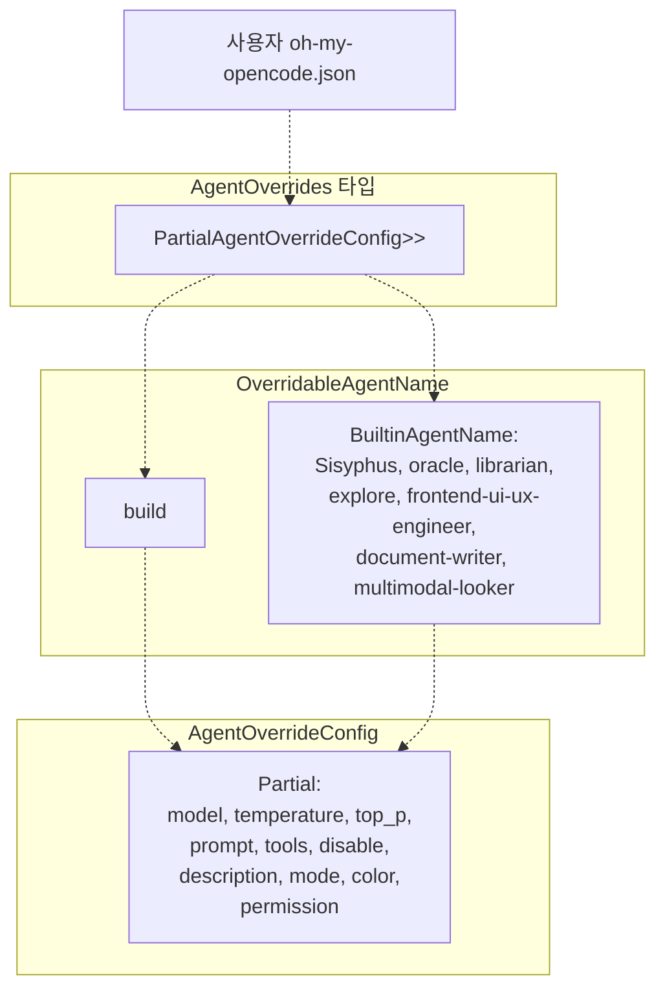

# 에이전트 시스템 (Agent System)

> **관련 소스 파일**
> * [.github/assets/sisyphus.png](https://github.com/code-yeongyu/oh-my-opencode/blob/b92cd6ab/.github/assets/sisyphus.png)
> * [README.ja.md](https://github.com/code-yeongyu/oh-my-opencode/blob/b92cd6ab/README.ja.md)
> * [README.ko.md](https://github.com/code-yeongyu/oh-my-opencode/blob/b92cd6ab/README.ko.md)
> * [README.md](https://github.com/code-yeongyu/oh-my-opencode/blob/b92cd6ab/README.md)
> * [README.zh-cn.md](https://github.com/code-yeongyu/oh-my-opencode/blob/b92cd6ab/README.zh-cn.md)
> * [src/agents/document-writer.ts](https://github.com/code-yeongyu/oh-my-opencode/blob/b92cd6ab/src/agents/document-writer.ts)
> * [src/agents/explore.ts](https://github.com/code-yeongyu/oh-my-opencode/blob/b92cd6ab/src/agents/explore.ts)
> * [src/agents/frontend-ui-ux-engineer.ts](https://github.com/code-yeongyu/oh-my-opencode/blob/b92cd6ab/src/agents/frontend-ui-ux-engineer.ts)
> * [src/agents/index.ts](https://github.com/code-yeongyu/oh-my-opencode/blob/b92cd6ab/src/agents/index.ts)
> * [src/agents/librarian.ts](https://github.com/code-yeongyu/oh-my-opencode/blob/b92cd6ab/src/agents/librarian.ts)
> * [src/agents/multimodal-looker.ts](https://github.com/code-yeongyu/oh-my-opencode/blob/b92cd6ab/src/agents/multimodal-looker.ts)
> * [src/agents/oracle.ts](https://github.com/code-yeongyu/oh-my-opencode/blob/b92cd6ab/src/agents/oracle.ts)
> * [src/agents/sisyphus.ts](https://github.com/code-yeongyu/oh-my-opencode/blob/b92cd6ab/src/agents/sisyphus.ts)
> * [src/agents/types.ts](https://github.com/code-yeongyu/oh-my-opencode/blob/b92cd6ab/src/agents/types.ts)
> * [src/agents/utils.test.ts](https://github.com/code-yeongyu/oh-my-opencode/blob/b92cd6ab/src/agents/utils.test.ts)
> * [src/agents/utils.ts](https://github.com/code-yeongyu/oh-my-opencode/blob/b92cd6ab/src/agents/utils.ts)
> * [src/shared/config-path.ts](https://github.com/code-yeongyu/oh-my-opencode/blob/b92cd6ab/src/shared/config-path.ts)

에이전트 시스템은 전문화된 AI 에이전트가 개발 작업의 다양한 측면을 처리하는 계층적 오케스트레이션(orchestration) 모델을 제공합니다. Sisyphus는 기본 오케스트레이터 역할을 수행하며, 작업의 성격에 따라 분석 에이전트(읽기 전용)와 구현 에이전트(쓰기 권한 활성화)에게 작업을 위임합니다. 병렬 에이전트 작업을 가능하게 하는 백그라운드 작업 실행에 대한 정보는 [백그라운드 실행 시스템(Background Execution System)](../background-execution/)을 참조하십시오.

**출처**: [README.md L1-L1630](https://github.com/code-yeongyu/oh-my-opencode/blob/b92cd6ab/README.md#L1-L1630)

 [src/agents/index.ts L1-L22](https://github.com/code-yeongyu/oh-my-opencode/blob/b92cd6ab/src/agents/index.ts#L1-L22)

## 에이전트 계층 구조 및 역할 (Agent Hierarchy and Roles)

시스템은 7개의 내장 에이전트를 정의하며, 각 에이전트는 신중하게 선택된 모델을 통해 특정 작업에 최적화되어 있습니다.

| 에이전트 이름 | 모델 | 역할 | 액세스 수준 | 비용 계층 |
| --- | --- | --- | --- | --- |
| `Sisyphus` | `anthropic/claude-opus-4-5` | 기본 오케스트레이터, 작업 위임, 병렬 실행 | 전체 (Full) | 높음 |
| `oracle` | `openai/gpt-5.2` | 아키텍처 결정, 코드 리뷰, 디버깅 상담 | 읽기 + 자문 | 비쌈 |
| `librarian` | `anthropic/claude-sonnet-4-5` | 외부 문서, OSS 조사, 구현 사례 | 읽기 + 외부 | 저렴 |
| `explore` | `opencode/grok-code` | 빠른 코드베이스 검색, 패턴 매칭, 파일 탐색 | 읽기 | 무료 |
| `frontend-ui-ux-engineer` | `google/gemini-3-pro-preview` | 시각적 디자인, UI/UX 구현 | 쓰기 | 중간 |
| `document-writer` | `google/gemini-3-pro-preview` | 기술 문서 작성, 산문 생성 | 쓰기 | 중간 |
| `multimodal-looker` | `google/gemini-3-flash` | 이미지/PDF 분석, 시각적 콘텐츠 추출 | 읽기 | 저렴 |

**출처**: [README.md L486-L506](https://github.com/code-yeongyu/oh-my-opencode/blob/b92cd6ab/README.md#L486-L506)

 [src/agents/index.ts L10-L18](https://github.com/code-yeongyu/oh-my-opencode/blob/b92cd6ab/src/agents/index.ts#L10-L18)

## 시스템 아키텍처 (System Architecture)



**출처**: [src/agents/utils.ts L12-L22](https://github.com/code-yeongyu/oh-my-opencode/blob/b92cd6ab/src/agents/utils.ts#L12-L22)

 [src/agents/utils.ts L72-L105](https://github.com/code-yeongyu/oh-my-opencode/blob/b92cd6ab/src/agents/utils.ts#L72-L105)

 [src/agents/sisyphus.ts L1-L445](https://github.com/code-yeongyu/oh-my-opencode/blob/b92cd6ab/src/agents/sisyphus.ts#L1-L445)

## 에이전트 팩토리 패턴 (Agent Factory Pattern)

시스템은 모델 종속적 구성을 지원하기 위해 팩토리 패턴(factory pattern)을 사용합니다. 일부 에이전트는 팩토리 함수로 정의되고, 다른 에이전트는 정적 구성으로 정의됩니다.



[src/agents/utils.ts L28-L30](https://github.com/code-yeongyu/oh-my-opencode/blob/b92cd6ab/src/agents/utils.ts#L28-L30)에 있는 `buildAgent()` 함수는 [src/agents/utils.ts L24-L26](https://github.com/code-yeongyu/oh-my-opencode/blob/b92cd6ab/src/agents/utils.ts#L24-L26)의 타입 가드(type guard) `isFactory()`를 사용하여 소스가 팩토리 함수인지 확인합니다.

팩토리 함수는 모델 파라미터에 따라 동적 구성을 가능하게 하며, 특히 Claude(확장 사고)와 GPT(추론 노력) 모델 간의 차이를 처리하는 데 유용합니다.

**출처**: [src/agents/utils.ts L12-L30](https://github.com/code-yeongyu/oh-my-opencode/blob/b92cd6ab/src/agents/utils.ts#L12-L30)

 [src/agents/types.ts L1-L27](https://github.com/code-yeongyu/oh-my-opencode/blob/b92cd6ab/src/agents/types.ts#L1-L27)

## 모델 종속적 구성 (Model-Dependent Configuration)

팩토리 함수를 사용하는 에이전트는 제공된 모델에 따라 구성을 조정합니다.

### Sisyphus 에이전트 구성

[src/agents/sisyphus.ts L1-L445](https://github.com/code-yeongyu/oh-my-opencode/blob/b92cd6ab/src/agents/sisyphus.ts#L1-L445)의 `createSisyphusAgent()` 함수는 모델별 설정을 적용합니다.

| 모델 유형 | 감지 방법 | 구성 |
| --- | --- | --- |
| GPT 모델 | `isGptModel(model)`이 `true` 반환 | `reasoningEffort: "medium"` |
| Claude 모델 (기본값) | 기타 모든 모델 | `thinking: { type: "enabled", budgetTokens: 32000 }` |

모델 감지는 패턴 매칭을 사용합니다: [src/agents/types.ts L5-L7](https://github.com/code-yeongyu/oh-my-opencode/blob/b92cd6ab/src/agents/types.ts#L5-L7)

```javascript
export function isGptModel(model: string): boolean {
  return model.startsWith("openai/") || model.startsWith("github-copilot/gpt-")
}
```

**출처**: [src/agents/types.ts L5-L7](https://github.com/code-yeongyu/oh-my-opencode/blob/b92cd6ab/src/agents/types.ts#L5-L7)

 [src/agents/sisyphus.ts L1-L10](https://github.com/code-yeongyu/oh-my-opencode/blob/b92cd6ab/src/agents/sisyphus.ts#L1-L10)

 [src/agents/utils.test.ts L5-L87](https://github.com/code-yeongyu/oh-my-opencode/blob/b92cd6ab/src/agents/utils.test.ts#L5-L87)

### Oracle 에이전트 구성

Sisyphus와 마찬가지로 `createOracleAgent()` 함수는 모델에 따라 구성을 조정합니다.

* **GPT 모델**: `reasoningEffort: "medium"`, `textVerbosity: "high"`
* **Claude 모델**: `thinking: { type: "enabled", budgetTokens: 32000 }`

[src/agents/utils.test.ts L45-L72](https://github.com/code-yeongyu/oh-my-opencode/blob/b92cd6ab/src/agents/utils.test.ts#L45-L72)의 테스트는 이러한 동작을 검증하며, 모델을 재정의할 때 에이전트 구성이 적절하게 재빌드되는지 확인합니다.

**출처**: [src/agents/utils.test.ts L45-L87](https://github.com/code-yeongyu/oh-my-opencode/blob/b92cd6ab/src/agents/utils.test.ts#L45-L87)

 [src/agents/oracle.ts L1-L50](https://github.com/code-yeongyu/oh-my-opencode/blob/b92cd6ab/src/agents/oracle.ts#L1-L50)

## 에이전트 생성 흐름 (Agent Creation Flow)



[src/agents/utils.ts L72-L105](https://github.com/code-yeongyu/oh-my-opencode/blob/b92cd6ab/src/agents/utils.ts#L72-L105)에 있는 `createBuiltinAgents()` 함수는 다음 단계에 따라 에이전트 생성을 오케스트레이션합니다.

1. **에이전트 소스 반복**: [src/agents/utils.ts L14-L22](https://github.com/code-yeongyu/oh-my-opencode/blob/b92cd6ab/src/agents/utils.ts#L14-L22)의 `agentSources` 객체를 루프 처리합니다.
2. **비활성화 목록 확인**: 에이전트 이름이 [src/agents/utils.ts L83-L85](https://github.com/code-yeongyu/oh-my-opencode/blob/b92cd6ab/src/agents/utils.ts#L83-L85)의 `disabledAgents` 배열에 있으면 건너뜁니다.
3. **모델 확인**: [src/agents/utils.ts L87-L88](https://github.com/code-yeongyu/oh-my-opencode/blob/b92cd6ab/src/agents/utils.ts#L87-L88)에서 재정의된 모델을 사용하거나, Sisyphus의 경우 `systemDefaultModel`을 사용하고, 그렇지 않으면 정의되지 않은 상태로 둡니다.
4. **기본 구성 빌드**: [src/agents/utils.ts L90](https://github.com/code-yeongyu/oh-my-opencode/blob/b92cd6ab/src/agents/utils.ts#L90-L90)에서 소스와 모델을 사용하여 `buildAgent()`를 호출합니다.
5. **환경 컨텍스트 주입**: Sisyphus 및 librarian의 경우, [src/agents/utils.ts L92-L95](https://github.com/code-yeongyu/oh-my-opencode/blob/b92cd6ab/src/agents/utils.ts#L92-L95)에서 환경 정보(날짜, 시간, 시간대, 플랫폼)를 프롬프트에 추가합니다.
6. **재정의 적용**: [src/agents/utils.ts L97-L99](https://github.com/code-yeongyu/oh-my-opencode/blob/b92cd6ab/src/agents/utils.ts#L97-L99)에서 `mergeAgentConfig()`를 통해 사용자가 제공한 재정의 사항을 병합합니다.
7. **결과에 추가**: [src/agents/utils.ts L101](https://github.com/code-yeongyu/oh-my-opencode/blob/b92cd6ab/src/agents/utils.ts#L101-L101)에서 최종 구성을 결과 맵에 저장합니다.

**출처**: [src/agents/utils.ts L72-L105](https://github.com/code-yeongyu/oh-my-opencode/blob/b92cd6ab/src/agents/utils.ts#L72-L105)

 [src/agents/utils.ts L32-L63](https://github.com/code-yeongyu/oh-my-opencode/blob/b92cd6ab/src/agents/utils.ts#L32-L63)

 [src/agents/utils.ts L65-L70](https://github.com/code-yeongyu/oh-my-opencode/blob/b92cd6ab/src/agents/utils.ts#L65-L70)

## 환경 컨텍스트 주입 (Environment Context Injection)

Sisyphus 및 librarian 에이전트는 프롬프트에 추가된 런타임 환경 정보를 수신합니다.



[src/agents/utils.ts L32-L63](https://github.com/code-yeongyu/oh-my-opencode/blob/b92cd6ab/src/agents/utils.ts#L32-L63)에 있는 `createEnvContext()` 함수는 다음을 포함하는 포맷팅된 문자열을 생성합니다.

* 작업 디렉토리 경로
* 플랫폼 (darwin/linux/win32)
* 명시적인 "NOT 2024" 경고가 포함된 현재 날짜
* 시간대가 포함된 현재 시간
* 로케일(Locale) 정보

이 컨텍스트는 에이전트가 시간 및 플랫폼을 인식하여 결정을 내리는 데 도움을 줍니다.

**출처**: [src/agents/utils.ts L32-L63](https://github.com/code-yeongyu/oh-my-opencode/blob/b92cd6ab/src/agents/utils.ts#L32-L63)

 [src/agents/utils.ts L92-L95](https://github.com/code-yeongyu/oh-my-opencode/blob/b92cd6ab/src/agents/utils.ts#L92-L95)

## 구성 및 재정의 (Configuration and Overrides)

에이전트는 `oh-my-opencode.json`의 구성 객체를 통해 커스터마이징할 수 있습니다.

### 재정의 구조 (Override Structure)



[src/agents/types.ts L9-L26](https://github.com/code-yeongyu/oh-my-opencode/blob/b92cd6ab/src/agents/types.ts#L9-L26)의 타입 시스템은 다음을 정의합니다.

* `BuiltinAgentName`: 모든 내장 에이전트 이름의 유니온 타입
* `OverridableAgentName`: 레거시 지원을 위해 내장 이름에 `"build"`를 추가
* `AgentOverrideConfig`: 선택적 필드 재정의를 허용하는 부분적인 `AgentConfig`
* `AgentOverrides`: 에이전트 이름을 재정의 구성에 매핑하는 레코드

**출처**: [src/agents/types.ts L9-L27](https://github.com/code-yeongyu/oh-my-opencode/blob/b92cd6ab/src/agents/types.ts#L9-L27)

 [README.md L750-L805](https://github.com/code-yeongyu/oh-my-opencode/blob/b92cd6ab/README.md#L750-L805)

### 딥 머지 전략 (Deep Merge Strategy)

[src/agents/utils.ts L65-L70](https://github.com/code-yeongyu/oh-my-opencode/blob/b92cd6ab/src/agents/utils.ts#L65-L70)의 `mergeAgentConfig()` 함수는 딥 머지(deep merge)를 사용하여 기본 구성과 재정의 사항을 결합합니다.

```javascript
function mergeAgentConfig(
  base: AgentConfig,
  override: AgentOverrideConfig
): AgentConfig {
  return deepMerge(base, override as Partial<AgentConfig>)
}
```

이를 통해 중첩된 속성(`permission` 객체 등)이 교체되지 않고 병합되도록 보장합니다.

**출처**: [src/agents/utils.ts L65-L70](https://github.com/code-yeongyu/oh-my-opencode/blob/b92cd6ab/src/agents/utils.ts#L65-L70)

 [src/agents/utils.ts L10](https://github.com/code-yeongyu/oh-my-opencode/blob/b92cd6ab/src/agents/utils.ts#L10-L10)

## 에이전트 전문화 세부 사항 (Agent Specialization Details)

### Sisyphus: 오케스트레이터

Sisyphus는 [src/agents/sisyphus.ts L6-L445](https://github.com/code-yeongyu/oh-my-opencode/blob/b92cd6ab/src/agents/sisyphus.ts#L6-L445)의 시스템 프롬프트에 정의된 3단계 워크플로우를 통해 작동합니다.

**단계 0 - 의도 게이트 (Intent Gate)**: 모든 요청을 사소함(Trivial), 명시적(Explicit), 탐색적(Exploratory), 개방형(Open-ended) 또는 모호함(Ambiguous)으로 분류합니다. 외부 라이브러리나 여러 모듈이 언급되면 백그라운드 에이전트를 선제적으로 트리거합니다.

**단계 1 - 코드베이스 평가 (Codebase Assessment)**: 개방형 작업의 경우, 코드베이스 성숙도(규율적, 과도기적, 레거시/혼란, 또는 신규 프로젝트)를 평가하여 기존 패턴을 따를지 아니면 개선 사항을 제안할지 결정합니다.

**단계 2A - 탐색 및 조사 (Exploration & Research)**: 비용과 복잡성을 기준으로 도구를 선택합니다. `explore`/`librarian` 에이전트를 각각 "컨텍스트 grep" 및 "참조 grep"으로 사용하며, 이들을 백그라운드 작업으로 병렬 실행합니다.

**단계 2B - 구현 (Implementation)**: 상세한 TODO 목록을 작성하고, 프론트엔드 시각적 작업은 `frontend-ui-ux-engineer`에게 위임하며, 비즈니스 로직은 직접 처리합니다.

**출처**: [src/agents/sisyphus.ts L6-L445](https://github.com/code-yeongyu/oh-my-opencode/blob/b92cd6ab/src/agents/sisyphus.ts#L6-L445)

 [README.md L486-L496](https://github.com/code-yeongyu/oh-my-opencode/blob/b92cd6ab/README.md#L486-L496)

### 분석 에이전트 역할

**Oracle** (`openai/gpt-5.2`): Sisyphus 프롬프트에서 "EXPENSIVE(비쌈)"로 표시됩니다. 아키텍처 결정, 2회 이상의 실패 후 복잡한 디버깅, 또는 전략적 코드 리뷰를 위해서만 상담합니다. 논리적 추론과 깊은 분석을 위해 GPT-5.2를 사용합니다.

**Librarian** (`anthropic/claude-sonnet-4-5`): 외부 리소스(공식 문서, OSS 저장소, 웹)를 검색합니다. "[라이브러리]를 어떻게 사용하나요?"와 같은 문구에 의해 트리거되거나 익숙하지 않은 의존성으로 작업할 때 호출됩니다. `context7`, `websearch_exa`, `grep_app`과 같은 MCP에 액세스할 수 있습니다.

**Explore** (`opencode/grok-code`): 내부 코드베이스 검색을 수행합니다. 여러 검색 관점이 필요하거나 모듈 구조가 익숙하지 않을 때 실행됩니다. 속도와 비용 효율성을 위해 무료 티어 모델(Grok Code)이 선택되었습니다.

**출처**: [src/agents/sisyphus.ts L110-L183](https://github.com/code-yeongyu/oh-my-opencode/blob/b92cd6ab/src/agents/sisyphus.ts#L110-L183)

 [README.md L486-L506](https://github.com/code-yeongyu/oh-my-opencode/blob/b92cd6ab/README.md#L486-L506)

### 구현 에이전트 역할

**Frontend UI/UX Engineer** (`google/gemini-3-pro-preview`): 시각적 변경(색상, 간격, 레이아웃, 애니메이션)을 처리합니다. Sisyphus는 모든 시각적 수정을 위임하지만 순수 로직(API 호출, 상태 관리)은 직접 처리합니다.

**Document Writer** (`google/gemini-3-pro-preview`): 기술 문서 생성을 담당합니다. Gemini 모델은 산문 및 구조화된 글쓰기에 탁월합니다.

**Multimodal Looker** (`google/gemini-3-flash`): `look_at` 도구를 사용하여 이미지, PDF 및 다이어그램을 분석합니다. 미디어 파일에서 관련 정보만 추출하여 컨텍스트 비대화를 방지합니다.

**출처**: [src/agents/sisyphus.ts L193-L220](https://github.com/code-yeongyu/oh-my-opencode/blob/b92cd6ab/src/agents/sisyphus.ts#L193-L220)

 [README.md L486-L506](https://github.com/code-yeongyu/oh-my-opencode/blob/b92cd6ab/README.md#L486-L506)

## 구성 파일 위치 (Configuration File Locations)

에이전트 재정의는 표준 구성 계층 구조에 따라 두 위치에서 지정할 수 있습니다.

| 위치 | 경로 | 우선순위 |
| --- | --- | --- |
| 프로젝트 구성 | `.opencode/oh-my-opencode.json` | 높음 |
| 사용자 구성 | `~/.config/opencode/oh-my-opencode.json` (Linux/macOS)<br>`%APPDATA%\opencode\oh-my-opencode.json` (Windows fallback) | 낮음 |

구성 시스템은 [src/shared/config-path.ts L1-L48](https://github.com/code-yeongyu/oh-my-opencode/blob/b92cd6ab/src/shared/config-path.ts#L1-L48)의 헬퍼 함수를 사용합니다.

* `getUserConfigDir()`: [src/shared/config-path.ts L13-L33](https://github.com/code-yeongyu/oh-my-opencode/blob/b92cd6ab/src/shared/config-path.ts#L13-L33)에서 크로스 플랫폼 Windows 지원을 포함한 사용자 구성 디렉토리를 반환합니다.
* `getUserConfigPath()`: [src/shared/config-path.ts L38-L40](https://github.com/code-yeongyu/oh-my-opencode/blob/b92cd6ab/src/shared/config-path.ts#L38-L40)에서 사용자 수준 구성의 전체 경로를 반환합니다.
* `getProjectConfigPath()`: [src/shared/config-path.ts L45-L47](https://github.com/code-yeongyu/oh-my-opencode/blob/b92cd6ab/src/shared/config-path.ts#L45-L47)에서 프로젝트 수준 구성의 전체 경로를 반환합니다.

**출처**: [src/shared/config-path.ts L1-L48](https://github.com/code-yeongyu/oh-my-opencode/blob/b92cd6ab/src/shared/config-path.ts#L1-L48)

 [README.md L707-L723](https://github.com/code-yeongyu/oh-my-opencode/blob/b92cd6ab/README.md#L707-L723)
