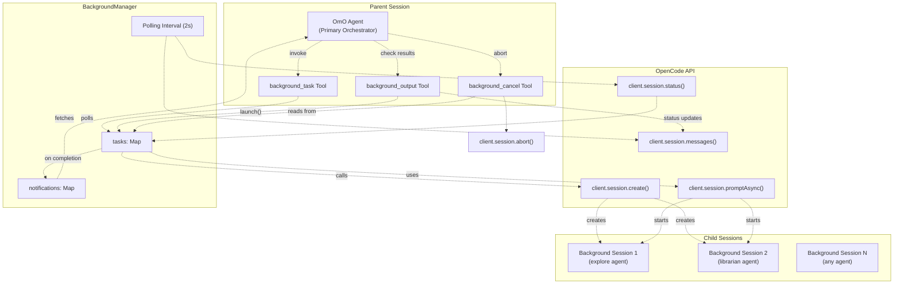
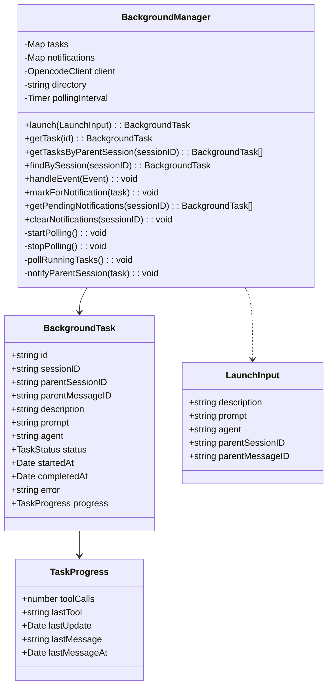
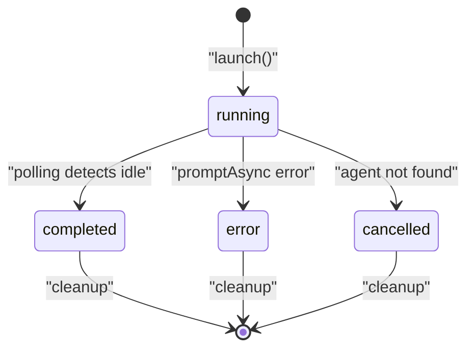
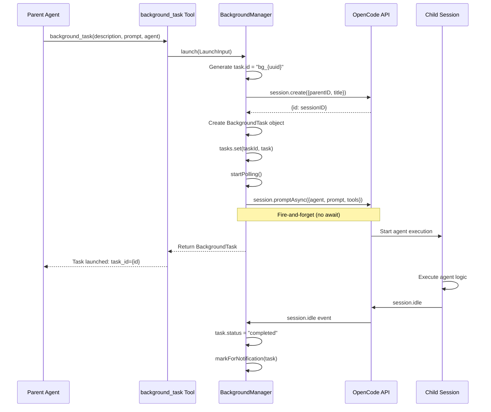
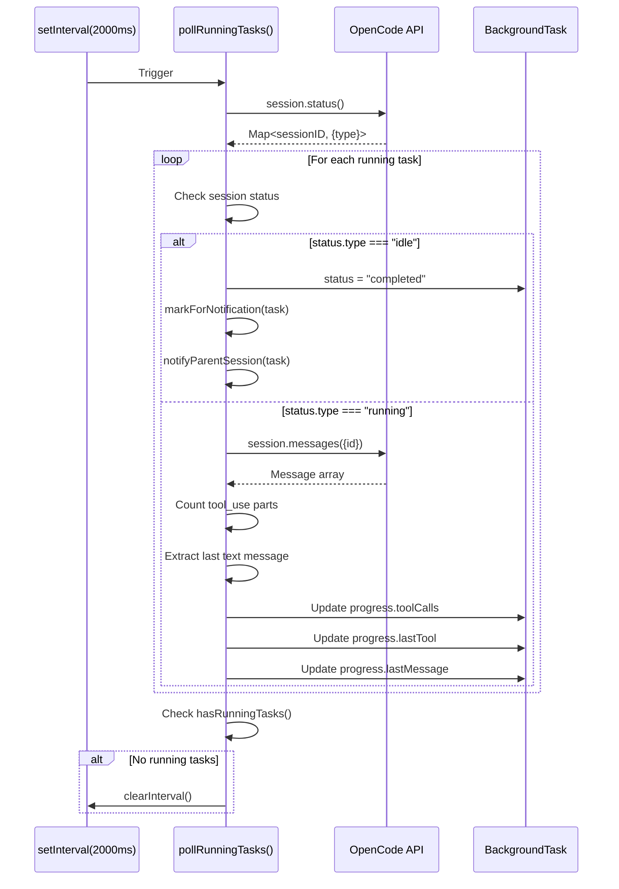
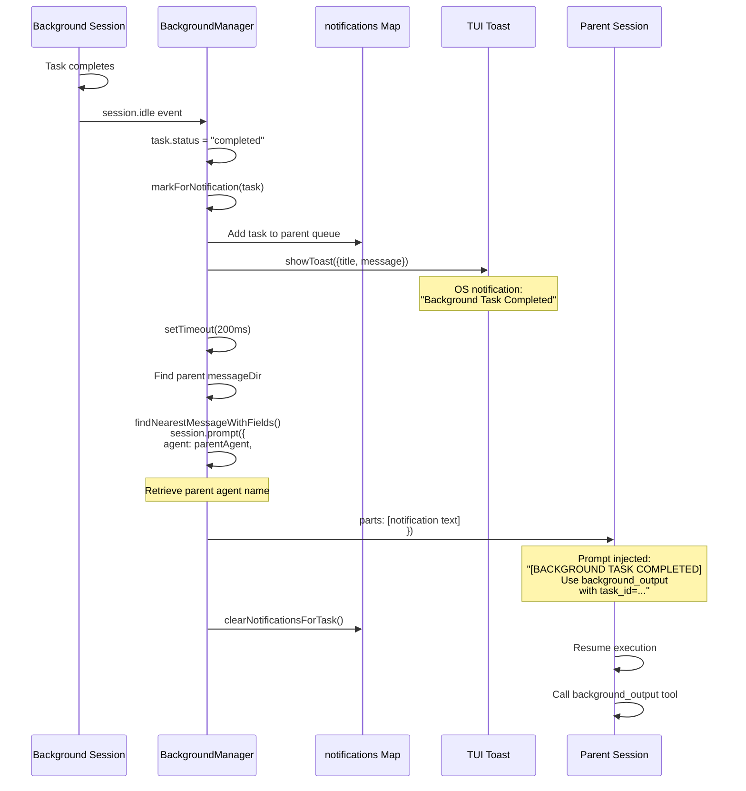
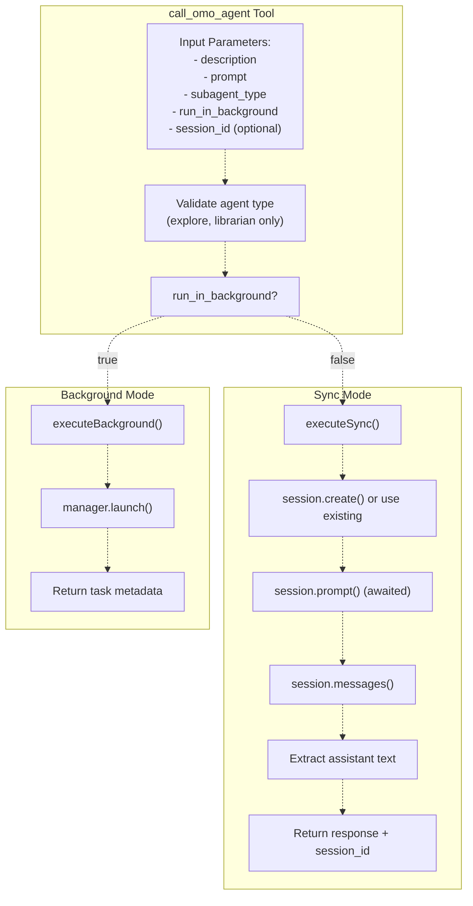

# 백그라운드 태스크 시스템 (Background Task System)

> **관련 소스 파일**
> * [.opencode/background-tasks.json](https://github.com/code-yeongyu/oh-my-opencode/blob/b92cd6ab/.opencode/background-tasks.json)
> * [README.ja.md](https://github.com/code-yeongyu/oh-my-opencode/blob/b92cd6ab/README.ja.md)
> * [README.ko.md](https://github.com/code-yeongyu/oh-my-opencode/blob/b92cd6ab/README.ko.md)
> * [README.md](https://github.com/code-yeongyu/oh-my-opencode/blob/b92cd6ab/README.md)
> * [README.zh-cn.md](https://github.com/code-yeongyu/oh-my-opencode/blob/b92cd6ab/README.zh-cn.md)
> * [src/features/background-agent/index.ts](https://github.com/code-yeongyu/oh-my-opencode/blob/b92cd6ab/src/features/background-agent/index.ts)
> * [src/features/background-agent/manager.test.ts](https://github.com/code-yeongyu/oh-my-opencode/blob/b92cd6ab/src/features/background-agent/manager.test.ts)
> * [src/features/background-agent/manager.ts](https://github.com/code-yeongyu/oh-my-opencode/blob/b92cd6ab/src/features/background-agent/manager.ts)
> * [src/features/background-agent/types.ts](https://github.com/code-yeongyu/oh-my-opencode/blob/b92cd6ab/src/features/background-agent/types.ts)
> * [src/shared/config-path.ts](https://github.com/code-yeongyu/oh-my-opencode/blob/b92cd6ab/src/shared/config-path.ts)
> * [src/tools/background-task/tools.ts](https://github.com/code-yeongyu/oh-my-opencode/blob/b92cd6ab/src/tools/background-task/tools.ts)
> * [src/tools/call-omo-agent/tools.ts](https://github.com/code-yeongyu/oh-my-opencode/blob/b92cd6ab/src/tools/call-omo-agent/tools.ts)

## 목적 및 범위

백그라운드 태스크 시스템은 oh-my-opencode에서 특화된 에이전트의 병렬 실행을 가능하게 합니다. 메인 오케스트레이터(orchestrator, 조정자)인 OmO가 비동기적으로 실행되는 서브 에이전트에게 작업을 위임할 수 있도록 하여, 기본 세션을 차단하지 않고 진정한 동시 실행을 구현합니다. 이 시스템은 태스크 생성, 생명주기 관리, 상태 추적 및 완료 알림을 처리합니다.

백그라운드 태스크로 호출할 수 있는 에이전트에 대한 정보는 [에이전트 시스템](../agents/)을 참조하십시오. 이 시스템과 상호작용하는 특정 도구에 대한 자세한 내용은 [백그라운드 도구](/code-yeongyu/oh-my-opencode/6.2-task-execution-and-polling)를 참조하십시오. 부모 세션에 알리는 데 사용되는 알림 메커니즘은 [알림 시스템](/code-yeongyu/oh-my-opencode/6.3-notification-system)을 참조하십시오.

## 시스템 개요

백그라운드 태스크 시스템은 세 가지 주요 구성 요소로 이루어집니다:

1. **BackgroundManager**: 태스크 생명주기, 상태 추적 및 알림을 관리하는 중앙 코디네이터
2. **백그라운드 도구 (Background Tools)**: 에이전트가 백그라운드 태스크를 생성하고 상호작용할 수 있는 인터페이스를 제공하는 세 가지 도구(`background_task`, `background_output`, `background_cancel`)
3. **세션 통합 (Session Integration)**: 각 백그라운드 태스크에 대해 자식 세션을 생성하는 OpenCode 세션 관리



**출처:** [src/features/background-agent/manager.ts L1-L391](https://github.com/code-yeongyu/oh-my-opencode/blob/b92cd6ab/src/features/background-agent/manager.ts#L1-L391)

 [src/tools/background-task/tools.ts L1-L301](https://github.com/code-yeongyu/oh-my-opencode/blob/b92cd6ab/src/tools/background-task/tools.ts#L1-L301)

## BackgroundManager 클래스

`BackgroundManager` 클래스는 모든 백그라운드 태스크 작업의 핵심 코디네이터입니다. 태스크 상태를 유지하고, 진행 상황을 추적하며, 알림 시스템을 관리합니다.

### 데이터 구조



**태스크 상태 맵 (Task State Map)**: `tasks` 맵은 태스크 ID(`bg_{uuid}` 형식)로 인덱싱된 모든 활성 및 완료된 백그라운드 태스크를 저장합니다. 각 항목에는 세션 ID, 에이전트 유형, 상태 및 진행 정보를 포함한 전체 태스크 메타데이터가 포함됩니다.

**알림 큐 (Notification Queue)**: `notifications` 맵은 부모 세션 ID를 키로 하여 부모 세션에 알림을 보낼 대기 중인 태스크들을 저장합니다. 태스크가 완료되면 이 큐에 추가되고, 부모 세션에 알림이 전달된 후 제거됩니다.

**출처:** [src/features/background-agent/manager.ts L47-L59](https://github.com/code-yeongyu/oh-my-opencode/blob/b92cd6ab/src/features/background-agent/manager.ts#L47-L59)

 [src/features/background-agent/types.ts](https://github.com/code-yeongyu/oh-my-opencode/blob/b92cd6ab/src/features/background-agent/types.ts)

## 태스크 생명주기

백그라운드 태스크는 다섯 가지 가능한 상태를 가진 잘 정의된 생명주기를 거칩니다:



### 상태 전이

| 전이 | 트리거 | 구현 |
| --- | --- | --- |
| → `running` | `launch()` 호출됨 | 자식 세션을 생성하고 `promptAsync()`를 통해 프롬프트를 전송 [src/features/background-agent/manager.ts L61-L129](https://github.com/code-yeongyu/oh-my-opencode/blob/b92cd6ab/src/features/background-agent/manager.ts#L61-L129) |
| `running` → `completed` | 세션이 유휴(idle) 상태가 됨 | `session.idle` 이벤트 또는 폴링을 통해 감지 [src/features/background-agent/manager.ts L179-L191](https://github.com/code-yeongyu/oh-my-opencode/blob/b92cd6ab/src/features/background-agent/manager.ts#L179-L191) <br>  [316-338](https://github.com/code-yeongyu/oh-my-opencode/blob/b92cd6ab/316-338) |
| `running` → `error` | 실행 실패 | `promptAsync()` catch 블록 또는 에이전트를 찾을 수 없음 [src/features/background-agent/manager.ts L111-L126](https://github.com/code-yeongyu/oh-my-opencode/blob/b92cd6ab/src/features/background-agent/manager.ts#L111-L126) |
| `running` → `cancelled` | 수동 취소 | `background_cancel` 도구 또는 `session.deleted` 이벤트 [src/features/background-agent/manager.ts L193-L209](https://github.com/code-yeongyu/oh-my-opencode/blob/b92cd6ab/src/features/background-agent/manager.ts#L193-L209) <br>  [src/tools/background-task/tools.ts L262-L300](https://github.com/code-yeongyu/oh-my-opencode/blob/b92cd6ab/src/tools/background-task/tools.ts#L262-L300) |

**출처:** [src/features/background-agent/manager.ts L61-L210](https://github.com/code-yeongyu/oh-my-opencode/blob/b92cd6ab/src/features/background-agent/manager.ts#L61-L210)

 [src/tools/background-task/tools.ts L262-L300](https://github.com/code-yeongyu/oh-my-opencode/blob/b92cd6ab/src/tools/background-task/tools.ts#L262-L300)

### 실행 프로세스 (Launch Process)

태스크 실행 시퀀스는 자식 세션을 생성하고 에이전트 실행을 시작하는 과정을 포함합니다:



**주요 구현 세부 사항:**

1. **태스크 ID 생성**: 짧고 고유한 식별자를 위해 `bg_{uuid.slice(0,8)}` 형식을 사용합니다. [src/features/background-agent/manager.ts L80](https://github.com/code-yeongyu/oh-my-opencode/blob/b92cd6ab/src/features/background-agent/manager.ts#L80-L80)
2. **자식 세션 생성**: 세션을 계층적으로 연결하기 위해 `parentID`를 설정합니다. [src/features/background-agent/manager.ts L66-L77](https://github.com/code-yeongyu/oh-my-opencode/blob/b92cd6ab/src/features/background-agent/manager.ts#L66-L77)
3. **도구 제한**: 재귀 호출을 방지하기 위해 백그라운드 세션에서는 `task`, `call_omo_agent`, `background_task` 도구를 비활성화합니다. [src/features/background-agent/manager.ts L104-L108](https://github.com/code-yeongyu/oh-my-opencode/blob/b92cd6ab/src/features/background-agent/manager.ts#L104-L108)
4. **비동기 실행**: `await` 없이 `promptAsync()`를 사용하여 즉시 반환할 수 있도록 합니다. [src/features/background-agent/manager.ts L100](https://github.com/code-yeongyu/oh-my-opencode/blob/b92cd6ab/src/features/background-agent/manager.ts#L100-L100)
5. **에러 처리**: 에이전트를 찾을 수 없는 에러를 포착하고 설명적인 에러 메시지를 설정합니다. [src/features/background-agent/manager.ts L117-L119](https://github.com/code-yeongyu/oh-my-opencode/blob/b92cd6ab/src/features/background-agent/manager.ts#L117-L119)

**출처:** [src/features/background-agent/manager.ts L61-L129](https://github.com/code-yeongyu/oh-my-opencode/blob/b92cd6ab/src/features/background-agent/manager.ts#L61-L129)

 [src/tools/background-task/tools.ts L23-L63](https://github.com/code-yeongyu/oh-my-opencode/blob/b92cd6ab/src/tools/background-task/tools.ts#L23-L63)

## 진행 상황 추적

BackgroundManager는 이벤트 처리와 주기적인 폴링(polling)이라는 두 가지 메커니즘을 통해 태스크 진행 상황을 추적합니다.

### 이벤트 기반 추적

매니저는 세 가지 OpenCode 이벤트를 수신합니다:

```mermaid
flowchart TD

E1["message.part.updated"]
E2["session.idle"]
E3["session.deleted"]
H1["Extract sessionID"]
H2["Find task by session"]
H3["Update task state"]
UpdateProgress["Increment progress.toolCalls<br>Record progress.lastTool"]
MarkCompleted["status = 'completed'<br>completedAt = now<br>markForNotification()"]
MarkCancelled["status = 'cancelled'<br>tasks.delete()<br>clearNotifications()"]

E1 -.->|"type=tool"| H1
E2 -.->|"marks completed"| H1
E3 -.->|"marks cancelled"| H1
H3 -.->|"message.part.updated"| UpdateProgress
H3 -.->|"session.deleted"| MarkCompleted
H3 -.-> MarkCancelled

subgraph BackgroundManager.handleEvent() ["BackgroundManager.handleEvent()"]
    H1
    H2
    H3
    H1 -.-> H2
    H2 -.->|"session.idle"| H3
end

subgraph subGraph0 ["OpenCode Events"]
    E1
    E2
    E3
end
```

**도구 호출 추적**: `type=tool`인 각 `message.part.updated` 이벤트는 `progress.toolCalls` 카운터를 증가시키고 `progress.lastTool`에 도구 이름을 기록합니다. [src/features/background-agent/manager.ts L154-L177](https://github.com/code-yeongyu/oh-my-opencode/blob/b92cd6ab/src/features/background-agent/manager.ts#L154-L177)

**완료 감지**: `session.idle` 이벤트는 태스크를 완료된 것으로 표시하고 알림 시스템을 트리거합니다. [src/features/background-agent/manager.ts L179-L191](https://github.com/code-yeongyu/oh-my-opencode/blob/b92cd6ab/src/features/background-agent/manager.ts#L179-L191)

**정리 (Cleanup)**: `session.deleted` 이벤트는 메모리에서 태스크를 제거하고 대기 중인 알림을 삭제합니다. [src/features/background-agent/manager.ts L193-L209](https://github.com/code-yeongyu/oh-my-opencode/blob/b92cd6ab/src/features/background-agent/manager.ts#L193-L209)

**출처:** [src/features/background-agent/manager.ts L154-L210](https://github.com/code-yeongyu/oh-my-opencode/blob/b92cd6ab/src/features/background-agent/manager.ts#L154-L210)

### 폴링 메커니즘

2초 간격으로 실행 중인 태스크를 폴링하여 상세한 진행 상황을 가져옵니다:



**폴링 시작**: 첫 번째 태스크가 실행될 때 자동으로 시작됩니다. [src/features/background-agent/manager.ts L96](https://github.com/code-yeongyu/oh-my-opencode/blob/b92cd6ab/src/features/background-agent/manager.ts#L96-L96)

 [237-243](https://github.com/code-yeongyu/oh-my-opencode/blob/b92cd6ab/237-243)

**폴링 중지**: `running` 상태의 태스크가 더 이상 남지 않으면 자동으로 중지됩니다. [src/features/background-agent/manager.ts L245-L250](https://github.com/code-yeongyu/oh-my-opencode/blob/b92cd6ab/src/features/background-agent/manager.ts#L245-L250)

 [386-388](https://github.com/code-yeongyu/oh-my-opencode/blob/b92cd6ab/386-388)

**상태 확인**: 단일 호출로 모든 세션 상태를 가져오기 위해 `session.status()` API를 사용합니다. [src/features/background-agent/manager.ts L317-L318](https://github.com/code-yeongyu/oh-my-opencode/blob/b92cd6ab/src/features/background-agent/manager.ts#L317-L318)

**메시지 분석**: 메시지 파트(part)를 파싱하여 도구 호출 횟수를 세고 어시스턴트 텍스트를 추출합니다. [src/features/background-agent/manager.ts L344-L379](https://github.com/code-yeongyu/oh-my-opencode/blob/b92cd6ab/src/features/background-agent/manager.ts#L344-L379)

**출처:** [src/features/background-agent/manager.ts L237-L389](https://github.com/code-yeongyu/oh-my-opencode/blob/b92cd6ab/src/features/background-agent/manager.ts#L237-L389)

## 알림 시스템

백그라운드 태스크가 완료되면, 오케스트레이터가 결과를 회수하고 작업을 계속할 수 있도록 부모 세션에 알림을 보내야 합니다.

### 알림 흐름



**알림 큐**: 알림 전송 전 부모 세션 ID별로 태스크가 큐에 쌓입니다. [src/features/background-agent/manager.ts L212-L216](https://github.com/code-yeongyu/oh-my-opencode/blob/b92cd6ab/src/features/background-agent/manager.ts#L212-L216)

**이중 알림**: OS 토스트(TUI를 통해)와 프롬프트 주입(prompt injection)이 모두 발생합니다. [src/features/background-agent/manager.ts L259-L268](https://github.com/code-yeongyu/oh-my-opencode/blob/b92cd6ab/src/features/background-agent/manager.ts#L259-L268)

 [274-293](https://github.com/code-yeongyu/oh-my-opencode/blob/b92cd6ab/274-293)

**에이전트 보존**: 컨텍스트 유지를 위해 부모 세션의 에이전트 정보를 가져옵니다. [src/features/background-agent/manager.ts L276-L278](https://github.com/code-yeongyu/oh-my-opencode/blob/b92cd6ab/src/features/background-agent/manager.ts#L276-L278)

**주입 전 지연**: 200ms의 지연을 두어 세션 상태가 안정되도록 보장합니다. [src/features/background-agent/manager.ts L274](https://github.com/code-yeongyu/oh-my-opencode/blob/b92cd6ab/src/features/background-agent/manager.ts#L274-L274)

**메시지 형식**: 표준화된 알림에는 태스크 설명, 소요 시간 및 결과 회수 지침이 포함됩니다. [src/features/background-agent/manager.ts L270](https://github.com/code-yeongyu/oh-my-opencode/blob/b92cd6ab/src/features/background-agent/manager.ts#L270-L270)

**출처:** [src/features/background-agent/manager.ts L212-L293](https://github.com/code-yeongyu/oh-my-opencode/blob/b92cd6ab/src/features/background-agent/manager.ts#L212-L293)

 [src/hooks/background-notification/hook.ts](https://github.com/code-yeongyu/oh-my-opencode/blob/b92cd6ab/src/hooks/background-notification/hook.ts)

## 백그라운드 도구 (Background Tools)

에이전트가 백그라운드 태스크를 생성하고 상호작용할 수 있도록 세 가지 도구를 제공합니다.

### background_task 도구

새로운 백그라운드 태스크를 생성하고 실행합니다:

| 매개변수 | 타입 | 설명 |
| --- | --- | --- |
| `description` | string | 짧은 태스크 설명 (상태 표시용) |
| `prompt` | string | 에이전트를 위한 상세 프롬프트 전체 내용 |
| `agent` | string | 사용할 에이전트 유형 (등록된 모든 에이전트 가능) |

**반환 값**: `task.id`, `task.sessionID` 및 실행 상태를 포함한 태스크 메타데이터.

**구현**: 에이전트 매개변수를 검증하고, `manager.launch()`를 호출하며, 사용 지침과 함께 태스크 정보를 반환합니다. [src/tools/background-task/tools.ts L23-L63](https://github.com/code-yeongyu/oh-my-opencode/blob/b92cd6ab/src/tools/background-task/tools.ts#L23-L63)

**도구 제한**: 백그라운드 세션 내에서는 호출할 수 없습니다 (실행 시 비활성화됨). [src/features/background-agent/manager.ts L104-L108](https://github.com/code-yeongyu/oh-my-opencode/blob/b92cd6ab/src/features/background-agent/manager.ts#L104-L108)

**출처:** [src/tools/background-task/tools.ts L23-L63](https://github.com/code-yeongyu/oh-my-opencode/blob/b92cd6ab/src/tools/background-task/tools.ts#L23-L63)

### background_output 도구

백그라운드 태스크의 상태 또는 결과를 회수합니다:

| 매개변수 | 타입 | 기본값 | 설명 |
| --- | --- | --- | --- |
| `task_id` | string | - | 출력을 가져올 태스크 ID |
| `block` | boolean | `false` | 완료될 때까지 대기 (거의 필요하지 않음) |
| `timeout` | number | `60000` | 최대 대기 시간(ms) (최대: 600000) |

**비차단 모드 (Non-Blocking Mode)** (`block=false`): 진행 정보와 함께 즉각적인 상태를 반환합니다. [src/tools/background-task/tools.ts L225-L227](https://github.com/code-yeongyu/oh-my-opencode/blob/b92cd6ab/src/tools/background-task/tools.ts#L225-L227)

**차단 모드 (Blocking Mode)** (`block=true`): 완료되거나 타임아웃이 발생할 때까지 태스크 상태를 폴링합니다. [src/tools/background-task/tools.ts L229-L254](https://github.com/code-yeongyu/oh-my-opencode/blob/b92cd6ab/src/tools/background-task/tools.ts#L229-L254)

**상태 형식**: 태스크 메타데이터, 소요 시간, 진행 상황 및 마지막으로 사용된 도구가 포함된 마크다운 테이블을 반환합니다. [src/tools/background-task/tools.ts L74-L125](https://github.com/code-yeongyu/oh-my-opencode/blob/b92cd6ab/src/tools/background-task/tools.ts#L74-L125)

**결과 형식**: 메시지에서 추출된 전체 어시스턴트 응답 텍스트와 함께 태스크 결과를 반환합니다. [src/tools/background-task/tools.ts L127-L194](https://github.com/code-yeongyu/oh-my-opencode/blob/b92cd6ab/src/tools/background-task/tools.ts#L127-L194)

**출처:** [src/tools/background-task/tools.ts L196-L260](https://github.com/code-yeongyu/oh-my-opencode/blob/b92cd6ab/src/tools/background-task/tools.ts#L196-L260)

### background_cancel 도구

실행 중인 백그라운드 태스크를 취소합니다:

| 매개변수 | 타입 | 설명 |
| --- | --- | --- |
| `taskId` | string | 취소할 태스크 ID |

**검증**: `status="running"`인 태스크만 취소할 수 있습니다. [src/tools/background-task/tools.ts L275-L278](https://github.com/code-yeongyu/oh-my-opencode/blob/b92cd6ab/src/tools/background-task/tools.ts#L275-L278)

**세션 중단 (Session Abort)**: 부모 세션이 중단되는 것을 방지하기 위해 fire-and-forget 모드로 `session.abort()`를 호출합니다. [src/tools/background-task/tools.ts L282-L284](https://github.com/code-yeongyu/oh-my-opencode/blob/b92cd6ab/src/tools/background-task/tools.ts#L282-L284)

**상태 업데이트**: 즉시 태스크 상태를 `"cancelled"`로 업데이트하고 `completedAt`을 설정합니다. [src/tools/background-task/tools.ts L286-L287](https://github.com/code-yeongyu/oh-my-opencode/blob/b92cd6ab/src/tools/background-task/tools.ts#L286-L287)

**출처:** [src/tools/background-task/tools.ts L262-L300](https://github.com/code-yeongyu/oh-my-opencode/blob/b92cd6ab/src/tools/background-task/tools.ts#L262-L300)

## call_omo_agent와의 통합

`call_omo_agent` 도구는 백그라운드 실행을 지원하며, 특화된 에이전트를 호출하기 위한 상위 수준의 인터페이스를 제공합니다:



**에이전트 제한**: 이 도구를 통해서는 `explore` 및 `librarian` 에이전트만 허용됩니다. [src/tools/call-omo-agent/constants.ts](https://github.com/code-yeongyu/oh-my-opencode/blob/b92cd6ab/src/tools/call-omo-agent/constants.ts)

**백그라운드 모드**: `manager.launch()`에 위임하고 태스크 ID와 함께 즉시 반환합니다. [src/tools/call-omo-agent/tools.ts L48-L78](https://github.com/code-yeongyu/oh-my-opencode/blob/b92cd6ab/src/tools/call-omo-agent/tools.ts#L48-L78)

**동기 모드 (Sync Mode)**: 자식 세션을 생성하고, 완료될 때까지 기다린 후 전체 응답을 반환합니다. [src/tools/call-omo-agent/tools.ts L80-L178](https://github.com/code-yeongyu/oh-my-opencode/blob/b92cd6ab/src/tools/call-omo-agent/tools.ts#L80-L178)

**세션 연속성**: 이전 세션을 계속하기 위해 동기 모드에서 `session_id` 매개변수를 지원합니다. [src/tools/call-omo-agent/tools.ts L87-L96](https://github.com/code-yeongyu/oh-my-opencode/blob/b92cd6ab/src/tools/call-omo-agent/tools.ts#L87-L96)

**도구 제한**: 재귀를 방지하기 위해 두 모드 모두에서 `task`, `call_omo_agent`, `background_task`를 비활성화합니다. [src/tools/call-omo-agent/tools.ts L124-L127](https://github.com/code-yeongyu/oh-my-opencode/blob/b92cd6ab/src/tools/call-omo-agent/tools.ts#L124-L127)

**출처:** [src/tools/call-omo-agent/tools.ts L7-L178](https://github.com/code-yeongyu/oh-my-opencode/blob/b92cd6ab/src/tools/call-omo-agent/tools.ts#L7-L178)

## 사용 패턴

### 패턴 1: 실행 후 방치형 탐색 (Fire-and-Forget Exploration)

기다리지 않고 여러 탐색 에이전트를 병렬로 실행합니다:

```yaml
Agent invokes background_task:
  description: "Search for auth implementation"
  prompt: "Find all authentication-related code patterns..."
  agent: "explore"

Agent invokes background_task:
  description: "Search for database layer"
  prompt: "Locate database connection and query logic..."
  agent: "explore"

Agent continues other work...
System notifies when tasks complete.
Agent calls background_output with task IDs to get results.
```

**출처:** [src/tools/background-task/tools.ts L23-L63](https://github.com/code-yeongyu/oh-my-opencode/blob/b92cd6ab/src/tools/background-task/tools.ts#L23-L63)

### 패턴 2: 차단형 조사 (Blocking Research)

계속하기 전에 librarian의 결과를 기다립니다:

```yaml
Agent invokes background_task:
  description: "Research OpenAI API"
  prompt: "Find documentation on streaming responses..."
  agent: "librarian"

(System notifies after completion)

Agent invokes background_output:
  task_id: "bg_abc123"
  block: true
  timeout: 120000

Agent uses results to implement feature.
```

**출처:** [src/tools/background-task/tools.ts L196-L260](https://github.com/code-yeongyu/oh-my-opencode/blob/b92cd6ab/src/tools/background-task/tools.ts#L196-L260)

### 패턴 3: 다중 에이전트 오케스트레이션 (Multi-Agent Orchestration)

여러 특화된 에이전트를 조정합니다:

```
1. 아키텍처 리뷰를 위한 oracle 실행 (백그라운드)
2. 코드 검색을 위한 explore 실행 (백그라운드)
3. 문서 조사를 위한 librarian 실행 (백그라운드)
4. 기본 구조 구현 계속
5. 백그라운드 태스크 완료 대기
6. 조사 결과를 구현에 통합
```

**출처:** [README.md L282-L295](https://github.com/code-yeongyu/oh-my-opencode/blob/b92cd6ab/README.md#L282-L295)

## 에러 처리

시스템은 여러 에러 상황을 처리합니다:

| 에러 상황 | 감지 | 처리 |
| --- | --- | --- |
| 에이전트를 찾을 수 없음 | `promptAsync()` catch | 설명적인 메시지와 함께 `task.error` 설정 [src/features/background-agent/manager.ts L117-L121](https://github.com/code-yeongyu/oh-my-opencode/blob/b92cd6ab/src/features/background-agent/manager.ts#L117-L121) |
| 세션 생성 실패 | `session.create()` 에러 | 호출자에게 에러 반환 [src/features/background-agent/manager.ts L73-L75](https://github.com/code-yeongyu/oh-my-opencode/blob/b92cd6ab/src/features/background-agent/manager.ts#L73-L75) |
| 세션 삭제됨 | `session.deleted` 이벤트 | 태스크를 취소됨으로 표시하고 상태 정리 [src/features/background-agent/manager.ts L193-L209](https://github.com/code-yeongyu/oh-my-opencode/blob/b92cd6ab/src/features/background-agent/manager.ts#L193-L209) |
| 차단 모드 타임아웃 | 폴링 루프가 타임아웃 초과 | 타임아웃 메시지와 함께 현재 상태 반환 [src/tools/background-task/tools.ts L249-L254](https://github.com/code-yeongyu/oh-my-opencode/blob/b92cd6ab/src/tools/background-task/tools.ts#L249-L254) |
| 태스크를 찾을 수 없음 | `getTask()`가 undefined 반환 | "Task not found" 메시지 반환 [src/tools/background-task/tools.ts L207-L209](https://github.com/code-yeongyu/oh-my-opencode/blob/b92cd6ab/src/tools/background-task/tools.ts#L207-L209) |

**단계적 기능 저하 (Graceful Degradation)**: 알림 전달 중 발생하는 에러는 태스크 상태에 영향을 주지 않고 포착되어 로그에 기록됩니다. [src/features/background-agent/manager.ts L289-L291](https://github.com/code-yeongyu/oh-my-opencode/blob/b92cd6ab/src/features/background-agent/manager.ts#L289-L291)

**출처:** [src/features/background-agent/manager.ts L73-L75](https://github.com/code-yeongyu/oh-my-opencode/blob/b92cd6ab/src/features/background-agent/manager.ts#L73-L75)

 [111-126](https://github.com/code-yeongyu/oh-my-opencode/blob/b92cd6ab/111-126)

 [193-209](https://github.com/code-yeongyu/oh-my-opencode/blob/b92cd6ab/193-209)

 [289-291](https://github.com/code-yeongyu/oh-my-opencode/blob/b92cd6ab/289-291)

 [src/tools/background-task/tools.ts L207-L254](https://github.com/code-yeongyu/oh-my-opencode/blob/b92cd6ab/src/tools/background-task/tools.ts#L207-L254)

## 메모리 관리

시스템은 메모리 누수를 방지하기 위해 다음과 같은 정리 전략을 구현합니다:

1. **태스크 삭제**: `session.deleted` 이벤트 발생 시 `tasks` 맵에서 태스크를 제거합니다. [src/features/background-agent/manager.ts L207](https://github.com/code-yeongyu/oh-my-opencode/blob/b92cd6ab/src/features/background-agent/manager.ts#L207-L207)
2. **알림 정리**: 알림이 전달되거나 태스크가 삭제된 후 알림을 삭제합니다. [src/features/background-agent/manager.ts L226-L235](https://github.com/code-yeongyu/oh-my-opencode/blob/b92cd6ab/src/features/background-agent/manager.ts#L226-L235)  [287](https://github.com/code-yeongyu/oh-my-opencode/blob/b92cd6ab/287)
3. **폴링 종료**: 실행 중인 태스크가 더 이상 없으면 인터벌(interval)을 중지합니다. [src/features/background-agent/manager.ts L386-L388](https://github.com/code-yeongyu/oh-my-opencode/blob/b92cd6ab/src/features/background-agent/manager.ts#L386-L388)
4. **이벤트 처리**: 세션 ID를 통한 태스크 조회에 O(1) 맵 연산을 사용합니다. [src/features/background-agent/manager.ts L145-L152](https://github.com/code-yeongyu/oh-my-opencode/blob/b92cd6ab/src/features/background-agent/manager.ts#L145-L152)

**태스크 유지**: 완료되거나 에러가 발생한 태스크는 부모 세션이 이를 읽거나 세션이 삭제될 때까지 메모리에 유지됩니다. 이를 통해 부모 세션은 완료 후 언제든지 결과를 회수할 수 있습니다.

**출처:** [src/features/background-agent/manager.ts L145-L152](https://github.com/code-yeongyu/oh-my-opencode/blob/b92cd6ab/src/features/background-agent/manager.ts#L145-L152)

 [207](https://github.com/code-yeongyu/oh-my-opencode/blob/b92cd6ab/207)

 [226-235](https://github.com/code-yeongyu/oh-my-opencode/blob/b92cd6ab/226-235)

 [287](https://github.com/code-yeongyu/oh-my-opencode/blob/b92cd6ab/287)

 [386-388](https://github.com/code-yeongyu/oh-my-opencode/blob/b92cd6ab/386-388)

## 설정

백그라운드 태스크 시스템을 위해 사용자가 직접 설정해야 할 사항은 없습니다. 그러나 시스템은 다음과 같은 에이전트 구성 설정을 준수합니다:

* **비활성화된 에이전트**: 에이전트가 `disabled_agents` 설정에 포함되어 있으면 실행 시도가 실패합니다. [README.md L552-L559](https://github.com/code-yeongyu/oh-my-opencode/blob/b92cd6ab/README.md#L552-L559)
* **에이전트 오버라이드**: 백그라운드 태스크는 동기 호출과 동일한 에이전트 설정(모델, 온도 등)을 사용합니다. [README.md L506-L525](https://github.com/code-yeongyu/oh-my-opencode/blob/b92cd6ab/README.md#L506-L525)
* **도구 권한**: 에이전트 권한은 백그라운드 세션에도 동일하게 적용됩니다. [README.md L527-L551](https://github.com/code-yeongyu/oh-my-opencode/blob/b92cd6ab/README.md#L527-L551)

**출처:** [README.md L506-L559](https://github.com/code-yeongyu/oh-my-opencode/blob/b92cd6ab/README.md#L506-L559)
