# 개요 (Overview)

> **관련 소스 파일**
> * [README.ja.md](https://github.com/code-yeongyu/oh-my-opencode/blob/b92cd6ab/README.ja.md)
> * [README.ko.md](https://github.com/code-yeongyu/oh-my-opencode/blob/b92cd6ab/README.ko.md)
> * [README.md](https://github.com/code-yeongyu/oh-my-opencode/blob/b92cd6ab/README.md)
> * [README.zh-cn.md](https://github.com/code-yeongyu/oh-my-opencode/blob/b92cd6ab/README.zh-cn.md)
> * [assets/oh-my-opencode.schema.json](https://github.com/code-yeongyu/oh-my-opencode/blob/b92cd6ab/assets/oh-my-opencode.schema.json)
> * [src/config/schema.ts](https://github.com/code-yeongyu/oh-my-opencode/blob/b92cd6ab/src/config/schema.ts)
> * [src/hooks/index.ts](https://github.com/code-yeongyu/oh-my-opencode/blob/b92cd6ab/src/hooks/index.ts)
> * [src/index.ts](https://github.com/code-yeongyu/oh-my-opencode/blob/b92cd6ab/src/index.ts)
> * [src/shared/config-path.ts](https://github.com/code-yeongyu/oh-my-opencode/blob/b92cd6ab/src/shared/config-path.ts)

oh-my-opencode는 [OpenCode](https://github.com/code-yeongyu/oh-my-opencode/blob/b92cd6ab/OpenCode)를 위한 고급 에이전트 하네스(agent harness)로, LLM 에이전트를 단일 목적의 어시스턴트에서 규율을 갖춘 프로덕션급 개발 팀으로 변모시키도록 설계되었습니다. 이 플러그인은 멀티 에이전트 오케스트레이션(multi-agent orchestration), 병렬 실행 기능, 강력한 안정성 기능 및 포괄적인 도구 향상을 통해 OpenCode를 확장합니다.

**주요 탐색:**

* [시작하기](./getting-started/) - 설치 및 설정
* [아키텍처](./architecture/) - 플러그인 생명주기 및 이벤트 시스템
* [에이전트 시스템](./agents/) - 멀티 에이전트 오케스트레이션
* [도구](./tools/) - 향상된 개발 도구
* [백그라운드 실행](./background-execution/) - 병렬 에이전트 시스템
* [안정성](./reliability/) - 심층 방어(Defense-in-Depth) 안정성

## oh-my-opencode란 무엇인가요?

oh-my-opencode는 에이전트 기반 개발의 근본적인 과제인 **AI 에이전트를 실제 개발 팀처럼 작동하게 만드는 것**을 해결합니다. 이 플러그인은 다음을 제공합니다:

### 멀티 에이전트 오케스트레이션 (Multi-Agent Orchestration)

특정 작업에 최적화된 고유한 AI 모델을 사용하는 6개의 전문 에이전트:

* **Sisyphus** (Claude Opus 4.5): 공격적인 위임 기능을 갖춘 기본 오케스트레이터
* **Oracle** (GPT-5.2): 아키텍처 설계 및 디버깅 어드바이저
* **Librarian** (Claude Sonnet 4.5 / Gemini 3 Flash): 문서화 및 리서치 전문가
* **Explore** (Grok Code / Gemini 3 Flash / Claude Haiku 4.5): 빠른 코드베이스 탐색
* **Frontend UI/UX Engineer** (Gemini 3 Pro): 시각적 구현 전문가
* **Document Writer** (Gemini 3 Flash): 기술 문서 작성 전문가
* **Multimodal Looker** (Gemini 3 Flash): 미디어 분석 전문가

**출처:** [README.md L463-L473](https://github.com/code-yeongyu/oh-my-opencode/blob/b92cd6ab/README.md#L463-L473)

### 병렬 백그라운드 실행

`BackgroundManager` 시스템을 통한 진정한 병렬 처리를 통해 다음과 같은 워크플로우가 가능해집니다:

* Claude가 백엔드를 처리하는 동안 Gemini가 프론트엔드 구축
* Claude가 대안적인 접근 방식을 시도하는 동안 GPT가 디버깅 수행
* 구현을 계속하면서 여러 병렬 검색 수행

**출처:** [README.md L484-L496](https://github.com/code-yeongyu/oh-my-opencode/blob/b92cd6ab/README.md#L484-L496)
[src/features/background-agent.ts L1-L300](https://github.com/code-yeongyu/oh-my-opencode/blob/b92cd6ab/src/features/background-agent.ts#L1-L300)

### 프로덕션급 안정성

예방, 감지 및 복구 계층을 갖춘 심층 방어 안정성:

* **Session Recovery**: API 오류로부터 자동 복구
* **Todo Continuation**: 모든 작업의 완료를 강제함
* **Context Management**: 선제적 컴팩션(compaction), 동적 프루닝(pruning), 자동 트런케이션(truncation)
* **Message Validation**: API 오류가 발생하기 전에 미리 방지

**출처:** [README.md L674-L693](https://github.com/code-yeongyu/oh-my-opencode/blob/b92cd6ab/README.md#L674-L693)
[src/hooks/session-recovery.ts L1-L200](https://github.com/code-yeongyu/oh-my-opencode/blob/b92cd6ab/src/hooks/session-recovery.ts#L1-L200)

### 향상된 개발 도구

에이전트를 위한 IDE급 기능:

* **LSP Tools**: 이름 변경(rename), 코드 액션(code actions), 진단(diagnostics)을 포함한 12가지 작업
* **AST-Grep**: 25개 언어에 걸친 패턴 매칭 및 안전한 교체
* **Interactive Bash**: 지속적인 셸을 위한 tmux 통합
* **Session Management**: 이력 분석 및 검색

**출처:** [README.md L500-L536](https://github.com/code-yeongyu/oh-my-opencode/blob/b92cd6ab/README.md#L500-L536)
[src/tools/index.ts L1-L100](https://github.com/code-yeongyu/oh-my-opencode/blob/b92cd6ab/src/tools/index.ts#L1-L100)

### Claude Code 호환성

다음을 완벽하게 지원하여 Claude Code로부터 원활한 마이그레이션이 가능합니다:

* Commands, Skills, Agents, MCP 서버
* Hooks (PreToolUse, PostToolUse, UserPromptSubmit, Stop)
* `~/.claude/`의 설정 파일

**출처:** [README.md L579-L665](https://github.com/code-yeongyu/oh-my-opencode/blob/b92cd6ab/README.md#L579-L665)

## 왜 oh-my-opencode인가요?

이 플러그인은 프로덕션 워크플로우를 테스트하는 과정에서 발생한 24,000달러 상당의 토큰 비용 지출을 통해 탄생했습니다. 주요 차별점은 다음과 같습니다:

**공격적인 위임 (Aggressive Delegation)**: Sisyphus는 가능한 모든 것을 전문 에이전트에게 위임하여 깨끗한 컨텍스트를 유지하고 병렬 작업 스트림을 가능하게 합니다.

**규율 있는 실행 (Disciplined Execution)**: Todo Continuation Enforcer는 작업 중간에 멈추는 LLM의 고질적인 습관을 방지합니다. 세션은 완료되거나, 아니면 멈추지 않습니다.

**컨텍스트 인텔리전스 (Context Intelligence)**: 컨텍스트 관리를 위한 여러 전략(선제적 컴팩션, 동적 프루닝, 도구 출력 트런케이션)을 통해 컨텍스트 부족에 대한 불안을 방지합니다.

**프로덕션 안정성**: 세션 복구, 메시지 검증 및 오류 처리 시스템을 통해 API 장애 및 모델의 특이한 동작 속에서도 세션이 생존할 수 있도록 보장합니다.

**멀티 프로바이더 지원**: 인증 플러그인(`opencode-antigravity-auth`, `opencode-openai-codex-auth`)을 통해 ChatGPT, Claude, Gemini 구독과 함께 작동합니다.

**출처:** [README.md L1-L50](https://github.com/code-yeongyu/oh-my-opencode/blob/b92cd6ab/README.md#L1-L50)
[README.md L153-L194](https://github.com/code-yeongyu/oh-my-opencode/blob/b92cd6ab/README.md#L153-L194)

## 시스템 아키텍처

oh-my-opencode는 OpenCode의 플러그인 시스템과 깊게 통합된 6계층 아키텍처를 구현합니다:

### 계층 1: 사용자 인터페이스 (User Interface)

**진입점:**

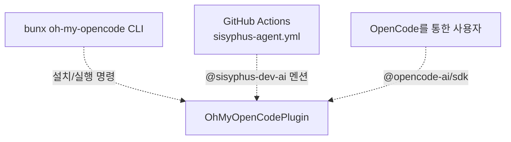

세 가지 상호작용 모드:

* **CLI**: 설치 (`bunx oh-my-opencode install`) 및 실행 (`bunx oh-my-opencode run`)
* **GitHub Actions**: 이슈/PR에서 `@sisyphus-dev-ai` 멘션을 통한 자동화된 에이전트 작업
* **직접 사용자**: 향상된 기능을 갖춘 표준 OpenCode 상호작용

**출처:** [README.md L196-L428](https://github.com/code-yeongyu/oh-my-opencode/blob/b92cd6ab/README.md#L196-L428)
[.github/workflows/sisyphus-agent.yml L1-L100](https://github.com/code-yeongyu/oh-my-opencode/blob/b92cd6ab/.github/workflows/sisyphus-agent.yml#L1-L100)

### 계층 2: 플러그인 코어 (Plugin Core)

**핵심 구성 요소:**

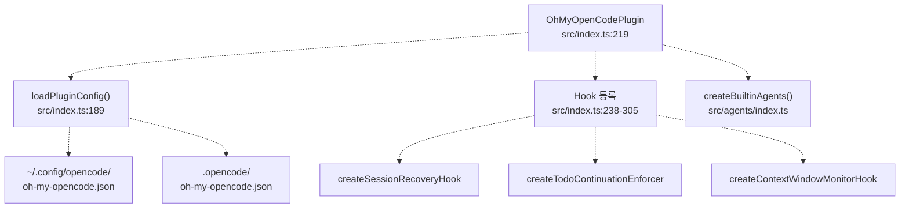

`OhMyOpenCodePlugin` 함수는 메인 진입점 역할을 하며 다음을 오케스트레이션합니다:

* 2단계 계층 구조(사용자 + 프로젝트)를 통한 설정 로딩
* 훅 초기화 (20개 이상의 이벤트 인터셉터)
* 에이전트 팩토리 인스턴스화
* 도구 등록
* MCP 통합

**출처:** [src/index.ts L219-L556](https://github.com/code-yeongyu/oh-my-opencode/blob/b92cd6ab/src/index.ts#L219-L556)
[src/index.ts L189-L217](https://github.com/code-yeongyu/oh-my-opencode/blob/b92cd6ab/src/index.ts#L189-L217)

### 계층 3: 에이전트 오케스트레이션 (Agent Orchestration)

**Sisyphus 오케스트레이션 모델:**

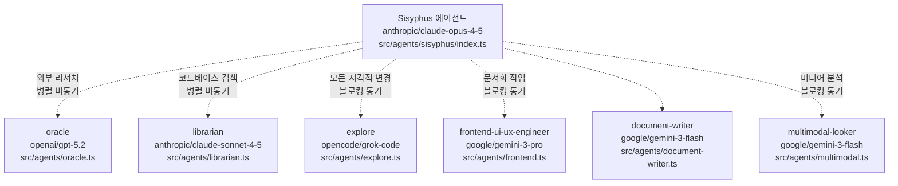

에이전트 팩토리(`createBuiltinAgents`)는 다음을 갖춘 전문 에이전트를 생성합니다:

* 설정에 따른 모델 오버라이드(override)
* 도구 액세스 제한 (읽기 전용 vs 읽기-쓰기)
* 권한 경계
* 환경 컨텍스트 주입

**출처:** [src/agents/index.ts L1-L200](https://github.com/code-yeongyu/oh-my-opencode/blob/b92cd6ab/src/agents/index.ts#L1-L200)
[src/agents/sisyphus/index.ts L1-L100](https://github.com/code-yeongyu/oh-my-opencode/blob/b92cd6ab/src/agents/sisyphus/index.ts#L1-L100)

### 계층 4: 도구 및 서비스 계층 (Tool & Service Layer)

**향상된 도구 생태계:**

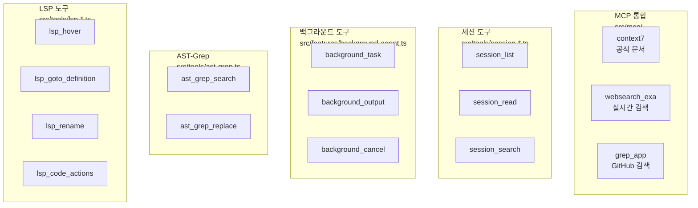

주요 도구 카테고리:

* **LSP Tools (12가지 작업)**: 타입 정보, 탐색, 리팩토링, 진단
* **AST-Grep (2가지 작업)**: 25개 언어에 걸친 패턴 검색/교체
* **Background Tools (3가지 작업)**: 비동기 에이전트 생성 및 모니터링
* **Session Tools (4가지 작업)**: 이력 분석 및 검색
* **MCPs (3개 프로바이더)**: 외부 지식 소스

**출처:** [src/tools/index.ts L1-L100](https://github.com/code-yeongyu/oh-my-opencode/blob/b92cd6ab/src/tools/index.ts#L1-L100)
[src/mcp/index.ts L1-L100](https://github.com/code-yeongyu/oh-my-opencode/blob/b92cd6ab/src/mcp/index.ts#L1-L100)

### 계층 5: 안정성 계층 (Reliability Layer)

**심층 방어 아키텍처:**

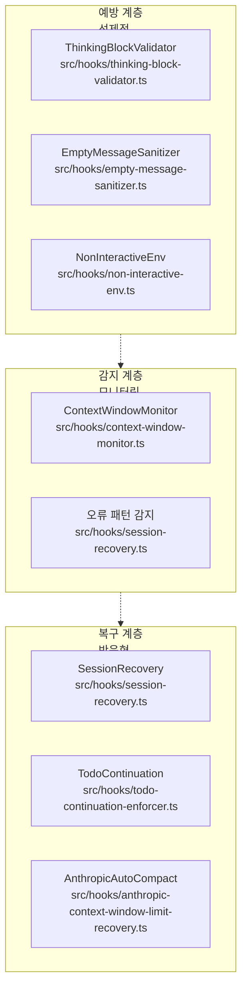

3단계 접근 방식:

* **예방 (Prevention)**: API 호출 전 메시지 검증 (생각 블록, 빈 내용, 대화형 프롬프트)
* **감지 (Detection)**: 컨텍스트 사용량, 오류 패턴, 작업 완료 여부 모니터링
* **복구 (Recovery)**: 세션 오류 자동 수정, 컨텍스트 제한 복구, 강제 작업 계속

**출처:** [src/hooks/session-recovery.ts L1-L200](https://github.com/code-yeongyu/oh-my-opencode/blob/b92cd6ab/src/hooks/session-recovery.ts#L1-L200)
[src/hooks/todo-continuation-enforcer.ts L1-L150](https://github.com/code-yeongyu/oh-my-opencode/blob/b92cd6ab/src/hooks/todo-continuation-enforcer.ts#L1-L150)
[src/hooks/context-window-monitor.ts L1-L100](https://github.com/code-yeongyu/oh-my-opencode/blob/b92cd6ab/src/hooks/context-window-monitor.ts#L1-L100)

### 계층 6: 외부 통합 (External Integration)

**프로바이더 및 호환성:**

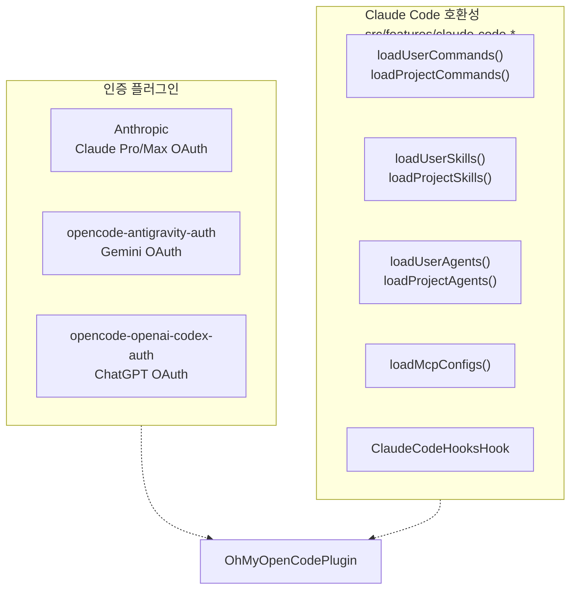

외부 통합 요소:

* **OpenCode SDK**: `@opencode-ai/sdk`를 통한 파운데이션 API
* **인증 (Authentication)**: 주요 AI 프로바이더를 위한 3가지 플러그인
* **Claude Code**: `~/.claude/` 설정과의 완벽한 호환성

**출처:** [src/index.ts L328-L331](https://github.com/code-yeongyu/oh-my-opencode/blob/b92cd6ab/src/index.ts#L328-L331)
[src/features/claude-code-command-loader.ts L1-L100](https://github.com/code-yeongyu/oh-my-opencode/blob/b92cd6ab/src/features/claude-code-command-loader.ts#L1-L100)
[src/features/claude-code-mcp-loader.ts L1-L100](https://github.com/code-yeongyu/oh-my-opencode/blob/b92cd6ab/src/features/claude-code-mcp-loader.ts#L1-L100)

## 플러그인 초기화 시퀀스

`OhMyOpenCodePlugin` 함수는 OpenCode의 플러그인 인터페이스를 구현하며, 구조화된 초기화 시퀀스를 실행합니다:

**초기화 흐름:**

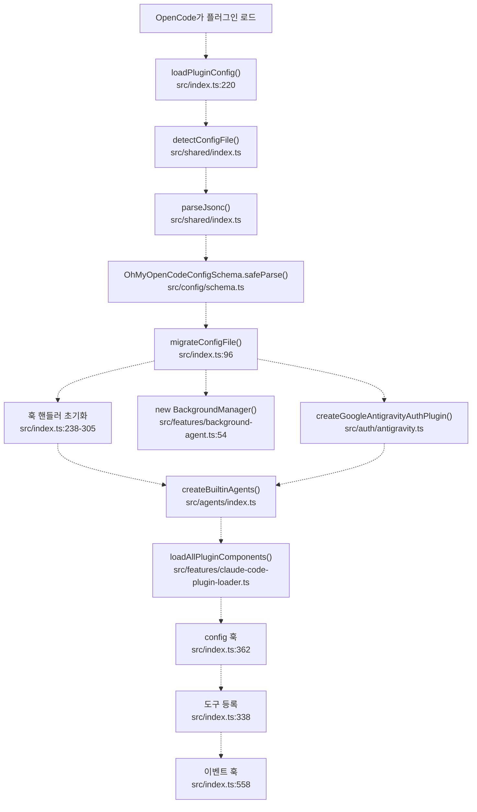

**주요 단계:**

1. **설정 로딩** (`loadPluginConfig`): * 사용자 및 프로젝트 경로에서 `.jsonc` 또는 `.json` 파일 감지 * JSONC 파싱 (주석 및 트레일링 콤마 지원) * Zod 스키마(`OhMyOpenCodeConfigSchema`)를 통한 검증 * 레거시 `omo` 에이전트 이름을 `Sisyphus`로 마이그레이션 * 사용자 + 프로젝트 설정 병합 (프로젝트가 사용자 설정을 덮어씀)
2. **훅 초기화** (238-305행): * `disabled_hooks` 설정에 따라 20개 이상의 훅 핸들러 생성 * 비활성화된 경우 각 훅은 `null`을 반환하고, 활성화된 경우 핸들러 함수를 반환 * 예: `createSessionRecoveryHook`, `createTodoContinuationEnforcer`
3. **매니저 초기화**: * 비동기 에이전트 실행을 위한 `BackgroundManager` * `google_auth !== false`인 경우 Google Auth 플러그인 * 도구 팩토리 (`createCallOmoAgent`, `createLookAt`, `createSkillTool`)
4. **에이전트 등록** (`config` 훅, 362행): * `createBuiltinAgents`를 통해 전문 에이전트 구축 * Claude Code 호환 에이전트/스킬/명령 로드 * 활성화된 경우 Sisyphus를 `default_agent`로 설정 * 에이전트별 도구 액세스 권한 설정
5. **런타임 등록**: * 도구: LSP, AST-grep, 백그라운드, 세션, 전문 도구 * 이벤트: OpenCode 이벤트를 훅 핸들러로 라우팅 * 채팅 변환: 메시지 검증 및 정리(sanitization)

**출처:** [src/index.ts L219-L556](https://github.com/code-yeongyu/oh-my-opencode/blob/b92cd6ab/src/index.ts#L219-L556)
[src/index.ts L189-L217](https://github.com/code-yeongyu/oh-my-opencode/blob/b92cd6ab/src/index.ts#L189-L217)
[src/index.ts L96-L123](https://github.com/code-yeongyu/oh-my-opencode/blob/b92cd6ab/src/index.ts#L96-L123)
[src/config/schema.ts L1-L205](https://github.com/code-yeongyu/oh-my-opencode/blob/b92cd6ab/src/config/schema.ts#L1-L205)

## 설정 시스템 (Configuration System)

설정 시스템은 JSONC 지원, 런타임 검증 및 자동 마이그레이션 기능을 갖춘 2단계 계층 구조를 구현합니다:

### 설정 계층 구조

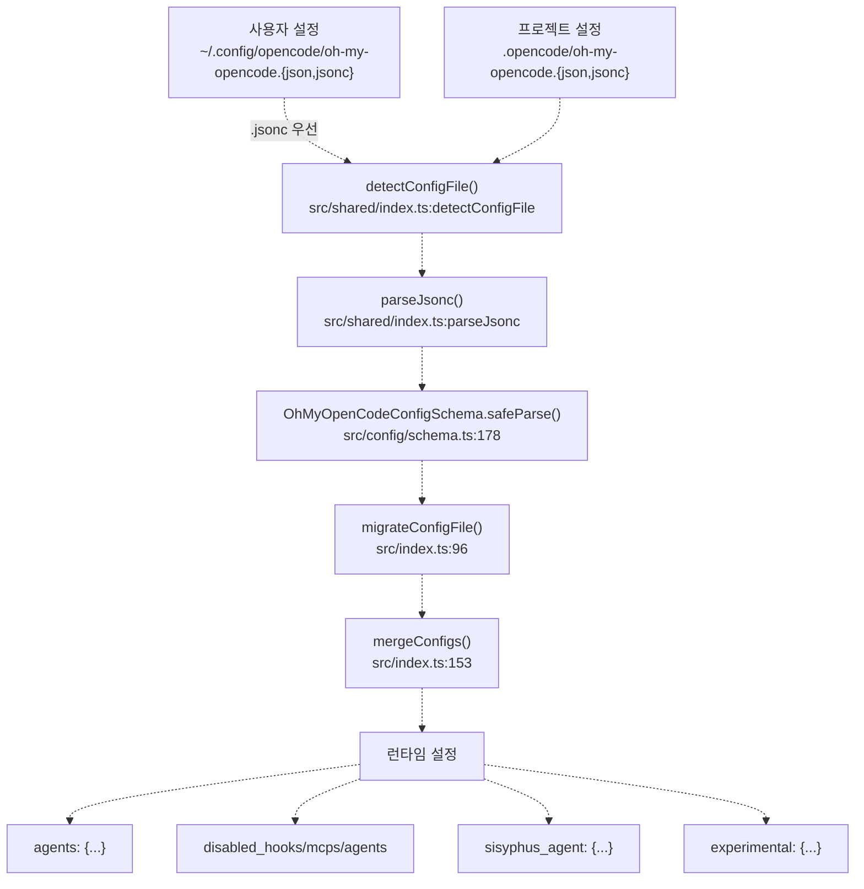

### 설정 우선순위

| 우선순위 | 경로 | OS별 동작 |
| --- | --- | --- |
| 1 (가장 높음) | `.opencode/oh-my-opencode.{jsonc,json}` | 프로젝트 레벨, `.jsonc` 우선 |
| 2 (사용자) | `~/.config/opencode/oh-my-opencode.{jsonc,json}` | Linux/macOS 표준 |
| 2 (사용자) | `%APPDATA%\opencode\oh-my-opencode.{jsonc,json}` | Windows 폴백(fallback) |

**크로스 플랫폼 경로 확인:**
`getUserConfigDir()` 함수 (src/shared/config-path.ts:13)는 스마트 경로 감지를 구현합니다:

* Windows: `~/.config`를 먼저 확인(크로스 플랫폼)하고, 없으면 `%APPDATA%`를 사용
* Linux/macOS: `$XDG_CONFIG_HOME` 또는 `~/.config` 사용

### JSONC 지원 기능

`parseJsonc()` 함수는 다음을 지원합니다:

* 한 줄 주석: `// 주석`
* 블록 주석: `/* 주석 */`
* 트레일링 콤마: `{ "key": "value", }`
* 파일 감지 시 `.json`보다 `.jsonc`를 선호함

### 설정 스키마 (Configuration Schema)

`OhMyOpenCodeConfigSchema` (Zod 스키마)는 다음을 검증합니다:

```
// src/config/schema.ts:178-191
{
  disabled_mcps?: Array<"websearch_exa" | "context7" | "grep_app">
  disabled_agents?: Array<"Sisyphus" | "oracle" | "librarian" | ...>
  disabled_hooks?: Array<"todo-continuation-enforcer" | ...>
  disabled_commands?: Array<"init-deep">
  agents?: Record<AgentName, AgentOverrideConfig>
  sisyphus_agent?: { disabled, default_builder_enabled, planner_enabled, replace_plan }
  claude_code?: { mcp, commands, skills, agents, hooks, plugins }
  google_auth?: boolean
  experimental?: { aggressive_truncation, preemptive_compaction, ... }
  auto_update?: boolean
}
```

### 마이그레이션 시스템

`migrateConfigFile()` 함수 (src/index.ts:96)는 다음을 자동으로 수행합니다:

* `omo` → `Sisyphus` 에이전트 이름 변환
* `omo_agent` → `sisyphus_agent` 설정 키 이름 변경
* 마이그레이션된 설정을 디스크에 다시 기록
* 마이그레이션 작업 로그 기록

### 병합 전략 (Merge Strategy)

`mergeConfigs()` 함수 (src/index.ts:153)는 딥 머지(deep merge)를 구현합니다:

* 객체: 재귀적으로 병합 (프로젝트가 사용자를 덮어씀)
* 배열: 두 설정의 합집합 (disabled_* 배열은 중복 제거됨)
* 원시 값(Primitives): 프로젝트 값이 우선함

**출처:** [src/index.ts L189-L217](https://github.com/code-yeongyu/oh-my-opencode/blob/b92cd6ab/src/index.ts#L189-L217)
[src/index.ts L153-L187](https://github.com/code-yeongyu/oh-my-opencode/blob/b92cd6ab/src/index.ts#L153-L187)
[src/index.ts L96-L123](https://github.com/code-yeongyu/oh-my-opencode/blob/b92cd6ab/src/index.ts#L96-L123)
[src/config/schema.ts L178-L205](https://github.com/code-yeongyu/oh-my-opencode/blob/b92cd6ab/src/config/schema.ts#L178-L205)
[src/shared/config-path.ts L13-L33](https://github.com/code-yeongyu/oh-my-opencode/blob/b92cd6ab/src/shared/config-path.ts#L13-L33)

## 에이전트 오케스트레이션 모델

에이전트 시스템은 **기본 오케스트레이터와 전문가(primary-orchestrator-with-specialists)** 패턴을 구현하며, Sisyphus가 작업 분류에 따라 도메인 전문가에게 위임합니다:

### 오케스트레이션 계층 구조

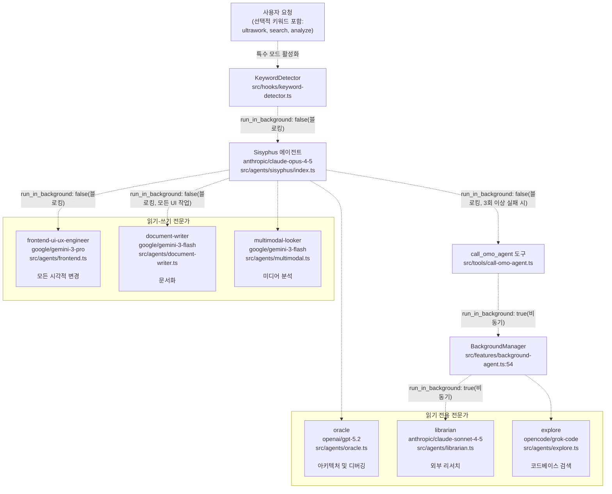

### 에이전트 팩토리 구현

`createBuiltinAgents()` 함수 (src/agents/index.ts)는 다음을 사용하여 에이전트를 구축합니다:

**에이전트 설정 표:**

| 에이전트 | 모델 | 모드 | 도구 액세스 | 위임 패턴 |
| --- | --- | --- | --- | --- |
| `Sisyphus` | `anthropic/claude-opus-4-5` | 기본 | 전체 + `background_task` | 공격적인 위임 |
| `oracle` | `openai/gpt-5.2` | 서브에이전트 | LSP + AST (읽기 전용) | 블로킹, 고비용 추론 |
| `librarian` | `anthropic/claude-sonnet-4-5` 또는 `google/gemini-3-flash` | 서브에이전트 | MCPs + 읽기 도구 | 병렬 비동기 |
| `explore` | `opencode/grok-code` 또는 `google/gemini-3-flash` 또는 `anthropic/claude-haiku-4-5` | 서브에이전트 | grep, LSP, AST (읽기 전용) | 병렬 비동기 |
| `frontend-ui-ux-engineer` | `google/gemini-3-pro` | 서브에이전트 | `background_task` 제외 전체 | 블로킹 동기 |
| `document-writer` | `google/gemini-3-flash` | 서브에이전트 | 읽기 + 쓰기 | 블로킹 동기 |
| `multimodal-looker` | `google/gemini-3-flash` | 서브에이전트 | `look_at` 전용 | 블로킹 동기 |

### 위임 규칙

**명확한 경계로 중복 방지:**

* **Oracle**: 전략적 조언을 위해 구현 실패가 3회 이상 발생한 후에만 호출됨
* **Librarian**: 외부 리서치(문서, GitHub, OSS 예제), 코드는 절대 건드리지 않음
* **Explore**: 다양한 각도에서의 내부 코드베이스 검색, 읽기 전용
* **Frontend**: 모든 시각적 변경 처리 (Sisyphus는 스타일링을 절대 건드리지 않음)
* **DocWriter**: 모든 문서화 작업 (README, API 문서, 가이드)
* **Multimodal**: 미디어 파일 해석 (PDF, 이미지, 다이어그램)

### 백그라운드 vs 블로킹 실행

**병렬 패턴** (`run_in_background: true`):

* `librarian`과 `explore`는 항상 비동기로 실행됨
* "Claude가 백엔드를 처리하는 동안 Gemini가 프론트엔드 구축" 가능
* 부모 세션은 완료 시 알림을 받음

**블로킹 패턴** (`run_in_background: false`):

* `oracle`, `frontend`, `document-writer`, `multimodal`은 동기적으로 실행됨
* 재귀적 생성 방지 (프론트엔드는 더 이상의 백그라운드 작업을 생성할 수 없음)
* 중요한 결정이 즉각적인 주의를 받도록 보장

### 모델 선택 전략

모델은 기능에 따라 선택됩니다:

* **Opus 4.5 High**: 복잡한 오케스트레이션을 위한 확장된 사고(32k 예산)
* **GPT-5.2 Medium**: 아키텍처를 위한 뛰어난 논리적 추론
* **Sonnet 4.5**: 깊은 코드베이스 이해 및 GitHub 리서치
* **Grok Code**: 탐색을 위한 무료이며 빠른 컨텍스트 기반 grep
* **Gemini 3 Pro**: 고품질의 창의적인 UI 생성
* **Gemini 3 Flash**: 문서화 및 미디어 분석에 효율적

**설정 오버라이드:**
`opencode-antigravity-auth`가 설치되면 모델이 자동으로 전환됩니다:

* `librarian`: `anthropic/claude-sonnet-4-5` → `google/gemini-3-flash`
* `explore`: `opencode/grok-code` → `google/gemini-3-flash`
* Claude max20 사용 가능 시: `explore` → `anthropic/claude-haiku-4-5`

**출처:** [src/agents/index.ts L1-L200](https://github.com/code-yeongyu/oh-my-opencode/blob/b92cd6ab/src/agents/index.ts#L1-L200)
[src/agents/sisyphus/index.ts L1-L100](https://github.com/code-yeongyu/oh-my-opencode/blob/b92cd6ab/src/agents/sisyphus/index.ts#L1-L100)
[src/agents/oracle.ts L1-L100](https://github.com/code-yeongyu/oh-my-opencode/blob/b92cd6ab/src/agents/oracle.ts#L1-L100)
[src/agents/librarian.ts L1-L100](https://github.com/code-yeongyu/oh-my-opencode/blob/b92cd6ab/src/agents/librarian.ts#L1-L100)
[src/agents/explore.ts L1-L100](https://github.com/code-yeongyu/oh-my-opencode/blob/b92cd6ab/src/agents/explore.ts#L1-L100)
[src/agents/frontend.ts L1-L100](https://github.com/code-yeongyu/oh-my-opencode/blob/b92cd6ab/src/agents/frontend.ts#L1-L100)
[src/tools/call-omo-agent.ts L1-L150](https://github.com/code-yeongyu/oh-my-opencode/blob/b92cd6ab/src/tools/call-omo-agent.ts#L1-L150)
[src/features/background-agent.ts L54-L300](https://github.com/code-yeongyu/oh-my-opencode/blob/b92cd6ab/src/features/background-agent.ts#L54-L300)

## 훅 시스템 아키텍처 (Hook System Architecture)

훅 시스템은 OpenCode 생명주기 이벤트를 가로채서 커스텀 동작을 주입합니다:

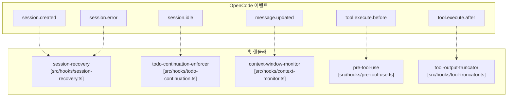

**출처**: [src/hooks/index.ts L1-L100](https://github.com/code-yeongyu/oh-my-opencode/blob/b92cd6ab/src/hooks/index.ts#L1-L100)
[src/hooks/session-recovery.ts L1-L200](https://github.com/code-yeongyu/oh-my-opencode/blob/b92cd6ab/src/hooks/session-recovery.ts#L1-L200)
[src/hooks/todo-continuation.ts L1-L150](https://github.com/code-yeongyu/oh-my-opencode/blob/b92cd6ab/src/hooks/todo-continuation.ts#L1-L150)
[src/hooks/context-monitor.ts L1-L100](https://github.com/code-yeongyu/oh-my-opencode/blob/b92cd6ab/src/hooks/context-window-monitor.ts#L1-L100)

훅 레지스트리(`src/hooks/index.ts`)는 모든 훅 구현체의 컬렉션을 유지합니다. 각 훅은 `disabled_hooks` 설정 배열을 통해 개별적으로 비활성화할 수 있습니다.

## 도구 향상 시스템 (Tool Enhancement System)

플러그인은 OpenCode의 기본 도구를 교체하고 확장합니다:

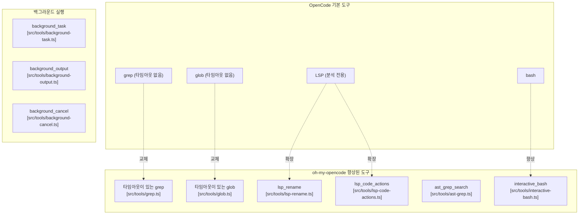

**출처**: [src/tools/grep.ts L1-L150](https://github.com/code-yeongyu/oh-my-opencode/blob/b92cd6ab/src/tools/grep.ts#L1-L150)
[src/tools/glob.ts L1-L100](https://github.com/code-yeongyu/oh-my-opencode/blob/b92cd6ab/src/tools/glob.ts#L1-L100)
[src/tools/lsp-rename.ts L1-L100](https://github.com/code-yeongyu/oh-my-opencode/blob/b92cd6ab/src/tools/lsp-rename.ts#L1-L100)
[src/tools/lsp-code-actions.ts L1-L100](https://github.com/code-yeongyu/oh-my-opencode/blob/b92cd6ab/src/tools/lsp-code-actions.ts#L1-L100)
[src/tools/ast-grep.ts L1-L200](https://github.com/code-yeongyu/oh-my-opencode/blob/b92cd6ab/src/tools/ast-grep.ts#L1-L200)
[src/tools/interactive-bash.ts L1-L300](https://github.com/code-yeongyu/oh-my-opencode/blob/b92cd6ab/src/tools/interactive-bash.ts#L1-L300)
[src/tools/background-task.ts L1-L200](https://github.com/code-yeongyu/oh-my-opencode/blob/b92cd6ab/src/tools/background-task.ts#L1-L200)

## 백그라운드 실행 아키텍처

백그라운드 작업 시스템은 병렬 에이전트 실행을 가능하게 합니다:

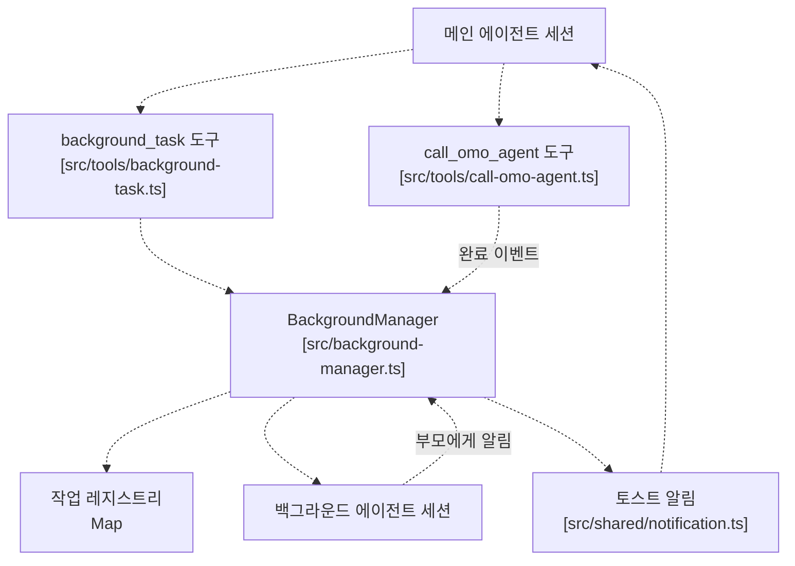

**출처**: [src/background-manager.ts L1-L300](https://github.com/code-yeongyu/oh-my-opencode/blob/b92cd6ab/src/background-manager.ts#L1-L300)
[src/tools/background-task.ts L1-L200](https://github.com/code-yeongyu/oh-my-opencode/blob/b92cd6ab/src/tools/background-task.ts#L1-L200)
[src/tools/call-omo-agent.ts L1-L150](https://github.com/code-yeongyu/oh-my-opencode/blob/b92cd6ab/src/tools/call-omo-agent.ts#L1-L150)
[src/shared/notification.ts L1-L100](https://github.com/code-yeongyu/oh-my-opencode/blob/b92cd6ab/src/shared/notification.ts#L1-L100)

`BackgroundManager` 클래스는 세션 간의 부모-자식 관계를 추적하는 계층적 작업 레지스트리를 유지합니다. 백그라운드 작업이 완료되면 데스크톱 알림 및 메시지 주입을 통해 부모 세션에 알립니다.

## 외부 지식 통합 (MCPs)

플러그인은 외부 지식 액세스를 위해 세 가지 MCP(Model Context Protocol) 서버를 제공합니다:

### 내장 MCP 서버

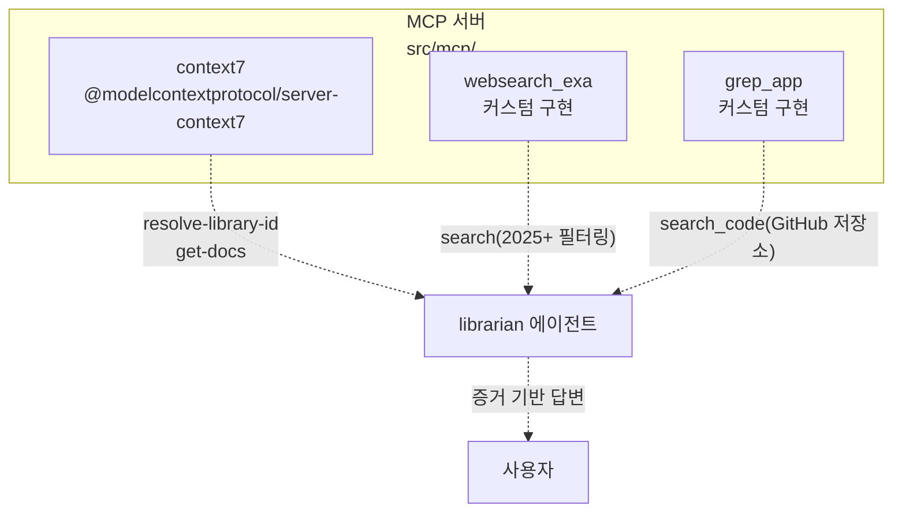

### MCP 설정

| MCP | 도구 | 유스케이스 | 비활성화 가능 여부 |
| --- | --- | --- | --- |
| `context7` | `resolve-library-id`, `get-docs` | 공식 문서 (NPM, PyPI, Cargo 등) | `disabled_mcps: ["context7"]` |
| `websearch_exa` | `search` | 2025년 이후 날짜 필터링을 포함한 실시간 웹 검색 | `disabled_mcps: ["websearch_exa"]` |
| `grep_app` | `search_code` | 수백만 개의 저장소에 걸친 GitHub 코드 검색 | `disabled_mcps: ["grep_app"]` |

**MCP 생성:**
`createBuiltinMcps()` 함수 (src/mcp/index.ts)는 MCP 설정을 구축합니다:

* `disabled_mcps` 설정 배열을 기반으로 필터링
* OpenCode의 MCP 시스템을 위한 서버 설정 반환
* 각 MCP는 stdio 통신을 사용하는 별도의 서브프로세스로 실행됨

**에이전트 액세스:**

* **Librarian**: 기본적으로 세 가지 MCP 모두에 액세스할 수 있음
* **Explore**: 외부 코드 검색을 위해 `grep_app`을 사용할 수 있음
* 기타 에이전트: MCP 액세스 권한 없음 (집중 경계 유지)

### Claude Code MCP 호환성

플러그인은 Claude Code 경로에서도 MCP를 로드합니다:

* `~/.claude/.mcp.json` (사용자 레벨)
* `./.mcp.json` (프로젝트 레벨)
* `./.claude/.mcp.json` (로컬, git-ignored)

src/features/claude-code-mcp-loader.ts의 `loadMcpConfigs()`를 통해 다음 기능을 제공하며 로드됩니다:

* 환경 변수 확장 (`${VAR}` 구문)
* 내장 MCP와 병합
* `claude_code.mcp: false`를 통해 비활성화 가능

**출처:** [src/mcp/index.ts L1-L100](https://github.com/code-yeongyu/oh-my-opencode/blob/b92cd6ab/src/mcp/index.ts#L1-L100)
[src/mcp/builtin.ts L1-L100](https://github.com/code-yeongyu/oh-my-opencode/blob/b92cd6ab/src/mcp/builtin.ts#L1-L100)
[src/features/claude-code-mcp-loader.ts L1-L150](https://github.com/code-yeongyu/oh-my-opencode/blob/b92cd6ab/src/features/claude-code-mcp-loader.ts#L1-L150)

## Claude Code 호환성 계층 (Claude Code Compatibility Layer)

플러그인은 Claude Code 설정과의 완전한 하위 호환성을 유지합니다:

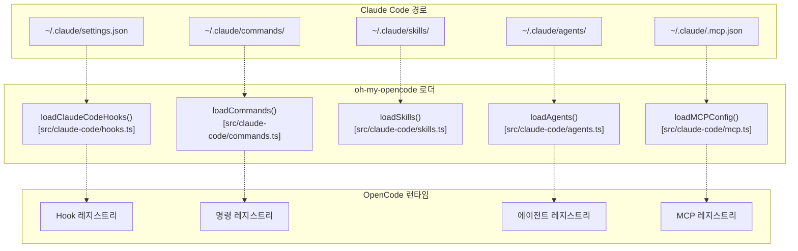

**출처**: [src/claude-code/hooks.ts L1-L150](https://github.com/code-yeongyu/oh-my-opencode/blob/b92cd6ab/src/claude-code/hooks.ts#L1-L150)
[src/claude-code/commands.ts L1-L100](https://github.com/code-yeongyu/oh-my-opencode/blob/b92cd6ab/src/claude-code/commands.ts#L1-L100)
[src/claude-code/skills.ts L1-L100](https://github.com/code-yeongyu/oh-my-opencode/blob/b92cd6ab/src/claude-code/skills.ts#L1-L100)
[src/claude-code/agents.ts L1-L100](https://github.com/code-yeongyu/oh-my-opencode/blob/b92cd6ab/src/claude-code/agents.ts#L1-L100)
[src/claude-code/mcp.ts L1-L100](https://github.com/code-yeongyu/oh-my-opencode/blob/b92cd6ab/src/claude-code/mcp.ts#L1-L100)

각 호환성 로더는 `claude_code` 설정 객체(`claude_code.hooks`, `claude_code.commands` 등)를 통해 개별적으로 비활성화할 수 있습니다.

## 상태 관리 (State Management)

플러그인은 메모리 내 상태와 영구 상태를 모두 유지합니다:

| 상태 유형 | 저장 위치 | 목적 | 관리 주체 |
| --- | --- | --- | --- |
| 세션 상태 | 메모리 내 Map | 주입된 규칙, 백그라운드 작업의 세션별 추적 | 훅 핸들러 |
| 백그라운드 작업 | `BackgroundManager` 인스턴스 | 계층적 작업 레지스트리 | [src/background-manager.ts L1-L300](https://github.com/code-yeongyu/oh-my-opencode/blob/b92cd6ab/src/background-manager.ts#L1-L300) |
| Interactive Bash | JSON 파일 | tmux 세션 추적 | [src/tools/interactive-bash.ts L1-L300](https://github.com/code-yeongyu/oh-my-opencode/blob/b92cd6ab/src/tools/interactive-bash.ts#L1-L300) |
| Auto-Compact | 메모리 내 플래그 | 컨텍스트 컴팩션을 위한 재시도 추적 | [src/hooks/anthropic-auto-compact.ts L1-L200](https://github.com/code-yeongyu/oh-my-opencode/blob/b92cd6ab/src/hooks/anthropic-auto-compact.ts#L1-L200) |

세션 레벨 상태는 플러그인 재로드 시 유지되지 않습니다. 백그라운드 작업 상태는 OpenCode 프로세스가 활성 상태로 유지되는 동안 생존합니다.

**출처**: [src/background-manager.ts L1-L300](https://github.com/code-yeongyu/oh-my-opencode/blob/b92cd6ab/src/background-manager.ts#L1-L300)
[src/tools/interactive-bash.ts L1-L300](https://github.com/code-yeongyu/oh-my-opencode/blob/b92cd6ab/src/tools/interactive-bash.ts#L1-L300)
[src/hooks/anthropic-auto-compact.ts L1-L200](https://github.com/code-yeongyu/oh-my-opencode/blob/b92cd6ab/src/hooks/anthropic-auto-compact.ts#L1-L200)