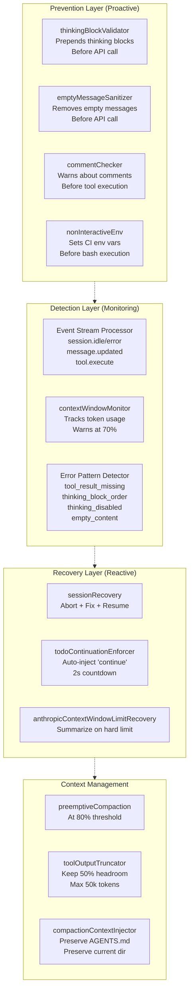
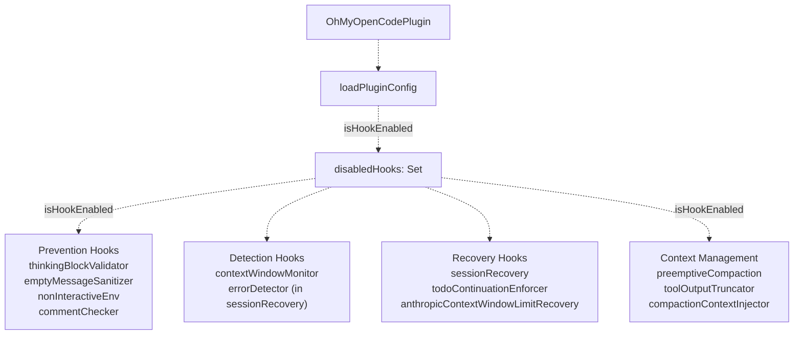
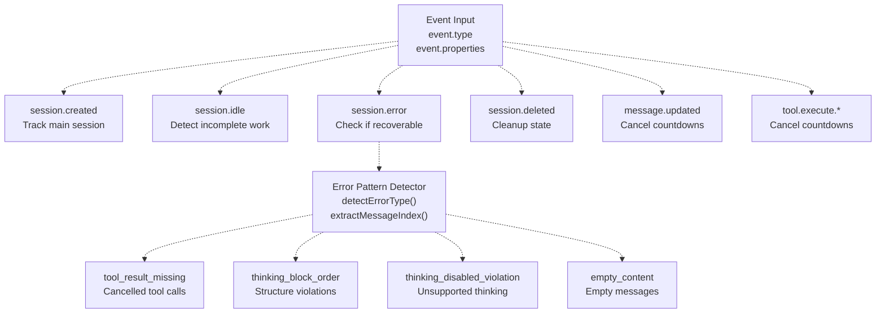
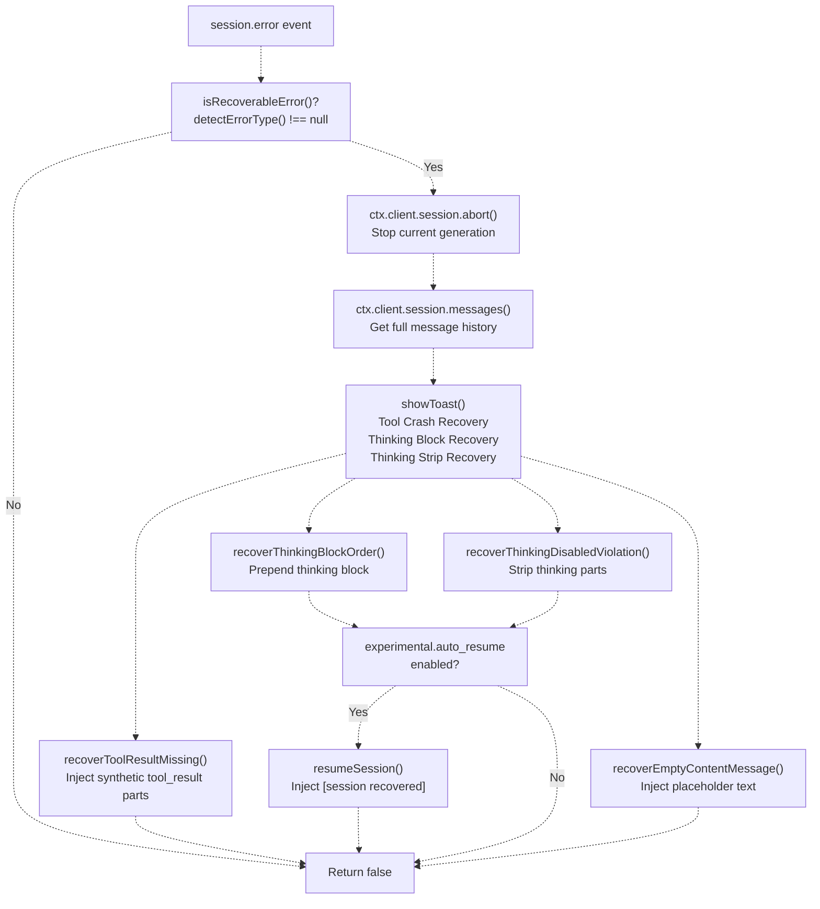
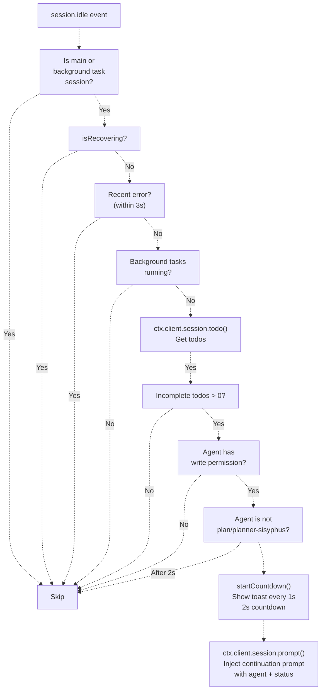
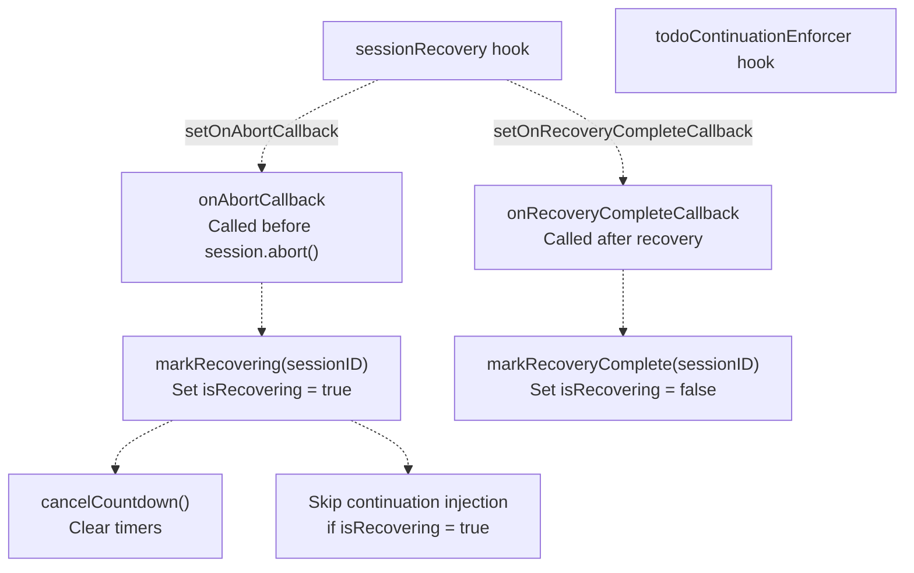
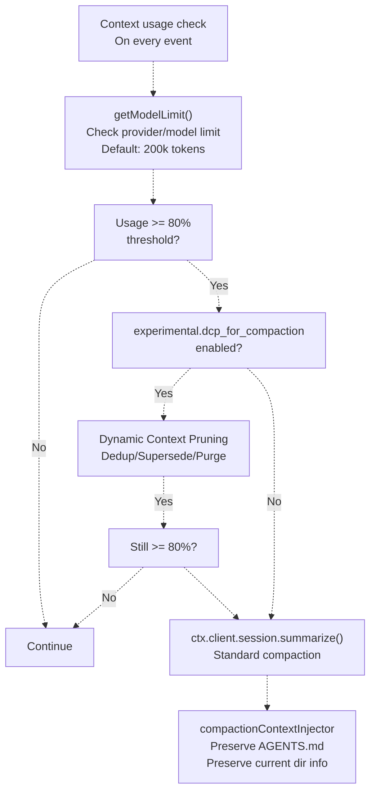
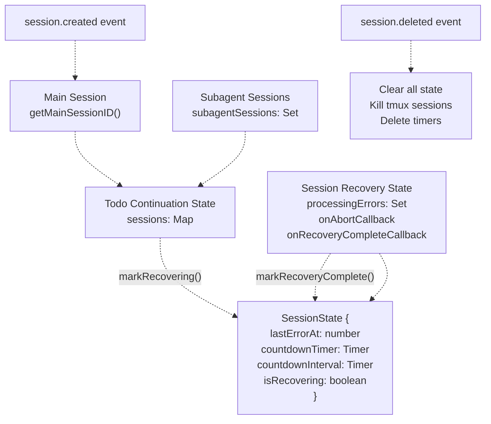

# Reliability System (신뢰성 시스템)

> **관련 소스 파일**
> * [assets/oh-my-opencode.schema.json](https://github.com/code-yeongyu/oh-my-opencode/blob/b92cd6ab/assets/oh-my-opencode.schema.json)
> * [src/config/schema.ts](https://github.com/code-yeongyu/oh-my-opencode/blob/b92cd6ab/src/config/schema.ts)
> * [src/hooks/index.ts](https://github.com/code-yeongyu/oh-my-opencode/blob/b92cd6ab/src/hooks/index.ts)
> * [src/hooks/non-interactive-env/constants.ts](https://github.com/code-yeongyu/oh-my-opencode/blob/b92cd6ab/src/hooks/non-interactive-env/constants.ts)
> * [src/hooks/non-interactive-env/detector.ts](https://github.com/code-yeongyu/oh-my-opencode/blob/b92cd6ab/src/hooks/non-interactive-env/detector.ts)
> * [src/hooks/non-interactive-env/index.ts](https://github.com/code-yeongyu/oh-my-opencode/blob/b92cd6ab/src/hooks/non-interactive-env/index.ts)
> * [src/hooks/non-interactive-env/types.ts](https://github.com/code-yeongyu/oh-my-opencode/blob/b92cd6ab/src/hooks/non-interactive-env/types.ts)
> * [src/hooks/session-recovery/index.ts](https://github.com/code-yeongyu/oh-my-opencode/blob/b92cd6ab/src/hooks/session-recovery/index.ts)
> * [src/hooks/session-recovery/storage.ts](https://github.com/code-yeongyu/oh-my-opencode/blob/b92cd6ab/src/hooks/session-recovery/storage.ts)
> * [src/hooks/session-recovery/types.ts](https://github.com/code-yeongyu/oh-my-opencode/blob/b92cd6ab/src/hooks/session-recovery/types.ts)
> * [src/hooks/thinking-block-validator/index.ts](https://github.com/code-yeongyu/oh-my-opencode/blob/b92cd6ab/src/hooks/thinking-block-validator/index.ts)
> * [src/hooks/todo-continuation-enforcer.test.ts](https://github.com/code-yeongyu/oh-my-opencode/blob/b92cd6ab/src/hooks/todo-continuation-enforcer.test.ts)
> * [src/hooks/todo-continuation-enforcer.ts](https://github.com/code-yeongyu/oh-my-opencode/blob/b92cd6ab/src/hooks/todo-continuation-enforcer.ts)
> * [src/index.ts](https://github.com/code-yeongyu/oh-my-opencode/blob/b92cd6ab/src/index.ts)

Reliability System(신뢰성 시스템)은 예방, 탐지 및 복구 계층 전반에서 견고한 에이전트 작동을 보장하기 위해 심층 방어(defense-in-depth) 아키텍처를 구현합니다. 이 시스템은 오류가 API에 도달하기 전에 예방하고, 실행 중 문제를 모니터링하며, 실패가 발생했을 때 자동으로 복구합니다. 모든 신뢰성 훅(hook)은 `disabled_hooks` 설정 배열을 통해 조건부로 초기화되며 플러그인 생명주기(lifecycle)와 원활하게 통합됩니다.

특정 신뢰성 메커니즘에 대한 자세한 내용은 다음을 참조하십시오: [Session Recovery](/code-yeongyu/oh-my-opencode/7.1-session-recovery), [Message Validation](/code-yeongyu/oh-my-opencode/7.2-message-validation), [Todo Continuation Enforcer](/code-yeongyu/oh-my-opencode/7.3-todo-continuation-enforcer), [Context Management Hooks](/code-yeongyu/oh-my-opencode/7.4-context-management-hooks), [Context Injection Hooks](/code-yeongyu/oh-my-opencode/7.5-context-injection-hooks), [Non-Interactive Environment](/code-yeongyu/oh-my-opencode/7.6-non-interactive-environment), 및 [Other Hooks](/code-yeongyu/oh-my-opencode/7.7-other-hooks).

---

## Defense-in-Depth Architecture (심층 방어 아키텍처)

Reliability System은 실패를 예방, 탐지 및 복구하기 위해 함께 작동하는 세 가지 방어 계층을 구현합니다.

### Reliability Layers Overview (신뢰성 계층 개요)



**소스:** [src/index.ts L238-L306](https://github.com/code-yeongyu/oh-my-opencode/blob/b92cd6ab/src/index.ts#L238-L306)

 [src/hooks/index.ts L1-L25](https://github.com/code-yeongyu/oh-my-opencode/blob/b92cd6ab/src/hooks/index.ts#L1-L25)

### Initialization and Registration (초기화 및 등록)

모든 신뢰성 훅은 플러그인 시작 시 [src/index.ts L238-L306](https://github.com/code-yeongyu/oh-my-opencode/blob/b92cd6ab/src/index.ts#L238-L306)에서 초기화됩니다. [src/index.ts L222](https://github.com/code-yeongyu/oh-my-opencode/blob/b92cd6ab/src/index.ts#L222-L222)에 있는 `isHookEnabled` 함수는 `disabled_hooks` 설정을 확인하여 각 훅을 조건부로 생성합니다.



**소스:** [src/index.ts L219-L306](https://github.com/code-yeongyu/oh-my-opencode/blob/b92cd6ab/src/index.ts#L219-L306)

 [src/config/schema.ts L45-L68](https://github.com/code-yeongyu/oh-my-opencode/blob/b92cd6ab/src/config/schema.ts#L45-L68)

### Event Dispatch Pipeline (이벤트 디스패치 파이프라인)

신뢰성 훅은 플러그인 생명주기의 전략적 지점에서 이벤트를 가로채어 실패를 예방, 탐지 및 복구합니다.

```mermaid
flowchart TD

OpenCodeEvents["OpenCode Events"]
MessagesTransform["experimental.chat.messages.transform<br>(Before API call)"]
ToolBefore["tool.execute.before"]
EventHandler["event handler"]
ToolAfter["tool.execute.after"]
ThinkValidator["thinkingBlockValidator<br>Prepend thinking blocks"]
EmptySanitizer["emptyMessageSanitizer<br>Remove empty messages"]
NonInteractive["nonInteractiveEnv<br>Set CI env vars"]
CommentCheck["commentChecker<br>Warn about comments"]
SessionRecovery["sessionRecovery<br>Detect & fix errors"]
TodoEnforcer["todoContinuationEnforcer<br>Auto-continue tasks"]
ContextMonitor["contextWindowMonitor<br>Track token usage"]
PreemptiveCompact["preemptiveCompaction<br>Trigger at 80%"]
AnthropicLimit["anthropicContextWindowLimitRecovery<br>Handle hard limits"]
ToolTruncator["toolOutputTruncator<br>Truncate outputs"]
EmptyTask["emptyTaskResponseDetector<br>Detect empty responses"]

OpenCodeEvents -.-> MessagesTransform
OpenCodeEvents -.-> ToolBefore
OpenCodeEvents -.-> EventHandler
OpenCodeEvents -.-> ToolAfter
MessagesTransform -.-> ThinkValidator
MessagesTransform -.-> EmptySanitizer
ToolBefore -.-> NonInteractive
ToolBefore -.-> CommentCheck
EventHandler -.-> SessionRecovery
EventHandler -.-> TodoEnforcer
EventHandler -.-> ContextMonitor
EventHandler -.-> PreemptiveCompact
EventHandler -.-> AnthropicLimit
ToolAfter -.-> ToolTruncator
ToolAfter -.-> EmptyTask
```



**소스:** [src/index.ts L347-L652](https://github.com/code-yeongyu/oh-my-opencode/blob/b92cd6ab/src/index.ts#L347-L652)

각 핸들러는 async/await를 사용하여 순차적으로 훅을 호출하며, 훅이 다음 단계로 진행하기 전에 API 호출이나 파일 I/O와 같은 비동기 작업을 수행할 수 있도록 보장합니다.

---

## Prevention Layer (Proactive) (예방 계층 - 선제적)

Prevention Layer는 검증 및 새니타이제이션(sanitization, 정화) 훅을 통해 오류가 API에 도달하기 전에 차단합니다.

### Message Validation Hooks (메시지 검증 훅)

| 훅 이름 | 구현체 | 예방 메커니즘 |
| --- | --- | --- |
| `thinkingBlockValidator` | [src/hooks/thinking-block-validator/index.ts](https://github.com/code-yeongyu/oh-my-opencode/blob/b92cd6ab/src/hooks/thinking-block-validator/index.ts) | API 호출 전 assistant 메시지에 thinking 블록을 추가하여 "Expected thinking/redacted_thinking but found tool_use" 오류를 예방함 |
| `emptyMessageSanitizer` | [src/hooks/empty-message-sanitizer.ts](https://github.com/code-yeongyu/oh-my-opencode/blob/b92cd6ab/src/hooks/empty-message-sanitizer.ts) | API 호출 전 내용이 비어 있는 메시지를 제거하여 "messages[i].content: Expected array but received []" 오류를 예방함 |

**훅 지점:** `experimental.chat.messages.transform` (메시지가 API 형식으로 변환되기 전에 실행됨)

**소스:** [src/index.ts L300-L360](https://github.com/code-yeongyu/oh-my-opencode/blob/b92cd6ab/src/index.ts#L300-L360)

 [src/hooks/thinking-block-validator/index.ts L1-L172](https://github.com/code-yeongyu/oh-my-opencode/blob/b92cd6ab/src/hooks/thinking-block-validator/index.ts#L1-L172)

### Tool Execution Prevention (도구 실행 예방)

| 훅 이름 | 구현체 | 예방 메커니즘 |
| --- | --- | --- |
| `nonInteractiveEnv` | [src/hooks/non-interactive-env/index.ts](https://github.com/code-yeongyu/oh-my-opencode/blob/b92cd6ab/src/hooks/non-interactive-env/index.ts) | 11개 이상의 환경 변수(`CI=true`, `DEBIAN_FRONTEND=noninteractive` 등)를 주입하여 bash 명령이 사용자 입력을 기다리며 멈추는 것을 예방함 |
| `commentChecker` | [src/hooks/comment-checker.ts](https://github.com/code-yeongyu/oh-my-opencode/blob/b92cd6ab/src/hooks/comment-checker.ts) | 도구 실행이 완료되기 전에 코드에 TODO 주석을 남기는 것에 대해 에이전트에게 경고함 |

**훅 지점:** `tool.execute.before`, `tool.execute.after`

**설정된 환경 변수:** [src/hooks/non-interactive-env/constants.ts L3-L23](https://github.com/code-yeongyu/oh-my-opencode/blob/b92cd6ab/src/hooks/non-interactive-env/constants.ts#L3-L23)

* `CI=true`
* `DEBIAN_FRONTEND=noninteractive`
* `GIT_TERMINAL_PROMPT=0`
* `GIT_EDITOR=true`, `EDITOR=true`, `VISUAL=true` (대화형 에디터 차단)
* `GIT_PAGER=cat`, `PAGER=cat` (페이저 차단)
* `npm_config_yes=true`, `PIP_NO_INPUT=1`, `YARN_ENABLE_IMMUTABLE_INSTALLS=false`

**탐지된 금지 명령:** [src/hooks/non-interactive-env/constants.ts L54-L59](https://github.com/code-yeongyu/oh-my-opencode/blob/b92cd6ab/src/hooks/non-interactive-env/constants.ts#L54-L59)

* 에디터: `vim`, `nano`, `vi`, `emacs`
* 페이저: `less`, `more`, `man`
* 대화형 모드: `git add -p`, `git rebase -i`

**소스:** [src/index.ts L294-L623](https://github.com/code-yeongyu/oh-my-opencode/blob/b92cd6ab/src/index.ts#L294-L623)

 [src/hooks/non-interactive-env/index.ts L22-L53](https://github.com/code-yeongyu/oh-my-opencode/blob/b92cd6ab/src/hooks/non-interactive-env/index.ts#L22-L53)

 [src/hooks/non-interactive-env/constants.ts L1-L70](https://github.com/code-yeongyu/oh-my-opencode/blob/b92cd6ab/src/hooks/non-interactive-env/constants.ts#L1-L70)

---

## Detection Layer (Monitoring) (탐지 계층 - 모니터링)

Detection Layer는 실행을 실시간으로 모니터링하여 문제를 조기에 식별합니다.

### Event Stream Monitoring (이벤트 스트림 모니터링)

[src/index.ts L558-L618](https://github.com/code-yeongyu/oh-my-opencode/blob/b92cd6ab/src/index.ts#L558-L618)에 있는 이벤트 핸들러는 모든 세션 생명주기 이벤트를 처리합니다.



**소스:** [src/index.ts L558-L618](https://github.com/code-yeongyu/oh-my-opencode/blob/b92cd6ab/src/index.ts#L558-L618)

 [src/hooks/session-recovery/index.ts L125-L147](https://github.com/code-yeongyu/oh-my-opencode/blob/b92cd6ab/src/hooks/session-recovery/index.ts#L125-L147)

### Context Window Monitoring (컨텍스트 윈도우 모니터링)

`contextWindowMonitor` 훅은 세션 전반의 토큰 사용량을 추적하고 임계값에 도달하면 경고합니다.

| 임계값 | 동작 |
| --- | --- |
| 70% | 경고 토스트: "Context window approaching limit" |
| 80% | 선제적 컴팩션(preemptive compaction) 트리거 (활성화된 경우) |
| 95% | Anthropic이 자동으로 컴팩션을 수행함 |

**토큰 추적:** 모니터는 `tool.execute.after` 훅을 통해 모든 도구 실행 시 업데이트됩니다.

**소스:** [src/index.ts L238-L644](https://github.com/code-yeongyu/oh-my-opencode/blob/b92cd6ab/src/index.ts#L238-L644)

### Error Pattern Detection (오류 패턴 탐지)

세션 복구 훅은 [src/hooks/session-recovery/index.ts L125-L147](https://github.com/code-yeongyu/oh-my-opencode/blob/b92cd6ab/src/hooks/session-recovery/index.ts#L125-L147)에서 문자열 매칭을 통해 오류 탐지를 구현합니다.

```javascript
function detectErrorType(error: unknown): RecoveryErrorType {
  const message = getErrorMessage(error)

  if (message.includes("tool_use") && message.includes("tool_result")) {
    return "tool_result_missing"
  }

  if (
    message.includes("thinking") &&
    (message.includes("first block") ||
      message.includes("must start with") ||
      message.includes("preceeding") ||
      (message.includes("expected") && message.includes("found")))
  ) {
    return "thinking_block_order"
  }

  if (message.includes("thinking is disabled") && message.includes("cannot contain")) {
    return "thinking_disabled_violation"
  }

  return null
}
```

**소스:** [src/hooks/session-recovery/index.ts L91-L147](https://github.com/code-yeongyu/oh-my-opencode/blob/b92cd6ab/src/hooks/session-recovery/index.ts#L91-L147)

---

## Recovery Layer (Reactive) (복구 계층 - 반응적)

Recovery Layer는 타겟팅된 개입을 통해 탐지된 문제를 자동으로 수정합니다.

### Session Recovery Strategies (세션 복구 전략)

`sessionRecovery` 훅은 네 가지 복구 전략을 구현합니다.

| 오류 유형 | 탐지 패턴 | 복구 전략 | 구현체 |
| --- | --- | --- | --- |
| `tool_result_missing` | 오류에 "tool_use" + "tool_result" 포함 | "Operation cancelled by user (ESC pressed)"라는 내용의 가상 `tool_result` 파트 주입 | [src/hooks/session-recovery/index.ts L153-L192](https://github.com/code-yeongyu/oh-my-opencode/blob/b92cd6ab/src/hooks/session-recovery/index.ts#L153-L192) |
| `thinking_block_order` | "thinking" + "first block"/"must start with" 포함 | 대상 메시지에 thinking 블록을 추가하고 이전 턴의 내용을 재사용함 | [src/hooks/session-recovery/index.ts L194-L223](https://github.com/code-yeongyu/oh-my-opencode/blob/b92cd6ab/src/hooks/session-recovery/index.ts#L194-L223) |
| `thinking_disabled_violation` | "thinking is disabled" + "cannot contain" 포함 | 메시지에서 모든 thinking 파트를 제거함 | [src/hooks/session-recovery/index.ts L225-L244](https://github.com/code-yeongyu/oh-my-opencode/blob/b92cd6ab/src/hooks/session-recovery/index.ts#L225-L244) |
| `empty_content` | 비어 있는 content 배열 | "[user interrupted]" 플레이스홀더 텍스트를 주입하거나 비어 있는 텍스트 파트를 교체함 | [src/hooks/session-recovery/index.ts L248-L305](https://github.com/code-yeongyu/oh-my-opencode/blob/b92cd6ab/src/hooks/session-recovery/index.ts#L248-L305) |

**복구 흐름:**



**소스:** [src/hooks/session-recovery/index.ts L319-L430](https://github.com/code-yeongyu/oh-my-opencode/blob/b92cd6ab/src/hooks/session-recovery/index.ts#L319-L430)

 [src/index.ts L593-L616](https://github.com/code-yeongyu/oh-my-opencode/blob/b92cd6ab/src/index.ts#L593-L616)

### Todo Continuation Enforcer (할 일 연속성 강제 도구)

`todoContinuationEnforcer`는 작업이 완료되지 않았을 때 자동으로 작업을 재개합니다.

**카운트다운 흐름:**



**연속성 프롬프트 템플릿:** [src/hooks/todo-continuation-enforcer.ts L38-L44](https://github.com/code-yeongyu/oh-my-opencode/blob/b92cd6ab/src/hooks/todo-continuation-enforcer.ts#L38-L44)

```
[SYSTEM REMINDER - TODO CONTINUATION]

Incomplete tasks remain in your todo list. Continue working on the next pending task.

- Proceed without asking for permission
- Mark each task complete when finished
- Do not stop until all tasks are done
```

**취소 이벤트:**

* `message.updated` (role: user) - 사용자가 새 메시지를 보냄
* `message.updated` (role: assistant) - 에이전트가 응답을 시작함
* `message.part.updated` (role: assistant) - 에이전트가 응답을 스트리밍함
* `tool.execute.before` / `tool.execute.after` - 도구 실행이 시작됨
* `session.deleted` - 세션이 삭제됨

**소스:** [src/hooks/todo-continuation-enforcer.ts L1-L377](https://github.com/code-yeongyu/oh-my-opencode/blob/b92cd6ab/src/hooks/todo-continuation-enforcer.ts#L1-L377)

 [src/index.ts L309-L563](https://github.com/code-yeongyu/oh-my-opencode/blob/b92cd6ab/src/index.ts#L309-L563)

### Coordination Between Recovery and Continuation (복구와 연속성 간의 조정)

세션 복구와 할 일 연속성은 충돌하는 동작을 방지하기 위해 콜백을 통해 조정됩니다.



**구현:** [src/index.ts L313-L316](https://github.com/code-yeongyu/oh-my-opencode/blob/b92cd6ab/src/index.ts#L313-L316)

```
if (sessionRecovery && todoContinuationEnforcer) {
  sessionRecovery.setOnAbortCallback(todoContinuationEnforcer.markRecovering);
  sessionRecovery.setOnRecoveryCompleteCallback(todoContinuationEnforcer.markRecoveryComplete);
}
```

**소스:** [src/index.ts L313-L316](https://github.com/code-yeongyu/oh-my-opencode/blob/b92cd6ab/src/index.ts#L313-L316)

 [src/hooks/todo-continuation-enforcer.ts L124-L137](https://github.com/code-yeongyu/oh-my-opencode/blob/b92cd6ab/src/hooks/todo-continuation-enforcer.ts#L124-L137)

 [src/hooks/session-recovery/index.ts L312-L420](https://github.com/code-yeongyu/oh-my-opencode/blob/b92cd6ab/src/hooks/session-recovery/index.ts#L312-L420)

---

## Context Management System (컨텍스트 관리 시스템)

컨텍스트 관리 훅은 선제적인 트런케이션(truncation, 자르기) 및 컴팩션(compaction, 압축)을 통해 토큰 제한 오류를 예방합니다.

### Preemptive Compaction (선제적 컴팩션)

설정 가능한 임계값(기본값 80%)에서 자동 요약을 트리거합니다.



**설정 옵션:** [src/config/schema.ts L163-L176](https://github.com/code-yeongyu/oh-my-opencode/blob/b92cd6ab/src/config/schema.ts#L163-L176)

* `experimental.preemptive_compaction` (boolean, 기본값: true)
* `experimental.preemptive_compaction_threshold` (number, 0.5-0.95, 기본값: 0.80)
* `experimental.dcp_for_compaction` (boolean, 기본값: false)

**소스:** [src/index.ts L273-L277](https://github.com/code-yeongyu/oh-my-opencode/blob/b92cd6ab/src/index.ts#L273-L277)

 [src/hooks/preemptive-compaction.ts](https://github.com/code-yeongyu/oh-my-opencode/blob/b92cd6ab/src/hooks/preemptive-compaction.ts)

### Tool Output Truncation (도구 출력 트런케이션)

50%의 컨텍스트 여유 공간을 유지하기 위해 도구 출력을 동적으로 자릅니다.

**트런케이션 대상 도구:** [src/hooks/tool-output-truncator.ts L5-L19](https://github.com/code-yeongyu/oh-my-opencode/blob/b92cd6ab/src/hooks/tool-output-truncator.ts#L5-L19)

* `safe_grep`, `glob`, `Glob`, `safe_glob`
* `lsp_find_references`, `lsp_document_symbols`, `lsp_workspace_symbols`, `lsp_diagnostics`
* `ast_grep_search`
* `interactive_bash`, `Interactive_bash`

**트런케이션 전략:**

1. `contextWindowMonitor`에서 현재 컨텍스트 사용량을 가져옵니다.
2. 최대 안전 출력 크기를 계산합니다: `(limit - usage) * 0.5`
3. 출력이 최대치를 초과하면 최대 토큰 수(최대 50k로 제한)로 자릅니다.
4. 트런케이션 통계가 포함된 경고 메시지를 추가합니다.

**화이트리스트 모드:** `experimental.truncate_all_tool_outputs=false`인 경우, 나열된 도구만 트런케이션됩니다.

**소스:** [src/hooks/tool-output-truncator.ts L1-L41](https://github.com/code-yeongyu/oh-my-opencode/blob/b92cd6ab/src/hooks/tool-output-truncator.ts#L1-L41)

 [src/index.ts L251-L643](https://github.com/code-yeongyu/oh-my-opencode/blob/b92cd6ab/src/index.ts#L251-L643)

### Anthropic Context Window Limit Recovery (Anthropic 컨텍스트 윈도우 제한 복구)

Anthropic API의 하드 컨텍스트 제한 오류를 처리합니다.

**탐지:** 오류 메시지에서 "context window limit" 또는 "prompt is too long"을 모니터링합니다.

**응답:** 세션 기록을 압축하기 위해 자동으로 `ctx.client.session.summarize()`를 트리거합니다.

**소스:** [src/index.ts L269-L569](https://github.com/code-yeongyu/oh-my-opencode/blob/b92cd6ab/src/index.ts#L269-L569)

 [src/hooks/anthropic-context-window-limit-recovery.ts](https://github.com/code-yeongyu/oh-my-opencode/blob/b92cd6ab/src/hooks/anthropic-context-window-limit-recovery.ts)

### Compaction Context Injector (컴팩션 컨텍스트 인젝터)

요약 과정에서 중요한 컨텍스트를 보존합니다.

**주입되는 내용:**

1. **AGENTS.md** - 디렉토리 트리 탐색을 통한 전체 에이전트 문서
2. **Current Directory Info** - 작업 디렉토리 및 프로젝트 구조
3. **Session Metadata** - 에이전트 이름, 모델 및 세션 ID

**훅 지점:** 선제적 컴팩션의 `onBeforeSummarize` 콜백

**소스:** [src/index.ts L272-L276](https://github.com/code-yeongyu/oh-my-opencode/blob/b92cd6ab/src/index.ts#L272-L276)

 [src/hooks/compaction-context-injector.ts](https://github.com/code-yeongyu/oh-my-opencode/blob/b92cd6ab/src/hooks/compaction-context-injector.ts)

---

## Session State Management (세션 상태 관리)

### Session State Tracking (세션 상태 추적)

신뢰성 시스템은 복구 및 연속성을 조정하기 위해 세션별 상태를 유지합니다.



**메인 세션 등록:** [src/index.ts L577-L584](https://github.com/code-yeongyu/oh-my-opencode/blob/b92cd6ab/src/index.ts#L577-L584)

```typescript
if (event.type === "session.created") {
  const sessionInfo = props?.info as { id?: string; parentID?: string } | undefined;
  if (!sessionInfo?.parentID) {
    setMainSession(sessionInfo?.id);
  }
}
```

**서브에이전트 세션 추적:** 백그라운드 작업은 연속성 자격을 얻기 위해 `subagentSessions` 세트에 자신을 등록합니다.

**소스:** [src/features/claude-code-session-state.ts](https://github.com/code-yeongyu/oh-my-opencode/blob/b92cd6ab/src/features/claude-code-session-state.ts)

 [src/hooks/todo-continuation-enforcer.ts L31-L103](https://github.com/code-yeongyu/oh-my-opencode/blob/b92cd6ab/src/hooks/todo-continuation-enforcer.ts#L31-L103)

 [src/index.ts L577-L591](https://github.com/code-yeongyu/oh-my-opencode/blob/b92cd6ab/src/index.ts#L577-L591)

### State Cleanup on Session Deletion (세션 삭제 시 상태 정리)

세션이 삭제될 때 여러 훅이 정리 작업을 수행합니다.

| 훅 | 정리 작업 |
| --- | --- |
| `todoContinuationEnforcer` | 카운트다운 타이머 해제, 세션 상태 제거 |
| `interactiveBashSession` | 추적된 모든 tmux 세션 종료, 상태 파일 삭제 |
| `sessionRecovery` | 처리 중인 세트에서 제거 |

**구현:** [src/hooks/todo-continuation-enforcer.ts L362-L368](https://github.com/code-yeongyu/oh-my-opencode/blob/b92cd6ab/src/hooks/todo-continuation-enforcer.ts#L362-L368)

```typescript
if (event.type === "session.deleted") {
  const sessionInfo = props?.info as { id?: string } | undefined;
  if (sessionInfo?.id) {
    cleanup(sessionInfo.id);
    log(`[${HOOK_NAME}] Session deleted: cleaned up`, { sessionID: sessionInfo.id });
  }
}
```

**소스:** [src/hooks/todo-continuation-enforcer.ts L119-L368](https://github.com/code-yeongyu/oh-my-opencode/blob/b92cd6ab/src/hooks/todo-continuation-enforcer.ts#L119-L368)

 [src/hooks/interactive-bash-session/index.ts L169-L181](https://github.com/code-yeongyu/oh-my-opencode/blob/b92cd6ab/src/hooks/interactive-bash-session/index.ts#L169-L181)

---

## Reliability Configuration (신뢰성 설정)

### Disabling Reliability Hooks (신뢰성 훅 비활성화)

개별 신뢰성 훅은 `disabled_hooks` 배열을 통해 비활성화할 수 있습니다.

```
{
  "disabled_hooks": [
    "session-recovery",           // 자동 오류 복구 비활성화
    "todo-continuation-enforcer", // 자동 작업 연속성 비활성화
    "thinking-block-validator",   // 선제적 thinking 검증 비활성화
    "empty-message-sanitizer",    // 빈 메시지 제거 비활성화
    "non-interactive-env",        // bash 환경 주입 비활성화
    "tool-output-truncator",      // 출력 트런케이션 비활성화
    "context-window-monitor"      // 토큰 추적 비활성화
  ]
}
```

**설정 계층 구조:**

1. 사용자 수준: `~/.config/opencode/oh-my-opencode.json`
2. 프로젝트 수준: `.opencode/oh-my-opencode.json` (사용자 수준 설정을 덮어씀)

**소스:** [src/index.ts L189-L217](https://github.com/code-yeongyu/oh-my-opencode/blob/b92cd6ab/src/index.ts#L189-L217)

 [src/config/schema.ts L45-L68](https://github.com/code-yeongyu/oh-my-opencode/blob/b92cd6ab/src/config/schema.ts#L45-L68)

### Experimental Reliability Features (실험적 신뢰성 기능)

고급 신뢰성 기능은 `experimental` 설정 객체를 통해 제어됩니다.

```python
{
  "experimental": {
    // Session Recovery
    "auto_resume": false,  // 복구 후 자동으로 "continue" 주입 (기본값: false)
    
    // Context Management
    "aggressive_truncation": false,  // 화이트리스트뿐만 아니라 모든 도구 자르기 (기본값: false)
    "preemptive_compaction": true,   // 선제적 컴팩션 활성화 (기본값: true)
    "preemptive_compaction_threshold": 0.80,  // 80% 사용 시 트리거 (기본값: 0.80)
    "truncate_all_tool_outputs": true,  // 모든 도구 vs 화이트리스트 자르기 (기본값: true)
    "dcp_for_compaction": false,  // 요약 전 DCP 사용 (기본값: false)
    
    // Dynamic Context Pruning
    "dynamic_context_pruning": {
      "enabled": false,  // DCP 활성화 (기본값: false)
      "notification": "detailed",  // 알림 수준: off/minimal/detailed
      "turn_protection": {
        "enabled": true,  // 최근 턴을 프루닝(pruning)으로부터 보호 (기본값: true)
        "turns": 3  // 보호할 턴 수 (기본값: 3)
      },
      "protected_tools": [
        "task", "todowrite", "todoread",
        "lsp_rename", "lsp_code_action_resolve",
        "session_read", "session_write", "session_search"
      ],
      "strategies": {
        "deduplication": { "enabled": true },  // 중복 도구 호출 제거
        "supersede_writes": { 
          "enabled": true,
          "aggressive": false  // 이후에 읽기 작업이 있으면 모든 쓰기 작업 프루닝
        },
        "purge_errors": { 
          "enabled": true,
          "turns": 5  // 5턴 후 오류가 발생한 도구 프루닝
        }
      }
    }
  }
}
```

**스키마 정의:** [src/config/schema.ts L163-L176](https://github.com/code-yeongyu/oh-my-opencode/blob/b92cd6ab/src/config/schema.ts#L163-L176)

**소스:** [src/config/schema.ts L127-L176](https://github.com/code-yeongyu/oh-my-opencode/blob/b92cd6ab/src/config/schema.ts#L127-L176)

 [src/index.ts L242-L274](https://github.com/code-yeongyu/oh-my-opencode/blob/b92cd6ab/src/index.ts#L242-L274)

### Hook Name Schema (훅 이름 스키마)

모든 신뢰성 훅 이름은 `HookNameSchema`에 대해 검증됩니다.

**핵심 신뢰성 훅:** [src/config/schema.ts L45-L68](https://github.com/code-yeongyu/oh-my-opencode/blob/b92cd6ab/src/config/schema.ts#L45-L68)

* `session-recovery`
* `todo-continuation-enforcer`
* `context-window-monitor`
* `tool-output-truncator`
* `empty-message-sanitizer`
* `thinking-block-validator`
* `non-interactive-env`
* `anthropic-context-window-limit-recovery`

**소스:** [src/config/schema.ts L45-L68](https://github.com/code-yeongyu/oh-my-opencode/blob/b92cd6ab/src/config/schema.ts#L45-L68)

 [assets/oh-my-opencode.schema.json L37-L64](https://github.com/code-yeongyu/oh-my-opencode/blob/b92cd6ab/assets/oh-my-opencode.schema.json#L37-L64)

---

## Reliability Metrics and Observability (신뢰성 지표 및 관측성)

### Logging and Debugging (로깅 및 디버깅)

모든 신뢰성 훅은 [src/shared/logger.ts](https://github.com/code-yeongyu/oh-my-opencode/blob/b92cd6ab/src/shared/logger.ts)에 있는 중앙 집중식 로거를 구조화된 컨텍스트와 함께 사용합니다.

```yaml
log(`[${HOOK_NAME}] Event description`, {
  sessionID: "sess_123",
  additionalContext: value
})
```

**로그 예시:**

**Todo Continuation Enforcer:**

```
log(`[todo-continuation-enforcer] Countdown started`, { 
  sessionID, seconds: 2, incompleteCount 
})
log(`[todo-continuation-enforcer] Injection successful`, { sessionID })
log(`[todo-continuation-enforcer] Skipped: in recovery`, { sessionID })
```

**Session Recovery:**

```
console.error("[session-recovery] Recovery failed:", err)
```

**Non-Interactive Environment:**

```yaml
log(`[non-interactive-env] Set non-interactive environment variables`, {
  sessionID: input.sessionID,
  env: NON_INTERACTIVE_ENV,
})
```

**소스:** [src/hooks/todo-continuation-enforcer.ts L128-L218](https://github.com/code-yeongyu/oh-my-opencode/blob/b92cd6ab/src/hooks/todo-continuation-enforcer.ts#L128-L218)

 [src/hooks/session-recovery/index.ts L412](https://github.com/code-yeongyu/oh-my-opencode/blob/b92cd6ab/src/hooks/session-recovery/index.ts#L412-L412)

 [src/hooks/non-interactive-env/index.ts L47-L50](https://github.com/code-yeongyu/oh-my-opencode/blob/b92cd6ab/src/hooks/non-interactive-env/index.ts#L47-L50)

### Toast Notifications (토스트 알림)

신뢰성 훅은 중요한 이벤트에 대해 사용자에게 알림을 표시합니다.

| 훅 | 알림 내용 | 변형(Variant) | 지속 시간 |
| --- | --- | --- | --- |
| `sessionRecovery` | "Tool Crash Recovery: Injecting cancelled tool results..." | warning | 3000ms |
| `sessionRecovery` | "Thinking Block Recovery: Fixing message structure..." | warning | 3000ms |
| `sessionRecovery` | "Thinking Strip Recovery: Stripping thinking blocks..." | warning | 3000ms |
| `todoContinuationEnforcer` | "Todo Continuation: Resuming in 2s... (N tasks remaining)" | warning | 900ms |
| `contextWindowMonitor` | "Context window approaching limit (70%)" | warning | 가변적 |

**구현:** 모든 토스트는 `.catch(() => {})`를 통한 오류 억제와 함께 `ctx.client.tui.showToast()`를 사용합니다.

**소스:** [src/hooks/session-recovery/index.ts L368-L388](https://github.com/code-yeongyu/oh-my-opencode/blob/b92cd6ab/src/hooks/session-recovery/index.ts#L368-L388)

 [src/hooks/todo-continuation-enforcer.ts L139-L148](https://github.com/code-yeongyu/oh-my-opencode/blob/b92cd6ab/src/hooks/todo-continuation-enforcer.ts#L139-L148)

---

## Reliability Hook Integration Patterns (신뢰성 훅 통합 패턴)

### Hook Callback Interface (훅 콜백 인터페이스)

훅 간 조정이 필요한 신뢰성 훅은 콜백 세터(setter)를 구현합니다.

```typescript
export interface SessionRecoveryHook {
  handleSessionRecovery: (info: MessageInfo) => Promise<boolean>
  isRecoverableError: (error: unknown) => boolean
  setOnAbortCallback: (callback: (sessionID: string) => void) => void
  setOnRecoveryCompleteCallback: (callback: (sessionID: string) => void) => void
}
```

**콜백 등록:** [src/index.ts L313-L316](https://github.com/code-yeongyu/oh-my-opencode/blob/b92cd6ab/src/index.ts#L313-L316)

```
if (sessionRecovery && todoContinuationEnforcer) {
  sessionRecovery.setOnAbortCallback(todoContinuationEnforcer.markRecovering);
  sessionRecovery.setOnRecoveryCompleteCallback(todoContinuationEnforcer.markRecoveryComplete);
}
```

**소스:** [src/hooks/session-recovery/index.ts L312-L331](https://github.com/code-yeongyu/oh-my-opencode/blob/b92cd6ab/src/hooks/session-recovery/index.ts#L312-L331)

 [src/index.ts L313-L316](https://github.com/code-yeongyu/oh-my-opencode/blob/b92cd6ab/src/index.ts#L313-L316)

### Shared State Access (공유 상태 액세스)

신뢰성 훅은 중앙 집중식 모듈을 통해 공유 상태에 액세스합니다.

**세션 상태:** [src/features/claude-code-session-state.ts](https://github.com/code-yeongyu/oh-my-opencode/blob/b92cd6ab/src/features/claude-code-session-state.ts)

```javascript
import { getMainSessionID, subagentSessions } from "../features/claude-code-session-state"

const mainSessionID = getMainSessionID()
const isBackgroundTask = subagentSessions.has(sessionID)
```

**메시지 저장소:** [src/features/hook-message-injector.ts](https://github.com/code-yeongyu/oh-my-opencode/blob/b92cd6ab/src/features/hook-message-injector.ts)

```javascript
import { MESSAGE_STORAGE, findNearestMessageWithFields } from "../features/hook-message-injector"

const messageDir = getMessageDir(sessionID)
const prevMessage = findNearestMessageWithFields(messageDir)
```

**소스:** [src/hooks/todo-continuation-enforcer.ts L4-L196](https://github.com/code-yeongyu/oh-my-opencode/blob/b92cd6ab/src/hooks/todo-continuation-enforcer.ts#L4-L196)

 [src/hooks/session-recovery/storage.ts L1-L28](https://github.com/code-yeongyu/oh-my-opencode/blob/b92cd6ab/src/hooks/session-recovery/storage.ts#L1-L28)

---

## File-Level Architecture Map (파일 수준 아키텍처 맵)

신뢰성 시스템은 관심사 분리가 명확한 여러 파일에 걸쳐 구현되어 있습니다.

### Core Hook Implementations (핵심 훅 구현체)

| 파일 경로 | 신뢰성 계층 | 주요 책임 |
| --- | --- | --- |
| [src/hooks/thinking-block-validator/index.ts L1-L172](https://github.com/code-yeongyu/oh-my-opencode/blob/b92cd6ab/src/hooks/thinking-block-validator/index.ts#L1-L172) | Prevention | API 호출 전 thinking 블록 순서 검증 및 수정 |
| [src/hooks/empty-message-sanitizer.ts](https://github.com/code-yeongyu/oh-my-opencode/blob/b92cd6ab/src/hooks/empty-message-sanitizer.ts) | Prevention | API 호출 전 빈 메시지 제거 |
| [src/hooks/non-interactive-env/index.ts L22-L53](https://github.com/code-yeongyu/oh-my-opencode/blob/b92cd6ab/src/hooks/non-interactive-env/index.ts#L22-L53) | Prevention | bash 멈춤 방지를 위한 환경 변수 주입 |
| [src/hooks/session-recovery/index.ts L1-L430](https://github.com/code-yeongyu/oh-my-opencode/blob/b92cd6ab/src/hooks/session-recovery/index.ts#L1-L430) | Recovery | 4가지 오류 유형 탐지 및 복구 |
| [src/hooks/session-recovery/storage.ts L1-L391](https://github.com/code-yeongyu/oh-my-opencode/blob/b92cd6ab/src/hooks/session-recovery/storage.ts#L1-L391) | Recovery | 메시지 조작을 위한 파일 시스템 작업 |
| [src/hooks/todo-continuation-enforcer.ts L1-L377](https://github.com/code-yeongyu/oh-my-opencode/blob/b92cd6ab/src/hooks/todo-continuation-enforcer.ts#L1-L377) | Recovery | 카운트다운을 통한 자동 작업 연속성 보장 |
| [src/hooks/context-window-monitor.ts](https://github.com/code-yeongyu/oh-my-opencode/blob/b92cd6ab/src/hooks/context-window-monitor.ts) | Detection | 토큰 사용량 추적 및 임계값 경고 |
| [src/hooks/tool-output-truncator.ts L1-L41](https://github.com/code-yeongyu/oh-my-opencode/blob/b92cd6ab/src/hooks/tool-output-truncator.ts#L1-L41) | Context Mgmt | 동적 출력 트런케이션 |
| [src/hooks/preemptive-compaction.ts](https://github.com/code-yeongyu/oh-my-opencode/blob/b92cd6ab/src/hooks/preemptive-compaction.ts) | Context Mgmt | 80% 임계값에서 컴팩션 트리거 |
| [src/hooks/anthropic-context-window-limit-recovery.ts](https://github.com/code-yeongyu/oh-my-opencode/blob/b92cd6ab/src/hooks/anthropic-context-window-limit-recovery.ts) | Recovery | Anthropic 하드 제한 처리 |
| [src/hooks/compaction-context-injector.ts](https://github.com/code-yeongyu/oh-my-opencode/blob/b92cd6ab/src/hooks/compaction-context-injector.ts) | Context Mgmt | 요약 중 컨텍스트 보존 |

**소스:** 위에 나열된 파일들

### Configuration and Schema (설정 및 스키마)

| 파일 경로 | 목적 |
| --- | --- |
| [src/config/schema.ts L45-L68](https://github.com/code-yeongyu/oh-my-opencode/blob/b92cd6ab/src/config/schema.ts#L45-L68) | `HookNameSchema` - 유효한 훅 이름 |
| [src/config/schema.ts L127-L176](https://github.com/code-yeongyu/oh-my-opencode/blob/b92cd6ab/src/config/schema.ts#L127-L176) | `ExperimentalConfigSchema` - 신뢰성 기능 플래그 |
| [assets/oh-my-opencode.schema.json L37-L64](https://github.com/code-yeongyu/oh-my-opencode/blob/b92cd6ab/assets/oh-my-opencode.schema.json#L37-L64) | IDE 검증을 위한 JSON 스키마 |

**소스:** [src/config/schema.ts](https://github.com/code-yeongyu/oh-my-opencode/blob/b92cd6ab/src/config/schema.ts)

 [assets/oh-my-opencode.schema.json](https://github.com/code-yeongyu/oh-my-opencode/blob/b92cd6ab/assets/oh-my-opencode.schema.json)

### Supporting Infrastructure (지원 인프라)

| 파일 경로 | 목적 |
| --- | --- |
| [src/features/claude-code-session-state.ts](https://github.com/code-yeongyu/oh-my-opencode/blob/b92cd6ab/src/features/claude-code-session-state.ts) | 메인 세션 추적 및 서브에이전트 등록 |
| [src/features/hook-message-injector.ts](https://github.com/code-yeongyu/oh-my-opencode/blob/b92cd6ab/src/features/hook-message-injector.ts) | 메시지 저장 경로 및 필드 추출 |
| [src/shared/logger.ts](https://github.com/code-yeongyu/oh-my-opencode/blob/b92cd6ab/src/shared/logger.ts) | 중앙 집중식 구조화된 로깅 |
| [src/shared/dynamic-truncator.ts](https://github.com/code-yeongyu/oh-my-opencode/blob/b92cd6ab/src/shared/dynamic-truncator.ts) | 토큰 인식 트런케이션 알고리즘 |

**소스:** 위에 나열된 파일들

---

## Summary Table: All Built-in Hooks (요약 표: 모든 내장 훅)

| 훅 이름 | 카테고리 | 이벤트 유형 | 주요 기능 |
| --- | --- | --- | --- |
| `todo-continuation-enforcer` | Quality | `session.idle`, `session.error`, `message.updated`, `session.deleted` | 완료되지 않은 TODO에 대해 연속성 프롬프트 주입 |
| `context-window-monitor` | Quality | `event`, `tool.execute.after` | 토큰 사용량 추적 및 70%에서 경고 |
| `comment-checker` | Quality | `tool.execute.before`, `tool.execute.after` | 코드 주석 검증 |
| `empty-task-response-detector` | Quality | `tool.execute.after` | 비어 있는 Task 도구 응답 탐지 |
| `tool-output-truncator` | Tool Mgmt | `tool.execute.after` | grep, glob, LSP, AST 도구의 출력 자르기 |
| `grep-output-truncator` | Tool Mgmt | `tool.execute.after` | 특화된 grep 트런케이션 |
| `non-interactive-env` | Tool Mgmt | `tool.execute.before` | 비대화형 모드를 위해 bash 적응 |
| `interactive-bash-session` | Tool Mgmt | `tool.execute.after`, `event` | tmux 세션 추적 및 정리 |
| `directory-agents-injector` | Context | `event`, `tool.execute.after` | AGENTS.md 파일 주입 |
| `directory-readme-injector` | Context | `event`, `tool.execute.after` | README.md 파일 주입 |
| `rules-injector` | Context | `event`, `tool.execute.after` | 조건부로 .claude/rules/ 주입 |
| `session-recovery` | Session | `event` (session.error) | 4가지 오류 유형 탐지 및 복구 |
| `session-notification` | Session | `event` (session.idle) | OS 알림 전송 |
| `background-notification` | Session | `event` (session.idle) | 백그라운드 작업 완료 알림 |
| `keyword-detector` | UX | `chat.message`, `event` | "ultrawork", "ultrathink" 키워드 탐지 |
| `agent-usage-reminder` | UX | `event`, `tool.execute.after` | 특화된 에이전트 사용 제안 |
| `auto-update-checker` | UX | `event` | npm 업데이트 확인 |
| `startup-toast` | UX | (via auto-update-checker) | 환영 메시지 표시 |
| `claude-code-hooks` | Integration | `chat.message`, `event`, `tool.execute.before`, `tool.execute.after` | 외부 스크립트 실행 |
| `think-mode` | Advanced | `event` | 확장된 사고(thinking) 활성화 |
| `anthropic-auto-compact` | Advanced | `event` | Claude 세션 자동 컴팩션 |

**소스:** [src/config/schema.ts L44-L65](https://github.com/code-yeongyu/oh-my-opencode/blob/b92cd6ab/src/config/schema.ts#L44-L65)

 [src/index.ts L185-L248](https://github.com/code-yeongyu/oh-my-opencode/blob/b92cd6ab/src/index.ts#L185-L248)

 [src/hooks/index.ts L1-L22](https://github.com/code-yeongyu/oh-my-opencode/blob/b92cd6ab/src/hooks/index.ts#L1-L22)
