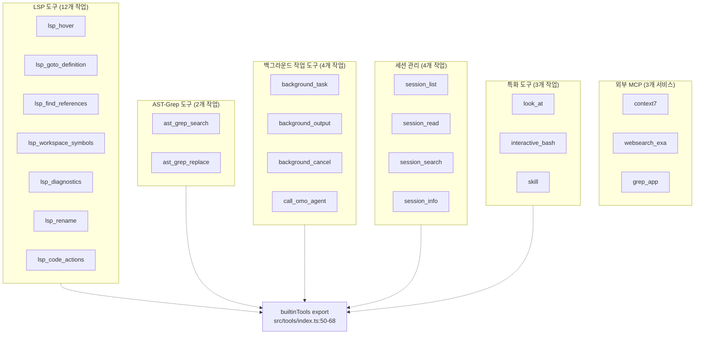
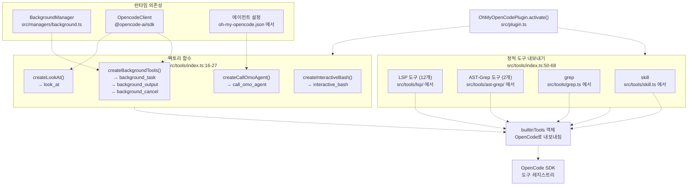
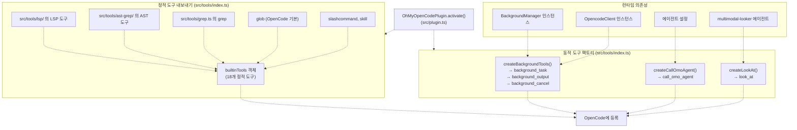
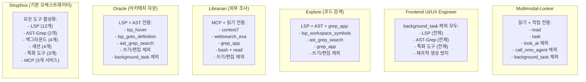
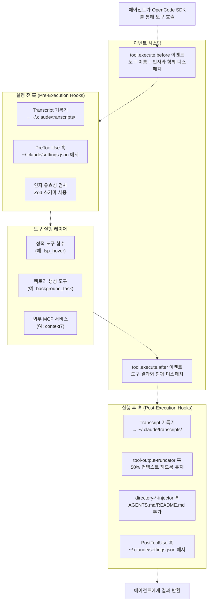
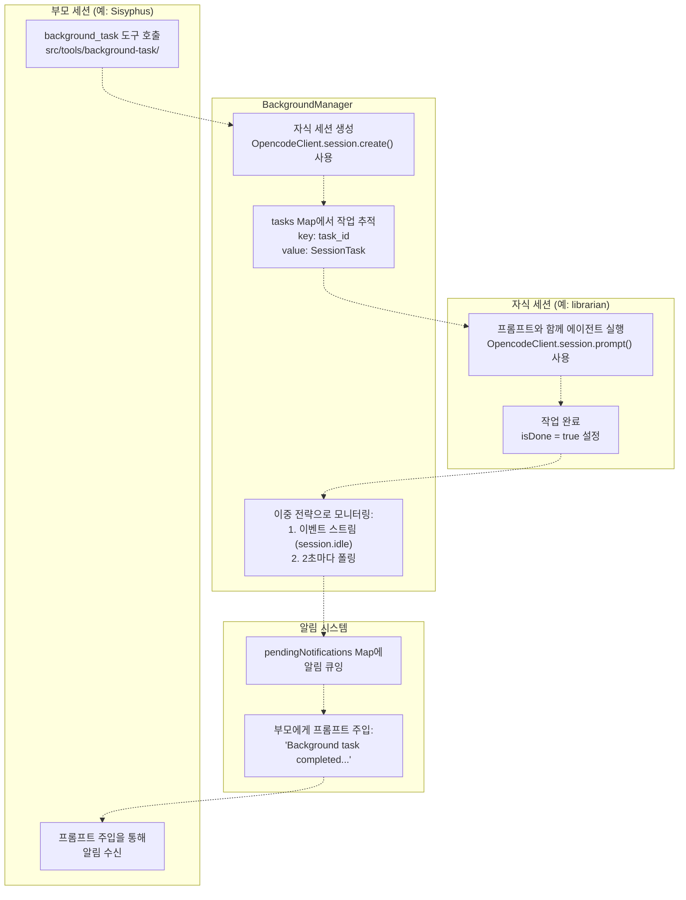
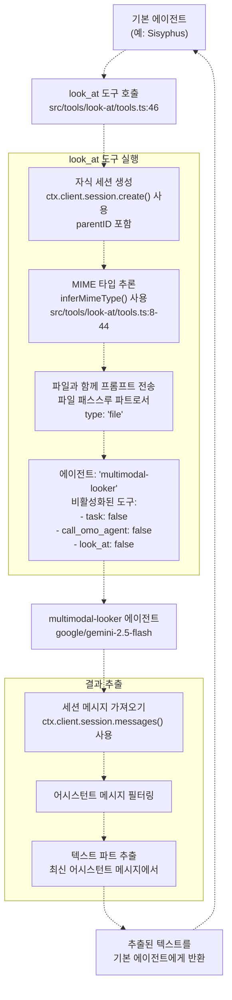

# 도구 시스템 (Tool System)

> **관련 소스 파일**
> * [README.ja.md](https://github.com/code-yeongyu/oh-my-opencode/blob/b92cd6ab/README.ja.md)
> * [README.ko.md](https://github.com/code-yeongyu/oh-my-opencode/blob/b92cd6ab/README.ko.md)
> * [README.md](https://github.com/code-yeongyu/oh-my-opencode/blob/b92cd6ab/README.md)
> * [README.zh-cn.md](https://github.com/code-yeongyu/oh-my-opencode/blob/b92cd6ab/README.zh-cn.md)
> * [src/shared/config-path.ts](https://github.com/code-yeongyu/oh-my-opencode/blob/b92cd6ab/src/shared/config-path.ts)
> * [src/tools/background-task/constants.ts](https://github.com/code-yeongyu/oh-my-opencode/blob/b92cd6ab/src/tools/background-task/constants.ts)
> * [src/tools/background-task/index.ts](https://github.com/code-yeongyu/oh-my-opencode/blob/b92cd6ab/src/tools/background-task/index.ts)
> * [src/tools/background-task/types.ts](https://github.com/code-yeongyu/oh-my-opencode/blob/b92cd6ab/src/tools/background-task/types.ts)
> * [src/tools/call-omo-agent/constants.ts](https://github.com/code-yeongyu/oh-my-opencode/blob/b92cd6ab/src/tools/call-omo-agent/constants.ts)
> * [src/tools/interactive-bash/constants.ts](https://github.com/code-yeongyu/oh-my-opencode/blob/b92cd6ab/src/tools/interactive-bash/constants.ts)
> * [src/tools/look-at/constants.ts](https://github.com/code-yeongyu/oh-my-opencode/blob/b92cd6ab/src/tools/look-at/constants.ts)
> * [src/tools/look-at/tools.ts](https://github.com/code-yeongyu/oh-my-opencode/blob/b92cd6ab/src/tools/look-at/tools.ts)

도구 시스템(Tool System)은 에이전트에게 코드 분석, 조작, 실행 및 오케스트레이션(orchestration)을 위한 30개 이상의 도구로 구성된 포괄적인 생태계를 제공합니다. 도구들은 6개의 기능적 카테고리로 분류되며, [src/tools/index.ts L1-L68](https://github.com/code-yeongyu/oh-my-opencode/blob/b92cd6ab/src/tools/index.ts#L1-L68)에 위치한 중앙 집중식 등록 시스템을 통해 통합됩니다.

이 페이지에서는 전체 도구 환경, 에이전트 역할별 차등 액세스 패턴, 그리고 조정된 멀티 에이전트 워크플로우를 가능하게 하는 통합 아키텍처에 대해 설명합니다.

특정 도구 카테고리에 대한 자세한 정보는 다음을 참조하십시오:

* **LSP 도구** (5.1 페이지) - 타입 정보, 탐색, 진단 및 리팩토링을 위한 12가지 Language Server Protocol 작업
* **AST-Grep 도구** (5.2 페이지) - 25개 언어에 걸친 구조적 코드 검색 및 교체
* **백그라운드 작업 도구 (Background Task Tools)** (5.3 페이지) - `background_task`, `background_output`, `background_cancel`, `call_omo_agent`를 사용한 비동기 에이전트 오케스트레이션
* **세션 관리 도구 (Session Management Tools)** (5.4 페이지) - `session_list`, `session_read`, `session_search`, `session_info`를 사용한 이력 분석
* **특화 도구 (Specialized Tools)** (5.5 페이지) - 멀티모달 분석을 위한 `look_at`, tmux 관리를 위한 `interactive_bash`, 그리고 `skill` 실행

## 전체 도구 생태계 (Complete Tool Ecosystem)

oh-my-opencode는 6개의 기능적 카테고리로 구성된 30개 이상의 도구를 제공합니다. 이 생태계는 LSP 작업, AST 조작, 백그라운드 작업 오케스트레이션, 세션 관리 및 멀티모달 분석을 위한 특화된 도구들을 통해 OpenCode의 기본 기능을 확장합니다.

**도구 생태계 아키텍처 (Tool Ecosystem Architecture)**



**도구 카테고리 개요**

| 카테고리 | 도구 수 | 주요 유스케이스 | 구현 위치 |
| --- | --- | --- | --- |
| LSP 도구 | 12 | 타입 정보, 탐색, 리팩토링 | [src/tools/lsp/](https://github.com/code-yeongyu/oh-my-opencode/blob/b92cd6ab/src/tools/lsp/) |
| AST-Grep | 2 | 구조적 코드 검색/교체 | [src/tools/ast-grep/](https://github.com/code-yeongyu/oh-my-opencode/blob/b92cd6ab/src/tools/ast-grep/) |
| 백그라운드 작업 | 4 | 비동기 에이전트 오케스트레이션 | [src/tools/background-task/](https://github.com/code-yeongyu/oh-my-opencode/blob/b92cd6ab/src/tools/background-task/) |
| 세션 관리 | 4 | 이력 분석 | OpenCode SDK 내장 |
| 특화 도구 | 3 | 미디어 분석, tmux, 스킬(skills) | [src/tools/look-at/](https://github.com/code-yeongyu/oh-my-opencode/blob/b92cd6ab/src/tools/look-at/) <br> [src/tools/interactive-bash/](https://github.com/code-yeongyu/oh-my-opencode/blob/b92cd6ab/src/tools/interactive-bash/) |
| 외부 MCP | 3 | 문서화, 웹 검색, GitHub 검색 | MCP 프로토콜 통합 |

출처: [src/tools/index.ts L1-L68](https://github.com/code-yeongyu/oh-my-opencode/blob/b92cd6ab/src/tools/index.ts#L1-L68), [README.md L512-L525](https://github.com/code-yeongyu/oh-my-opencode/blob/b92cd6ab/README.md#L512-L525), [README.md L531-L537](https://github.com/code-yeongyu/oh-my-opencode/blob/b92cd6ab/README.md#L531-L537)

## 도구 등록 및 통합 (Tool Registration and Integration)

도구는 [src/tools/index.ts L1-L68](https://github.com/code-yeongyu/oh-my-opencode/blob/b92cd6ab/src/tools/index.ts#L1-L68)을 통해 중앙에서 등록되며, 두 가지 뚜렷한 패턴을 사용합니다: 상태가 없는(stateless) 도구를 위한 정적 내보내기(static exports)와 런타임 의존성이 필요한 도구를 위한 팩토리 함수(factory functions)입니다.

**OpenCode SDK로의 도구 등록 흐름**



**도구 등록 패턴**

| 패턴 | 예시 도구 | 특징 | 구현 방식 |
| --- | --- | --- | --- |
| 정적 내보내기 (Static Export) | `lsp_hover`, `ast_grep_search`, `grep` | 런타임 의존성 없음, 순수 함수 | [src/tools/index.ts L50-L68](https://github.com/code-yeongyu/oh-my-opencode/blob/b92cd6ab/src/tools/index.ts#L50-L68)에서 직접 임포트/재내보내기 |
| 팩토리 함수 (Factory Function) | `background_task`, `call_omo_agent`, `look_at` | 주입된 의존성 필요 | 플러그인 활성화 시 팩토리 호출 |

팩토리 함수는 다음과 같은 의존성 주입을 가능하게 합니다:

* **`createBackgroundTools(manager, client)`** - 비동기 에이전트 오케스트레이션을 위해 `BackgroundManager` 인스턴스와 `OpencodeClient`를 주입합니다.
* **`createCallOmoAgent(config, context)`** - [src/tools/call-omo-agent/constants.ts L1](https://github.com/code-yeongyu/oh-my-opencode/blob/b92cd6ab/src/tools/call-omo-agent/constants.ts#L1-L1)에 따라 `explore` 또는 `librarian` 에이전트에게 위임하기 위한 에이전트 설정을 주입합니다.
* **`createLookAt(ctx)`** - [src/tools/look-at/tools.ts L46-L137](https://github.com/code-yeongyu/oh-my-opencode/blob/b92cd6ab/src/tools/look-at/tools.ts#L46-L137)에 따라 `multimodal-looker` 에이전트로 자식 세션을 생성하기 위해 플러그인 컨텍스트를 주입합니다.

출처: [src/tools/index.ts L1-L68](https://github.com/code-yeongyu/oh-my-opencode/blob/b92cd6ab/src/tools/index.ts#L1-L68), [src/tools/background-task/](https://github.com/code-yeongyu/oh-my-opencode/blob/b92cd6ab/src/tools/background-task/), [src/tools/call-omo-agent/constants.ts L1](https://github.com/code-yeongyu/oh-my-opencode/blob/b92cd6ab/src/tools/call-omo-agent/constants.ts#L1-L1), [src/tools/look-at/tools.ts L46-L137](https://github.com/code-yeongyu/oh-my-opencode/blob/b92cd6ab/src/tools/look-at/tools.ts#L46-L137)

## 도구 등록 및 내보내기 시스템 (Tool Registration and Export System)

도구는 [src/tools/index.ts L1-L68](https://github.com/code-yeongyu/oh-my-opencode/blob/b92cd6ab/src/tools/index.ts#L1-L68)에서 중앙 집중식으로 등록되며 플러그인 시스템에서 사용할 수 있도록 내보내집니다. 등록 시스템은 정적 도구(임포트 및 재내보내기)와 동적 도구(런타임 의존성을 주입하는 팩토리 함수에 의해 생성됨)를 구분합니다.

**도구 등록 흐름**



**정적 vs 동적 도구 등록**

| 등록 유형 | 도구 수 | 예시 | 초기화 방식 |
| --- | --- | --- | --- |
| 정적 (`builtinTools`) | 18 | `lsp_hover`, `ast_grep_search`, `grep`, `glob` | [src/tools/index.ts L50-L68](https://github.com/code-yeongyu/oh-my-opencode/blob/b92cd6ab/src/tools/index.ts#L50-L68)에서 임포트 및 재내보내기 |
| 동적 (팩토리) | 5 | `background_task`, `call_omo_agent`, `look_at` | 플러그인 활성화 중 의존성 주입과 함께 생성 |

동적 도구 팩토리 함수:

* **`createBackgroundTools(manager, client)`** - 백그라운드 작업 오케스트레이션을 가능하게 하기 위해 `BackgroundManager` 및 `OpencodeClient` 인스턴스를 주입합니다.
* **`createCallOmoAgent(config, context)`** - 서브 에이전트 위임을 위해 에이전트 설정 및 세션 컨텍스트를 주입합니다.
* **`createLookAt(agent)`** - 시각적 콘텐츠 분석을 위해 `multimodal-looker` 에이전트에 대한 참조를 주입합니다.

출처: [src/tools/index.ts L1-L68](https://github.com/code-yeongyu/oh-my-opencode/blob/b92cd6ab/src/tools/index.ts#L1-L68), [src/plugin.ts](https://github.com/code-yeongyu/oh-my-opencode/blob/b92cd6ab/src/plugin.ts)

## 에이전트별 차등 도구 액세스 (Differential Tool Access by Agent)

에이전트의 도구 액세스는 전문화를 강화하고 무한 재귀를 방지하기 위해 역할 기반 제한 원칙을 따릅니다. 액세스 제어 시스템은 세션 생성 시 에이전트별 도구 설정을 통해 구현됩니다.

**에이전트 도구 액세스 패턴**



**도구 액세스 제어 매트릭스**

| 에이전트 | LSP 도구 | AST-Grep | 백그라운드 도구 | 세션 도구 | 특화 도구 | MCP | 쓰기/편집 |
| --- | --- | --- | --- | --- | --- | --- | --- |
| **Sisyphus** | ✓ (12) | ✓ (2) | ✓ (4) | ✓ (4) | ✓ (3) | ✓ (3) | ✓ |
| **Oracle** | ✓ (읽기 전용) | ✓ (검색) | ✗ | ✓ | ✗ | ✗ | ✗ |
| **Librarian** | ✗ | ✗ | ✗ | ✓ | ✗ | ✓ (3) | ✗ |
| **Explore** | ✓ (검색) | ✓ (검색) | ✗ | ✓ | ✗ | ✓ (grep_app) | ✗ |
| **Frontend** | ✓ (12) | ✓ (2) | ✗ | ✓ (4) | ✓ (2) | ✓ (3) | ✓ |
| **Multimodal** | ✗ | ✗ | ✗ | ✗ | ✗ (look_at 제외) | ✗ | ✗ |

**주요 액세스 제어 규칙**

1. **재귀 방지 (Recursion Prevention)**: `explore` 및 `librarian`은 Sisyphus → explore → Sisyphus → explore... 와 같은 무한 위임 루프를 방지하기 위해 `call_omo_agent`를 사용할 수 없습니다.
2. **시각적 분석 격리 (Visual Analysis Isolation)**: `multimodal-looker`는 [src/tools/look-at/tools.ts L87](https://github.com/code-yeongyu/oh-my-opencode/blob/b92cd6ab/src/tools/look-at/tools.ts#L87-L87)에 따라 `look_at` 도구에 의해 호출되므로 스스로 `look_at`을 사용할 수 없습니다.
3. **프론트엔드 작업 격리 (Frontend Task Isolation)**: `frontend-ui-ux-engineer`는 관리되지 않는 백그라운드 세션을 생성할 수 있는 재귀적 에이전트 생성을 방지하기 위해 `background_task`를 사용할 수 없습니다.
4. **읽기 전용 전문가 (Read-Only Specialists)**: `oracle`, `librarian`, `explore`는 쓰기/편집 권한이 없습니다. 이들은 코드를 수정하지 않고 분석 및 조사 결과만 제공합니다.

출처: [README.md L463-L482](https://github.com/code-yeongyu/oh-my-opencode/blob/b92cd6ab/README.md#L463-L482), [src/tools/look-at/tools.ts L87](https://github.com/code-yeongyu/oh-my-opencode/blob/b92cd6ab/src/tools/look-at/tools.ts#L87-L87), [src/tools/call-omo-agent/constants.ts L1](https://github.com/code-yeongyu/oh-my-opencode/blob/b92cd6ab/src/tools/call-omo-agent/constants.ts#L1-L1)

## 도구 실행 및 통합 아키텍처 (Tool Execution and Integration Architecture)

도구 호출은 OpenCode의 이벤트 시스템, 훅(hook) 실행 및 안정성 레이어와 통합된 다단계 파이프라인을 통해 흐릅니다. 이 아키텍처는 컨텍스트 관리, 출력 절단(truncation) 및 실패 복구를 가능하게 합니다.

**도구 실행 파이프라인 아키텍처**



**훅 통합 지점 (Hook Integration Points)**

| 훅 유형 | 실행 시점 | 목적 | 설정 |
| --- | --- | --- | --- |
| PreToolUse | 도구 실행 전 | 입력 유효성 검사, 인자 수정, 실행 차단 | `~/.claude/settings.json` (README.md:586-610 참조) |
| PostToolUse | 도구 실행 후 | 경고 추가, 컨텍스트 주입, 결과 로깅 | `~/.claude/settings.json` (README.md:586-610 참조) |
| tool-output-truncator | 도구 결과 반환 후 | 대규모 출력 절단을 통한 컨텍스트 오버플로 방지 | 자동 활성화, 설정 불필요 |
| directory-*-injector | 파일 읽기 도구 후 | 디렉토리별 AGENTS.md 및 README.md 주입 | 읽기 작업 시 자동 활성화 |

**도구 결과 처리 흐름**

대규모 출력을 반환하는 도구(예: `grep`, `ast_grep_search`, `lsp_find_references`)의 경우, 실행 후 파이프라인에서 동적 절단이 적용됩니다:

1. **컨텍스트 계산**: 남은 컨텍스트 윈도우 공간을 측정합니다.
2. **헤드룸(Headroom) 보존**: 에이전트 응답을 위해 50%의 헤드룸을 유지합니다.
3. **토큰 제한**: 출력을 최대 50,000 토큰으로 제한합니다.
4. **절단 표시**: 절단된 경우 "... (output truncated)" 접미사를 추가합니다.

출처: [README.md L586-L610](https://github.com/code-yeongyu/oh-my-opencode/blob/b92cd6ab/README.md#L586-L610), [README.md L686-L688](https://github.com/code-yeongyu/oh-my-opencode/blob/b92cd6ab/README.md#L686-L688)

## 백그라운드 작업 통합 아키텍처 (Background Task Integration Architecture)

백그라운드 작업 도구는 `BackgroundManager` 클래스와 통합되어 진정한 병렬 에이전트 실행을 가능하게 합니다. 이 아키텍처는 자식 세션을 생성하고, 이중 이벤트/폴링 전략을 통해 완료를 모니터링하며, 완료 시 부모 세션에 알림을 보냅니다.

**백그라운드 작업 아키텍처**



**백그라운드 작업 도구 설명**

| 도구 | 상수 정의 설명 | 사용 패턴 |
| --- | --- | --- |
| `background_task` | "백그라운드에서 에이전트 작업을 실행합니다. 즉시 task_id를 반환하며 완료 시 알림을 보냅니다." ([src/tools/background-task/constants.ts L1-L3](https://github.com/code-yeongyu/oh-my-opencode/blob/b92cd6ab/src/tools/background-task/constants.ts#L1-L3) 참조) | 비동기 작업 생성, task_id 수신, 작업 계속 진행 |
| `background_output` | "백그라운드 작업의 출력을 가져옵니다. 시스템이 완료 시 알림을 주므로 block=true는 거의 필요하지 않습니다." ([src/tools/background-task/constants.ts L5](https://github.com/code-yeongyu/oh-my-opencode/blob/b92cd6ab/src/tools/background-task/constants.ts#L5-L5) 참조) | 결과 폴링 또는 준비될 때까지 블로킹 |
| `background_cancel` | "실행 중인 백그라운드 작업을 취소합니다. 최종 답변 전 모든 작업을 취소하려면 all=true를 사용하십시오." ([src/tools/background-task/constants.ts L7](https://github.com/code-yeongyu/oh-my-opencode/blob/b92cd6ab/src/tools/background-task/constants.ts#L7-L7) 참조) | 오류 발생 시 또는 완료 후 작업 종료 |

**call_omo_agent를 통한 에이전트 위임**

`call_omo_agent` 도구는 명시적인 백그라운드 실행 제어와 함께 특화된 에이전트에게 제어된 위임을 제공합니다:

```yaml
설명: "explore/librarian 에이전트를 생성합니다. run_in_background는 필수(REQUIRED)입니다 (true=task_id를 사용한 비동기, false=동기)."
사용 가능한 에이전트: ["explore", "librarian"]
```

출처: [src/tools/call-omo-agent/constants.ts L1-L7](https://github.com/code-yeongyu/oh-my-opencode/blob/b92cd6ab/src/tools/call-omo-agent/constants.ts#L1-L7)

`run_in_background` 파라미터는 에이전트가 다음 중 하나를 명시적으로 결정하도록 강제하기 위해 필수(REQUIRED) 사항입니다:

* **`true`**: `background_task`를 통한 비동기 실행 (task_id 반환, 즉시 계속 진행)
* **`false`**: 동기 실행 (에이전트가 완료될 때까지 블로킹)

이는 비동기 실행이 의도되었을 때 실수로 동기 블로킹이 발생하는 것을 방지합니다.

출처: [src/tools/background-task/constants.ts L1-L8](https://github.com/code-yeongyu/oh-my-opencode/blob/b92cd6ab/src/tools/background-task/constants.ts#L1-L8), [src/tools/call-omo-agent/constants.ts L1-L7](https://github.com/code-yeongyu/oh-my-opencode/blob/b92cd6ab/src/tools/call-omo-agent/constants.ts#L1-L7), [README.md L486-L497](https://github.com/code-yeongyu/oh-my-opencode/blob/b92cd6ab/README.md#L486-L497)

## 특화 도구 구현 (Specialized Tool Implementations)

일부 도구는 단순한 함수 호출 이상의 특화된 통합 패턴이 필요합니다. 이러한 도구들은 도구 시스템 아키텍처의 유연성을 보여줍니다.

**look_at 도구를 통한 멀티모달 분석**

`look_at` 도구는 기본 에이전트가 시각적 분석을 특화된 `multimodal-looker` 에이전트에게 오프로드(offload)하는 위임 패턴을 구현합니다:



**상수 정의에서의 도구 설명**

```python
설명: "원시 텍스트 이상의 해석이 필요한 미디어 파일(PDF, 이미지, 다이어그램)을 분석합니다. 
문서에서 특정 정보나 요약을 추출하고 시각적 콘텐츠를 설명합니다. 
파일 내용 그대로가 아니라 분석/추출된 데이터가 필요할 때 사용하십시오."
```

출처: [src/tools/look-at/constants.ts L3](https://github.com/code-yeongyu/oh-my-opencode/blob/b92cd6ab/src/tools/look-at/constants.ts#L3-L3)

**interactive_bash를 통한 Tmux 통합**

`interactive_bash` 도구는 보안 제한이 적용된 tmux 세션 관리를 제공합니다:

```
설명: "tmux 명령을 실행합니다. 'omo-{name}' 세션 패턴을 사용하십시오.
차단됨 (대신 bash 사용): capture-pane, save-buffer, show-buffer, pipe-pane."
```

출처: [src/tools/interactive-bash/constants.ts L14-L16](https://github.com/code-yeongyu/oh-my-opencode/blob/b92cd6ab/src/tools/interactive-bash/constants.ts#L14-L16)

**차단된 하위 명령** (보안 조치): `["capture-pane", "capturep", "save-buffer", "saveb", "show-buffer", "showb", "pipe-pane", "pipep"]` ([src/tools/interactive-bash/constants.ts L3-L12](https://github.com/code-yeongyu/oh-my-opencode/blob/b92cd6ab/src/tools/interactive-bash/constants.ts#L3-L12) 참조)

이러한 하위 명령들은 세션 내용을 유출하거나 보안 취약점을 만들 수 있기 때문에 차단됩니다. 에이전트는 이러한 작업을 위해 표준 `bash` 도구를 사용해야 합니다.

**세션 관리 도구 (Session Management Tools)**

세션 관리 도구는 에이전트가 이전 대화를 참조하고 연속성을 유지할 수 있게 합니다:

| 도구 | 목적 | 사용법 |
| --- | --- | --- |
| `session_list` | 날짜 필터링과 함께 모든 세션 나열 | 특정 기간의 세션 찾기 |
| `session_read` | 전체 메시지 이력 읽기 | 이전 대화 컨텍스트 검색 |
| `session_search` | 메시지 전체 텍스트 검색 | 특정 논의나 결정 사항 찾기 |
| `session_info` | 메타데이터 및 통계 가져오기 | 세션 특성 분석 |

출처: [README.md L528-L536](https://github.com/code-yeongyu/oh-my-opencode/blob/b92cd6ab/README.md#L528-L536)

출처: [src/tools/look-at/tools.ts L46-L137](https://github.com/code-yeongyu/oh-my-opencode/blob/b92cd6ab/src/tools/look-at/tools.ts#L46-L137), [src/tools/look-at/constants.ts L3](https://github.com/code-yeongyu/oh-my-opencode/blob/b92cd6ab/src/tools/look-at/constants.ts#L3-L3), [src/tools/interactive-bash/constants.ts L3-L16](https://github.com/code-yeongyu/oh-my-opencode/blob/b92cd6ab/src/tools/interactive-bash/constants.ts#L3-L16), [README.md L528-L536](https://github.com/code-yeongyu/oh-my-opencode/blob/b92cd6ab/README.md#L528-L536)

## Interactive Bash를 위한 명령 토큰화 (Command Tokenization)

`interactive_bash` 도구는 복잡한 tmux 명령을 적절히 처리하기 위해 따옴표를 인식하는(quote-aware) 명령 토큰화를 구현합니다:

```javascript
// src/tools/interactive-bash/tools.ts:9-48 에서 발췌
export function tokenizeCommand(cmd: string): string[] {
  const tokens: string[] = []
  let current = ""
  let inQuote = false
  let quoteChar = ""
  let escaped = false

  for (let i = 0; i < cmd.length; i++) {
    const char = cmd[i]

    if (escaped) {
      current += char
      escaped = false
      continue
    }

    if (char === "\\") {
      escaped = true
      continue
    }

    if ((char === "'" || char === '"') && !inQuote) {
      inQuote = true
      quoteChar = char
    } else if (char === quoteChar && inQuote) {
      inQuote = false
      quoteChar = ""
    } else if (char === " " && !inQuote) {
      if (current) {
        tokens.push(current)
        current = ""
      }
    } else {
      current += char
    }
  }

  if (current) tokens.push(current)
  return tokens
}
```

이 토크나이저는 다음을 처리합니다:

* **작은따옴표 및 큰따옴표**: 따옴표로 묶인 문자열 내의 공백을 보존합니다.
* **백슬래시 이스케이프**: 따옴표 문자를 이스케이프할 수 있게 합니다.
* **외부 의존성 없음**: 안정성을 위해 순수 TypeScript로 구현되었습니다.

**토큰화 예시**

| 입력 명령 | 토큰 |
| --- | --- |
| `send-keys -t session:0 "echo hello"` | `["send-keys", "-t", "session:0", "echo hello"]` |
| `send-keys -t session:0 'echo "test"'` | `["send-keys", "-t", "session:0", "echo \"test\""]` |
| `send-keys -t session:0 echo\ test` | `["send-keys", "-t", "session:0", "echo test"]` |

출처: [src/tools/interactive-bash/tools.ts L9-L48](https://github.com/code-yeongyu/oh-my-opencode/blob/b92cd6ab/src/tools/interactive-bash/tools.ts#L9-L48)
